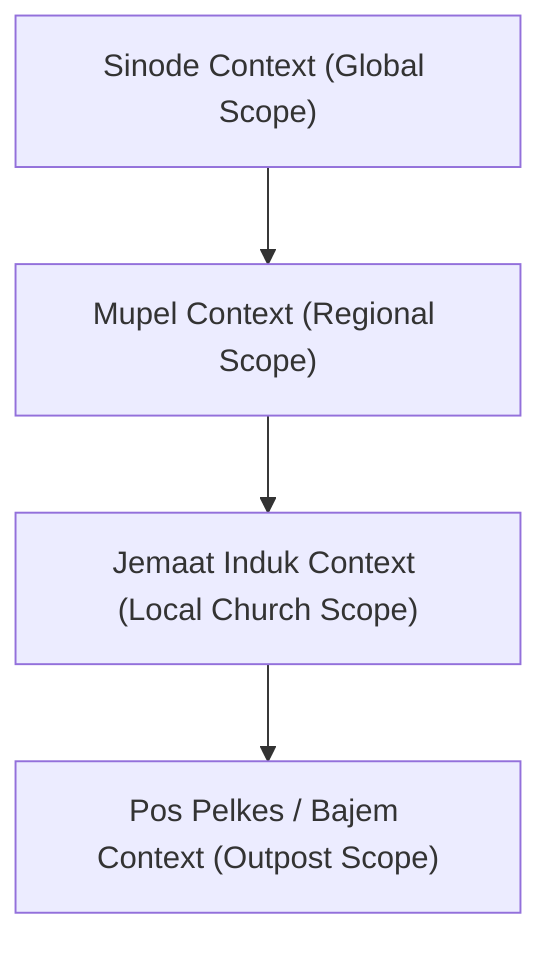
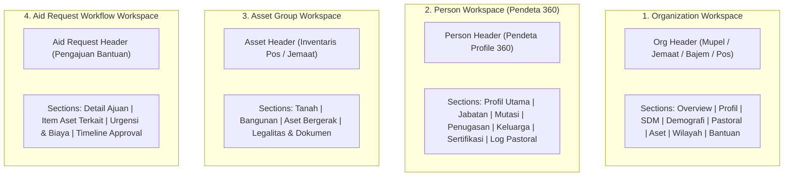
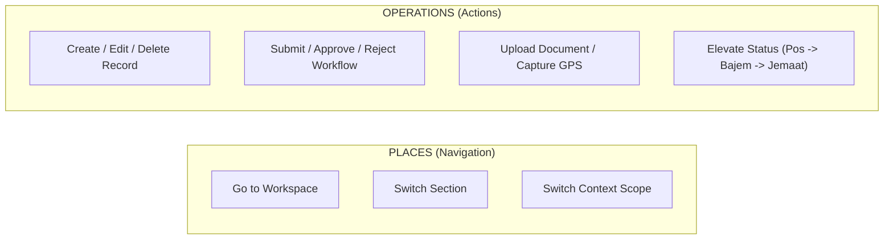

# UX INFORMATION ARCHITECTURE v1 — SI GPIB v2.2
## Phase 2: Domain → Context → Workspace Architecture

**Role**: Principal Information Architect, Enterprise UX Architect, dan Product Architecture Analyst  
**Project**: SI GPIB v2.2 (*Mobile First PWA*)  
**Source of Truth Baseline**: `current_state_inventory.md`, `entity_inventory.md`, `UX_ENTITY_CLASSIFICATION_v1.md`, & Codebase Empiris.  
**Status**: Architecture Discovery & Information Architecture Redesign (Tanpa Wireframe / Tanpa Visual Design / Tanpa Perubahan Kode).

---

## 1. Executive Summary

Dokumen ini merumuskan ulang Arsitektur Informasi (**Information Architecture - IA**) dan **UX Object Model** untuk aplikasi **SI GPIB v2.2**. Berlandaskan audit teknis eksisting, sistem yang semula berbasis *flat table routes* dan *mixed navigation menu* kini ditata ke dalam 6 hierarki konseptual murni:

$$\text{DOMAIN} \longrightarrow \text{CONTEXT} \longrightarrow \text{WORKSPACE} \longrightarrow \text{SECTION} \longrightarrow \text{ENTITY} \longrightarrow \text{ACTION}$$

### Temuan Arsitektur Utama (Phase 2):
1. **Dua Pilar Domain Utama**: Seluruh aktivitas bisnis SI GPIB berporos pada **Organizational Management** (Struktur & Operasional Pos) dan **People & Ministry** (Pendeta & Pelayan Presbiter).
2. **Pemisahan Tegas Navigation vs Action**: Navigation merepresentasikan **Tempat / Lingkungan Kerja** (*Places / Workspaces*), sedangkan Action merepresentasikan **Tindakan / Transaksi** (*Tasks / Operations*).
3. **Model Konteks Berlapis (Context Hierarchy)**: Bekerja di SI GPIB selalu terjadi di dalam sebuah **Context Scope** (`Sinode` $\rightarrow$ `Mupel` $\rightarrow$ `Jemaat` $\rightarrow$ `Pos Pelkes`). Perpindahan konteks (*Context Switching*) secara otomatis mengisolasi Data Scope dan Hak Akses (RBAC/RLS).
4. **Rescoping Workspace**: Tidak semua entitas memerlukan halaman *Standalone Workspace*. Hanya 4 Objek yang layak menjadi Standalone Workspace: **Organization Workspace**, **Person (Pendeta 360) Workspace**, **Asset Group Workspace**, dan **Aid Request Workflow Workspace**.

---

## 2. Audit Findings Evaluation

Evaluasi temuan dari `UX_ENTITY_CLASSIFICATION_v1.md` diklasifikasikan ke dalam 3 kategori kepastian (*Confirmed*, *Inference*, *Decision Required*):

| Finding / Topic | Classification | Evidence in Codebase / Database | Impact on UX Architecture |
|---|---|---|---|
| **35 Tabel Database Terstruktur** | **CONFIRMED** | `supabase/migrations/` (68 migration files). | Fondasi data mentah lengkap, namun memerlukan pemetaan UX Model agar tidak 1:1 menjadi menu. |
| **Hierarki Physical DB 3-Level** | **CONFIRMED** | Tabel `m_mupel`, `m_jemaat_induk`, `m_pos_pelkes` dengan FK berjenjang. | Menentukan batas fisik *Organization Hierarchy*. |
| **RBAC Enforcer Scope Helper** | **CONFIRMED** | `src/lib/utils/rbac.ts` (`assertPosWriteAccess`). | Memverifikasi metadata user `id_mupel`, `id_induk`, `id_pos` untuk isolasi scope baca/tulis. |
| **Profil 360 Pendeta 7 Sub-tabel** | **CONFIRMED** | `m_pendeta`, `t_penugasan_pendeta`, `t_riwayat_mutasi_pendeta`, `t_jabatan_struktural`, `t_keluarga_pendeta`, `t_kompetensi_pendeta`, `t_keterlibatan_pendeta`. | Membuktikan `Pendeta` sangat layak menjadi Standalone *Person Workspace*. |
| **Bajem disimpang di Pos Pelkes** | **INFERENCE** | `kategori = 'Bajem'` di `m_pos_pelkes` & helper `isBajemPos()`. | `Bajem` bukan tabel terpisah, melainkan *Organizational Subtype/Status Level* dari Pos Pelkes. |
| **Sinode sebagai Global Scope** | **INFERENCE** | Tidak ada tabel `m_sinode`. Menggunakan `role = 'super_user'`. | `Sinode` adalah *Root Context Scope* (Level 0) tanpa entitas fisik tersendiri. |
| **Log Pastoral Cross-Context** | **INFERENCE** | `t_log_pastoral` punya FK `id_pos` dan `id_pendeta`. | `Log Pastoral` muncul di 2 workspace: *Organization Workspace* (Pos) dan *Person Workspace* (Pendeta). |
| **Penyatuan Entitas Person** | **DECISION REQUIRED** | Physical DB memisah `m_pendeta`, `t_pelayan`, `t_relawan`, `users`. | **Keputusan UX**: Apakah menyatukannya secara konseptual dalam `Person Domain` atau tetap terpisah di UI. |
| **Asset Workspace Standalone vs Embedded** | **DECISION REQUIRED** | 3 tabel terpisah: `t_aset_tanah`, `t_aset_bangunan`, `t_aset_bergerak`. | **Keputusan UX**: Membuka Asset Workspace tersendiri atau cukup sebagai Section di Pos Pelkes Workspace. |

---

## 3. Domain Architecture

Domain merepresentasikan area besar bisnis GPIB yang memiliki tujuan, objek, proses, dan vocabulary tersendiri. Ditetapkan **6 Domain Utama**:

| Domain | Purpose | Primary Entities | Typical Users | Scope | Confidence |
|---|---|---|---|---|---|
| **1. Organizational Management** | Mengelola struktur hierarki organisasi GPIB, identitas gereja/pos, status kemandirian pos, dan batas geospasial. | `Organization` (Mupel, Jemaat, Bajem, Pos Pelkes) | Admin Mupel, KMJ, PJ Pos, Super User | Hierarki Regional & Lokal | **HIGH** |
| **2. People & Ministry** | Mengelola data personel pelayanan (Pendeta, Pelayan/Presbiter, Relawan) serta penugasan dan rekam jejaknya. | `Person` (Pendeta, Pelayan, Relawan, User) | Pendeta, KMJ, Admin Mupel, Super User | Persona & Penugasan | **HIGH** |
| **3. Pastoral Care** | Pencatatan dan pemantauan kegiatan penggembalaan, kunjungan jemaat, konseling, dan pembinaan jiwa di lapangan. | `PastoralRecord`, `WorshipSchedule` | Pendeta, PJ Pos, Pelayan | Operasional Harian Pos | **HIGH** |
| **4. Assets & Property** | Pengelolaan inventaris kekayaan fisik gereja (tanah, bangunan gedung, kendaraan operasional, & surat legalitas). | `Asset` (Tanah, Bangunan, Bergerak), `Document` | PJ Pos, Admin Jemaat, KMJ, Admin Mupel | Inventaris Fisik Pos | **HIGH** |
| **5. Aid & Workflow** | Transaksi pengajuan dana/bantuan operasional dan perbaikan dari pos dengan mekanisme approval berjenjang. | `AidRequest`, `ApprovalRecord` | PJ Pos (Pengaju), KMJ (Approver 1), Admin Mupel (Approver 2) | Transaksi & Finance | **HIGH** |
| **6. Territory Intelligence** | Pemetaan analisis geospasial mengenai risiko/kerawanan lingkungan dan potensi pemberdayaan di sekitar pos. | `TerritoryData` (Risiko & Potensi) | PJ Pos, Relawan, Admin Mupel | Spasial & Analitik | **HIGH** |

---

## 4. Entity Architecture

Evaluasi ulang terhadap struktur entitas bisnis (Entity Family & Subtypes):

### A. Organization Entity Family
- **Model Konseptual**: Satu Entitas Utama **`Organization`** dengan *Organizational Subtype/Level*:
  - Level 0: `Sinode` (Root Scope Implisit)
  - Level 1: `Mupel` (*Musyawarah Pelayanan*)
  - Level 2: `Jemaat Induk` (*Gereja Lokal Mandiri*)
  - Level 3a: `Bajem` (*Bakal Jemaat / Pos Pelkes Status Elevasi*)
  - Level 3b: `Pos Pelkes` (*Pos Pelayanan & Kesaksian*)
- **Konsekuensi IA**: Seluruh level organisasi menggunakan **Struktur Template Workspace yang Konsisten** (`Organization Workspace`), di mana kelengkapan seksinya menyesuaikan level hierarki.

### B. Person Entity Family
- **Model Konseptual**: Satu Entitas Utama **`Person`** dengan *Role & Subtype*:
  - Subtype `Pendeta`: Memiliki Profil 360 lengkap (Jabatan, Mutasi, Keluarga, Sertifikasi).
  - Subtype `Pelayan/Presbiter`: Pelayan organik pos (Penatua/Diaken).
  - Subtype `Relawan`: Tenaga pendukung pelayanan pos.
  - Subtype `User Account`: Objek identitas autentikasi login.
- **Konsekuensi IA**: Pendeta menjadi entitas ber-workspace mandiri (`Person Workspace / Profil 360`), sedangkan Pelayan & Relawan ditampilkan sebagai Section SDM di dalam *Organization Workspace*.

### C. Asset Entity Family
- **Model Konseptual**: Satu Entitas Utama **`Asset`** dengan *Asset Subtype*:
  - `Land` (Aset Tanah)
  - `Building` (Aset Bangunan Gedung)
  - `Movable` (Aset Bergerak / Kendaraan)
- **Konsekuensi IA**: Disatukan dalam **`Asset Group Workspace`** atau Seksion Aset Terpadu di Pos Pelkes.

### D. Territory Intelligence Family
- **Model Konseptual**: Satu Entitas Utama **`TerritoryData`** dengan *Feature Type*:
  - `Risk` (Kerawanan Bencana / Sosial)
  - `Potential` (Potensi Ekonomi / Kemitraan)

| UX Entity | Entity Family | Type/Subtype | Parent | Lifecycle | Candidate Workspace | Confidence |
|---|---|---|---|---|---|---|
| **Organization** | Organization | Mupel, Jemaat, Bajem, Pos Pelkes | Sinode / Parent Org | `Draft` $\rightarrow$ `Aktif` $\rightarrow$ `Elevasi` $\rightarrow$ `NonAktif` | **YES** (StandAlone) | **HIGH** |
| **Person** | Person | Pendeta, Pelayan, Relawan, User | Organization | `Aktif` $\rightarrow$ `Mutasi` $\rightarrow$ `Pensiun` / `NonAktif` | **YES** (Pendeta) | **HIGH** |
| **Asset** | Asset | Tanah, Bangunan, Bergerak | Organization | `Perolehan` $\rightarrow$ `Guna` $\rightarrow$ `Pemeliharaan` $\rightarrow$ `Hapus` | **YES** (Group) | **HIGH** |
| **PastoralRecord** | Pastoral | Record Kegiatan | PosPelkes / Pendeta | `Recorded` $\rightarrow$ `Archived` | NO (Section) | **HIGH** |
| **WorshipSchedule** | Pastoral | Schedule Record | PosPelkes | `Scheduled` $\rightarrow$ `Completed` | NO (Section) | **HIGH** |
| **AidRequest** | Workflow | Bantuan Operasional / Fisik | PosPelkes | `Draft` $\rightarrow$ `Submitted` $\rightarrow$ `Approved_KMJ` $\rightarrow$ `Approved_Mupel` $\rightarrow$ `Rejected` | **YES** (Workflow Detail) | **HIGH** |
| **TerritoryData** | Territory | Risk, Potential | PosPelkes | `Identified` $\rightarrow$ `Monitored` | NO (Section/Layer) | **HIGH** |

---

## 5. Context Architecture & Scope

Context menjawab: *"Di lingkup organisasi/wilayah mana user sedang bekerja saat ini?"*



### Matriks Context & RBAC Data Scope

| Role | Primary Working Context | Allowed Data Scope | Typical Workspace | Can Switch Context? |
|---|---|---|---|---|
| `super_user` / `superadmin` | **Sinode Context** (Global) | Seluruh Mupel, Jemaat, & Pos (Global Access) | All Workspaces | **YES** (Dapat memilih Mupel/Jemaat/Pos manapun) |
| `admin_mupel` | **Mupel Context** | Seluruh Jemaat & Pos di dalam 1 Mupelnya (`id_mupel`) | Organization (Mupel Workspace) | **YES** (Terbatas antar Jemaat/Pos di Mupelnya) |
| `kmj` / `admin_jemaat` | **Jemaat Context** | Jemaat Induknya (`id_induk`) & seluruh Pos bawahan | Organization (Jemaat Workspace) | **YES** (Terbatas ke Pos-Pos di bawah Jemaatnya) |
| `pj_pos` / `pj` | **Pos Pelkes Context** | 1 Pos Pelkes tempat tugasnya (`id_pos`) | Organization (Pos Workspace) | **NO** (Terkunci pada Pos tugasnya) |
| `pendeta` | **Person / Pos Context** | Profil Pribadi & Pos tempat ditugaskan | Person Workspace (Profil 360) | **LIMITED** (Sesuai riwayat/lokasi penugasan aktif) |
| `pelayan` / `relawan` | **Pos Pelkes Context** | 1 Pos Pelkes tempat tugas (`id_pos`) | Pos Pelkes Workspace (Read/Write Log) | **NO** (Terkunci pada Pos tugasnya) |
| `read_only` | **Assigned Context** | Sesuai scope asignasi (Read-Only) | View-Only Sections | **NO** |

---

## 6. Workspace Architecture

Workspace adalah lingkungan kerja terpadu yang menyatukan **Context + Entity + Sections + Actions**. Ditetapkan **4 Standalone Workspace**:



### Evaluasi Kelayakan Standalone Workspace

| Workspace | Entry Context | Primary Entity | Purpose | Key Sections Included | Primary Roles | Standalone? | Confidence |
|---|---|---|---|---|---|---|---|
| **Organization Workspace** | Active Org Scope (`id_pos` / `id_induk` / `id_mupel`) | `Organization` | Pusat kendali operasional, SDM, aset, & penggembalaan suatu unit organisasi. | Overview, Profil, SDM Pelayan, Demografi, Log Pastoral, Jadwal, Aset, Wilayah, Bantuan. | Super User, Admin Mupel, KMJ, PJ Pos | **YES** | **HIGH** |
| **Person Workspace (Pendeta 360)** | Active Person (`id_pendeta`) | `Person` (Pendeta) | Portfolio komprehensif 360 derajat karir, jabatan, mutasi, & penggembalaan pendeta. | Ringkasan Profil, Jabatan Struktural, Riwayat Mutasi, Penugasan Pos, Keluarga, Sertifikasi, Log Pastoral. | Pendeta, KMJ, Admin Mupel, Super User | **YES** | **HIGH** |
| **Asset Group Workspace** | Active Org Scope (`id_pos`) | `Asset` | Pengelolaan kolektif seluruh inventaris fisik (tanah, bangunan, kendaraan) & surat legalitas. | Ringkasan Aset, Tanah, Bangunan, Aset Bergerak, Dokumen/Lampiran. | PJ Pos, Admin Jemaat, KMJ | **YES** | **HIGH** |
| **Aid Request Workflow Workspace** | Active Transaction (`id_ajuan`) | `AidRequest` | Monitoring lifecycle persetujuan bantuan dari pengajuan hingga eksekusi. | Detail Pengajuan, Justifikasi Aset, Biaya & Urgensi, Workflow Timeline Approval. | PJ Pos, KMJ, Admin Mupel | **YES** | **HIGH** |

---

## 7. Section Architecture

Pengelompokan informasi di dalam masing-masing Workspace:

### Matrix Workspace $\rightarrow$ Section Mapping

| Workspace | Section | Primary Entity | Supporting Entities | Purpose & User Goal |
|---|---|---|---|---|
| **Organization Workspace** | **Overview** | `Organization` | Demografi, Pastoral, Aset | Summary KPI dashboard, statistik cepat, & status keaktifan unit. |
| | **Profil Identitas** | `Organization` | None | Informasi identitas, alamat, peta lokasi geospasial, & kontak resmi. |
| | **SDM & Pelayan** | `Person` | Pelayan, Relawan, Pendeta | Daftar presbiter, pelayan pos, & relawan bertugas beserta statusnya. |
| | **Demografi Pelkat** | `DemografiPelkat` | None | Matriks statistik jumlah KK, jiwa, laki/perempuan per Pelkat (PA-PKLU). |
| | **Log Pastoral** | `PastoralRecord` | Pendeta | Riwayat kegiatan penggembalaan & kunjungan jemaat di pos. |
| | **Jadwal Pelayanan** | `WorshipSchedule` | Pelayan | Agenda rutin ibadah minggu & persekutuan pos. |
| | **Aset & Property** | `Asset` | LampiranAset | Ringkasan inventaris tanah, bangunan, & kendaraan pos. |
| | **Wilayah & Intel** | `TerritoryData` | LampiranKerawanan/Potensi | Pemetaan spasial titik kerawanan bencana/sosial & potensi wilayah. |
| | **Pengajuan Bantuan** | `AidRequest` | ApprovalRecord | Daftar status pengajuan bantuan dana/perbaikan fisik pos. |
| **Person Workspace (360)** | **Identitas Utama** | `Person` (Pendeta) | User Account | Bio-data pendeta, NIP/NIK, status keaktifan, & info kontak. |
| | **Jabatan Struktural**| `JabatanStruktural` | None | Riwayat jabatan di majelis jemaat, mupel, atau badan sinodal. |
| | **Riwayat Mutasi** | `RiwayatMutasi` | Organization | Catatan historis perpindahan tempat tugas antar jemaat. |
| | **Penugasan Pos** | `PenugasanPendeta` | Organization | Daftar pos-pos pelkes tempat pendeta ditugaskan aktif. |
| | **Keluarga** | `KeluargaPendeta` | Document | Data anggota keluarga inti (pasangan & anak) beserta foto. |
| | **Kompetensi** | `KompetensiPendeta`| Document | Sertifikasi keahlian, pelatihan formal, & dokumen ijazah. |
| | **Log Pastoral** | `PastoralRecord` | Organization | Rekap seluruh log kegiatan pastoral yang pernah dilakukan pendeta. |
| **Asset Group Workspace**| **Tanah** | `Asset` (Land) | LampiranAset | Detail luas, thn perolehan, status legalitas hukum, & lokasi peta tanah. |
| | **Bangunan** | `Asset` (Building) | LampiranAset | Detail fisik bangunan gedung gereja/pastori, fungsi, & kondisi. |
| | **Aset Bergerak** | `Asset` (Movable) | LampiranAset | Detail kendaraan operasional, no polis, & tanggal pajak. |
| | **Dokumen Legalitas**| `Document` | Asset | Central repository scan sertifikat, STNK, & bukti kepemilikan. |

---

## 8. Action Architecture

Pemisahan tegas antara **Navigation** (*Berpindah Tempat*) dan **Action** (*Melakukan Tindakan*):



### Action Matrix

| Entity / Workspace | Action | Actor / Role | Preconditions | Result / Output | Scope |
|---|---|---|---|---|---|
| **Organization** | `ElevateStatus` | Super User, Admin Mupel | Pos Pelkes memenuhi kriteria kemandirian. | Status Pos berubah menjadi `Bajem` / `Jemaat Induk`, tercatat di `HistoriStatus`. | Org Context |
| **Organization** | `UpdateProfile` | KMJ, PJ Pos, Admin Mupel | Memiliki hak tulis (*assertPosWriteAccess*). | Metadata identitas & koordinat peta updated. | Org Context |
| **Person (Pendeta)** | `MutasiPendeta` | Super User, Admin Mupel | Pendeta aktif, Jemaat Baru dipilih. | Record `RiwayatMutasi` bertambah, homebase `m_pendeta` diperbarui. | Global / Mupel |
| **Person (Pendeta)** | `AssignToPos` | KMJ, Admin Mupel | Pendeta & Pos aktif. | Record `PenugasanPendeta` bertambah. | Jemaat / Mupel |
| **PastoralRecord** | `CreateLog` | Pendeta, PJ Pos, Pelayan | User berada dalam konteks Pos tugas. | Record `t_log_pastoral` tersimpan (Online/Offline sync). | Pos Context |
| **AidRequest** | `SubmitRequest` | PJ Pos | Draft pengajuan bantuan lengkap. | Status berubah menjadi `Submitted` / `Diajukan`. | Pos Context |
| **AidRequest** | `ApproveRequest` | KMJ (Step 1), Admin Mupel (Step 2) | Role sesuai tahapan workflow approval. | Status berubah `Approved_KMJ` / `Approved_Mupel`, `ApprovalRecord` bertambah. | Jemaat / Mupel |
| **AidRequest** | `RejectRequest` | KMJ, Admin Mupel | Mengisi catatan justifikasi penolakan. | Status berubah `Rejected`, workflow berhenti. | Jemaat / Mupel |
| **Asset** | `CreateAsset` | PJ Pos, Admin Jemaat | Data spesifikasi aset lengkap. | Record Aset (Tanah/Bangunan/Bergerak) dibuat. | Pos Context |
| **Document** | `UploadAttachment` | User terautentikasi | File valid (PDF/Foto < 5MB). | File tersimpan di Supabase Storage & terikat ke Parent ID. | Entity Context |

---

## 9. Cross-Context Entity Model

Metode pengaksesan entitas yang muncul di lebih dari satu konteks organisasi/workspace:

| Entity | Owning Context (Primary Owner) | Viewable From (Secondary View) | Editable From | Reason & Business Logic |
|---|---|---|---|---|
| **Pendeta** | Homebase Jemaat Induk (`m_pendeta.id_induk`) | 1. Mupel Workspace<br>2. Pos Pelkes Workspace (Tempat Tugas)<br>3. Sinode Global Catalog | 1. Homebase Jemaat (Profil/Keluarga)<br>2. Mupel / Sinode (Mutasi & Penugasan) | Pendeta dimiliki oleh Jemaat Induk tertentu tetapi ditugaskan melayani di beberapa Pos Pelkes. |
| **PastoralRecord** | Pos Pelkes Context (`id_pos`) | 1. Person Workspace (Profil 360 Pendeta)<br>2. Executive Pastoral Dashboard | Pos Pelkes Tempat Kegiatan | Log dicatat untuk Pos tertentu oleh Pendeta tertentu, sehingga harus muncul di riwayat kedua entitas. |
| **AidRequest** | Pos Pelkes Context (`id_pos`) | 1. Jemaat Induk Workspace (KMJ Approval)<br>2. Mupel Workspace (Mupel Approval) | 1. Pos Pelkes (Create/Edit Draft)<br>2. Jemaat/Mupel (Approve/Reject) | Transaksi berasal dari Pos tetapi memerlukan workflow kelayakan dari level organisasi di atasnya. |
| **Asset** | Pos Pelkes Context (`id_pos`) | 1. Jemaat Induk Workspace<br>2. Mupel Asset Report | Pos Pelkes / Admin Jemaat | Aset berlokasi di Pos tetapi merupakan milik inventaris gereja induk/mupel. |

---

## 10. Canonical Information Architecture

Struktur kanonis Arsitektur Informasi **SI GPIB v2.2**:

```text
GLOBAL SYSTEM SCOPE (SI GPIB v2.2)
│
├── 1. ORGANIZATIONAL DOMAIN
│   │
│   ├── CONTEXT SELECTOR (Working Context: Mupel / Jemaat / Pos)
│   │
│   └── WORKSPACE: Organization Workspace
│       ├── SECTION: Overview (KPI, Quick Stats, & Active Status)
│       ├── SECTION: Identity Profile (Identity, Location Map, & Contacts)
│       ├── SECTION: SDM & Pelayan (Presbiter, Pelayan, & Relawan Lists)
│       ├── SECTION: Demografi Pelkat (PA, PT, GP, PKP, PKB, PKLU Stats)
│       ├── SECTION: Pastoral Care (Log Pastoral & Worship Schedules)
│       ├── SECTION: Assets & Property (Land, Buildings, & Vehicles)
│       ├── SECTION: Territory Intelligence (Risk & Potential Map Layers)
│       └── SECTION: Aid Requests (Workflow Status & History)
│
├── 2. PEOPLE & MINISTRY DOMAIN
│   │
│   ├── DIRECTORY: Person / Pendeta Catalog (Search & Filter)
│   │
│   └── WORKSPACE: Person Workspace (Pendeta 360)
│       ├── SECTION: Primary Profile (Bio-data, NIP/NIK, & Photo)
│       ├── SECTION: Structural Positions (Majelis / Mupel / Sinodal Roles)
│       ├── SECTION: Transfer History (Riwayat Mutasi Antar Jemaat)
│       ├── SECTION: Pos Assignments (Penugasan Pelayanan Pos Aktif)
│       ├── SECTION: Family Data (Data Pasangan & Anak)
│       ├── SECTION: Competencies & Certificates (Ijazah & Sertifikasi)
│       ├── SECTION: External Involvement (Keaktifan Organisasi)
│       └── SECTION: Pastoral Activity Log (Rekap Penggembalaan Personal)
│
├── 3. ASSETS & PROPERTY DOMAIN
│   │
│   └── WORKSPACE: Asset Group Workspace
│       ├── SECTION: Land Assets (Bidang Tanah & Map Geospasial)
│       ├── SECTION: Building Assets (Gedung Gereja & Pastori)
│       ├── SECTION: Movable Assets (Kendaraan Operasional & Inventaris)
│       └── SECTION: Legal Documents (Sertifikat Tanah, STNK, & Legalitas)
│
├── 4. AID & WORKFLOW DOMAIN
│   │
│   └── WORKSPACE: Aid Request Workflow Workspace
│       ├── SECTION: Request Details (Jenis Bantuan & Justifikasi)
│       ├── SECTION: Linked Assets (Aset Fisik Terkait)
│       ├── SECTION: Cost & Urgency (Estimasi Biaya & Rating Urgensi)
│       └── SECTION: Approval Timeline (Jejak Persetujuan KMJ / Mupel)
│
└── 5. SYSTEM & GOVERNANCE DOMAIN
    │
    ├── UTILITY: User Account & Security Settings (Profile & Biometric Passkeys)
    ├── UTILITY: Admin User & Role Management (RBAC Configuration)
    └── UTILITY: Audit Trail & Offline Sync Manager (Queue & Logs)
```

---

## 11. Global Navigation Architecture

Navigasi global ditata ulang secara tegas memisahkan **Tempat (Places)**, **Konteks (Context)**, **Utilitas**, dan **Aksi Cepat (Quick Actions)**:

```text
GLOBAL NAVIGATION LAYOUT
│
├── PRIMARY NAVIGATION (Places / Destinations)
│   ├── 1. Beranda / Dashboard (Primary Context Overview)
│   ├── 2. Organisasi / Pos Pelkes (Organization Workspace)
│   ├── 3. SDM & Pendeta (Person Workspace & Catalog)
│   ├── 4. Peta Sebaran (Territory & Spasial Projection)
│   └── 5. Laporan & Analytics (Consolidated Reports Projection)
│
├── CONTEXT NAVIGATION (Current Working Scope)
│   └── Context Switcher Bar: [ Active Org: Pos Pelkes Anugerah ] (Tap to Switch)
│
├── UTILITY NAVIGATION (Global Tools)
│   ├── Universal Search (Global Search Bar for Person/Org/Asset)
│   ├── Network & Offline Sync Status Badge
│   ├── Notifications Center
│   └── User Profile & Security Settings
│
└── QUICK ACTIONS (Floating Action Button / Super Button)
    ├── [ + Input Log Pastoral ]  (Triggers Modal/Sheet Form)
    ├── [ + Foto / Input Aset ]   (Triggers Modal/Sheet Form)
    └── [ + Ajukan Bantuan ]     (Triggers Modal/Sheet Form)
```

---

## 12. Context Switching Architecture

Model perpindahan konteks organisasi (*Context Switching*) secara konseptual:

```text
USER WORKING FLOW:
[ Current Context: Jemaat Paulus Jakarta ]
         │
         ▼ (User Taps Context Switcher)
[ Context Selection Sheet: Select Mupel / Jemaat / Pos ]
         │
         ▼ (User Selects: "Pos Pelkes Serangkang")
[ CONTEXT SWITCHED TO: Pos Pelkes Serangkang ]
         │
         ├── 1. Data Scope Updated      : RLS & RBAC scoped to id_pos = 'POS-001'
         ├── 2. Active Workspace Reloaded: Organization Workspace loads Pos Serangkang Data
         ├── 3. Visual Context Badge   : Header displays "Pos Pelkes Serangkang (Bajem)"
         └── 4. Safety Guard Activated : All new entries (+Log, +Asset) locked to 'POS-001'
```

### Aturan Keamanan & UX Context Switching:
1. **Visual Prominence**: Nama Konteks Aktif (`id_pos` / `id_induk` / `id_mupel`) HARUS selalu terlihat menonjol di bagian atas layar (Header Context Chip).
2. **Form Auto-Lock (Poka-Yoke)**: Saat user membuka form aksi (misal: *Input Log Pastoral*), bidang Organisasi/Pos secara otomatis terisi dan terkunci (*disabled*) sesuai Konteks Aktif untuk mencegah kesalahan penginputan data ke unit organisasi lain.
3. **State Isolation**: Mengubah konteks organisasi akan mengosongkan cache transient state dan memuat ulang data workspace sesuai scope izin RBAC user.

---

## 13. Mobile-First IA Implications

Analisis konsekuensi arsitektur terhadap pengalaman pengguna di perangkat seluler (*Mobile PWA*):

| Workspace / Task | Mobile Priority | Primary Tasks (Mobile) | Secondary Tasks (Desktop / Extended) | IA Complexity |
|---|---|---|---|---|
| **Organization Workspace (Pos)** | **CRITICAL (P1)** | Quick view status pos, input log pastoral, foto aset lokasi, & lihat jadwal ibadah. | Pengaturan struktur hierarki, ekspor laporan demografi komprehensif. | Medium |
| **Log Pastoral (Input)** | **CRITICAL (P1)** | Fast Form Entry, Voice-to-Text input, Camera photo capture, GPS auto-tagging. | Bulk audit review log pastoral. | Low (Streamlined) |
| **Person Workspace (Pendeta 360)** | **HIGH (P2)** | Cek bio-data pendeta, kontak cepat WhatsApp, lihat status penugasan & mutasi. | Form input riwayat keluarga, upload dokumen sertifikasi PDF. | High (Multi-Tab) |
| **Aid Request Workflow** | **HIGH (P2)** | Notifikasi pengajuan masuk, quick review urgency & biaya, Tap Approve/Reject (KMJ). | Analisis rincian estimasi anggaran fisik & lampiran teknis. | Medium |
| **Territory Map Layer** | **MEDIUM (P3)** | View marker posisi pos, plot koordinat GPS kerawanan/potensi di lapangan. | Spatial clustering analytics & custom polygon mapping. | High |

---

## 14. Navigation Anti-Patterns

Daftar anti-pattern navigasi eksisting yang berhasil dieliminasi melalui arsitektur baru ini:

❌ **Anti-Pattern 1: Action As Navigation Item**  
*Eksisting*: Tombol navigasi menu `/pastoral/new` dan `/bantuan/new` diletakkan sejajar dengan rute tempat `/pelayan`.  
*Solusi IA v1*: `/pastoral/new` dipindahkan secara tegas menjadi **Quick Action** (Trigger Form Dialog), bukan rute navigasi tempat utama.

❌ **Anti-Pattern 2: Redundant Duplicate Routes**  
*Eksisting*: Terdapat rute ganda `/sdm/pendeta` vs `/pendeta`, `/sdm/pelayan` vs `/pelayan`, `/sdm/relawan` vs `/relawan`.  
*Solusi IA v1*: Disatukan ke dalam **Person Domain / Directory Catalog** (`/sdm/pendeta` $\rightarrow$ `Person Workspace`).

❌ **Anti-Pattern 3: Report & Projection as Standalone Entity**  
*Eksisting*: Rute `/dashboard/peta` dan `/laporan` dianggap seolah-olah sebagai entitas bisnis tersendiri.  
*Solusi IA v1*: Dispesifikasikan sebagai **View / Projection** (Peta Sebaran) dan **Consolidated Report Section**.

❌ **Anti-Pattern 4: 1 Table = 1 Page Route**  
*Eksisting*: Setiap tabel dibuatkan halaman CRUD tersendiri secara *flat*.  
*Solusi IA v1*: Tabel-tabel kecil disatukan ke dalam **Sections** di dalam Workspace terkait (misal: `t_jadwal_ibadah` menjadi Section di Organization Workspace).

---

## 15. Open Decisions

Enam keputusan arsitektur produk yang direkomendasikan untuk disepakati bersama sebelum masuk ke fase visual UX UI:

1. **Penyatuan Schema Person**: Apakah di fasa berikutnya database akan merefaktor `m_pendeta`, `t_pelayan`, dan `t_relawan` ke dalam 1 tabel induk `persons`, atau cukup disatukan di layer UX Model saja.
2. **Elevasi Status Bajem**: Apakah `Bajem` akan diberikan kolom status formal di database atau tetap mempertahankan deteksi string `kategori = 'Bajem'`.
3. **Asset Workspace Placement**: Apakah Asset Workspace akan memiliki tombol navigasi utama tersendiri di bottom bar mobile atau diakses penuh melalui Organization Workspace Pos Pelkes.
4. **Offline Queue Sync Indicator**: Penempatan visual status sync buffer (`t_form_draft` & IndexDB queue) pada header navigasi mobile PWA.
5. **Multi-Role User Context**: Mekanisme UX bagi user yang memiliki peran ganda (misal: Pendeta sekaligus PJ Pos) dalam memilih konteks kerja aktifnya.
6. **Public Portal Integration**: Batas konsumsi data entitas yang diizinkan untuk ditampilkan pada Portal Publik (`/peta-sebaran`).

---

## 16. Architectural Principles

Prinsip-prinsip arsitektural yang menjadi **aturan baku (Rules of Engagement)** untuk seluruh pengembangan UX/UI SI GPIB berikutnya:

1. **Navigation represents places, not actions.**  
   Navigasi utama hanya digunakan untuk berpindah ke *Workspace / Place*, bukan untuk memicu aksi input data.
2. **Context determines where the user is working.**  
   Seluruh data yang ditampilkan dan form yang dibuka HARUS tunduk pada *Active Working Context* yang sedang dipilih.
3. **Workspace represents the user's working environment.**  
   Workspace menggabungkan seluruh informasi, seksi, dan aksi yang dibutuhkan user untuk menyelesaikan suatu gugus tugas tanpa harus berpindah-pindah halaman.
4. **Entity represents meaningful business objects.**  
   Navigasi dan struktur UI berorientasi pada objek bisnis bermakna, bukan pada nama tabel database.
5. **Section groups related information and tasks.**  
   Informasi di dalam Workspace dikelompokkan ke dalam seksi-seksi logis berdasarkan tujuan kerja pengguna.
6. **Action represents something the user does.**  
   Aksi (Create, Edit, Approve, Submit) dipisahkan secara tegas dari navigasi dan hadir sebagai elemen interaktif di dalam konteks workspace/section.
7. **Database tables must not dictate navigation.**  
   Skema fisik tabel PostgreSQL tidak boleh menjadi penentu langsung struktur menu aplikasi.
8. **One entity may appear in multiple workspaces.**  
   Suatu entitas (seperti *Log Pastoral*) dapat muncul di lebih dari satu workspace (*Pos Pelkes Workspace* & *Pendeta 360 Workspace*).
9. **One workspace may contain multiple entities.**  
   Sebuah workspace (seperti *Organization Workspace*) mengonsolidasi banyak entitas pendukung (*SDM*, *Demografi*, *Pastoral*, *Aset*, *Wilayah*).
10. **RBAC controls capability; Context controls scope.**  
    RBAC menentukan *apa yang boleh dilakukan user*, sedangkan Context menentukan *di wilayah mana aksi tersebut berlaku*.
11. **Mobile navigation should prioritize user goals, not database structure.**  
    Pengalaman PWA mobile memprioritaskan tugas-tugas kritis pengguna lapangan (*Fast Input*, *Camera*, *GPS*, *Offline Sync*).
12. **Do not create navigation for every entity.**  
    Hanya entitas utama bernilai tinggi yang dijadikan destinasi navigasi; entitas pendukung disajikan sebagai seksi di dalam workspace.

---

## 17. Traceability to Existing Codebase

Pemetaan keterlacakan antara konsep Arsitektur Informasi v1 baru dengan file fisik pada codebase eksisting:

| Konsep IA v1 | Komponen / File Codebase Eksisting | Status Integritas Kode |
|---|---|---|
| **Organizational Context Scope** | `src/stores/pos-context.tsx` & `src/lib/utils/rbac.ts` | **EXISTING & SUPPORTED** |
| **Organization Workspace** | `src/app/(dashboard)/dashboard/pos-pelkes/[id_pos]/page.tsx` & `pos-pelkes-detail-tabs.tsx` | **EXISTING & SUPPORTED** |
| **Person Workspace (Pendeta 360)** | `src/app/(dashboard)/pendeta/[id_pendeta]/page.tsx` & `Profile360View.tsx` | **EXISTING & SUPPORTED** |
| **Aid Request Workflow** | `src/app/actions/bantuan.ts`, `bantuan.service.ts`, & `WorkflowTimeline.tsx` | **EXISTING & SUPPORTED** |
| **Pastoral Record Entry (Quick Action)** | `src/app/(dashboard)/pastoral/new/page.tsx` & `LogPastoralForm.tsx` | **EXISTING & SUPPORTED** |
| **Geospasial Territory Layers** | `src/components/maps/PosPelkesMap.tsx` & `WilayahMap.tsx` | **EXISTING & SUPPORTED** |
| **Offline Sync & Form Draft** | `src/lib/offline/sync-manager.ts`, `dexie.ts`, & `use-form-draft.ts` | **EXISTING & SUPPORTED** |
| **WebAuthn Biometric Security** | `src/app/api/auth/webauthn/` & `use-biometric.ts` | **EXISTING & SUPPORTED** |
