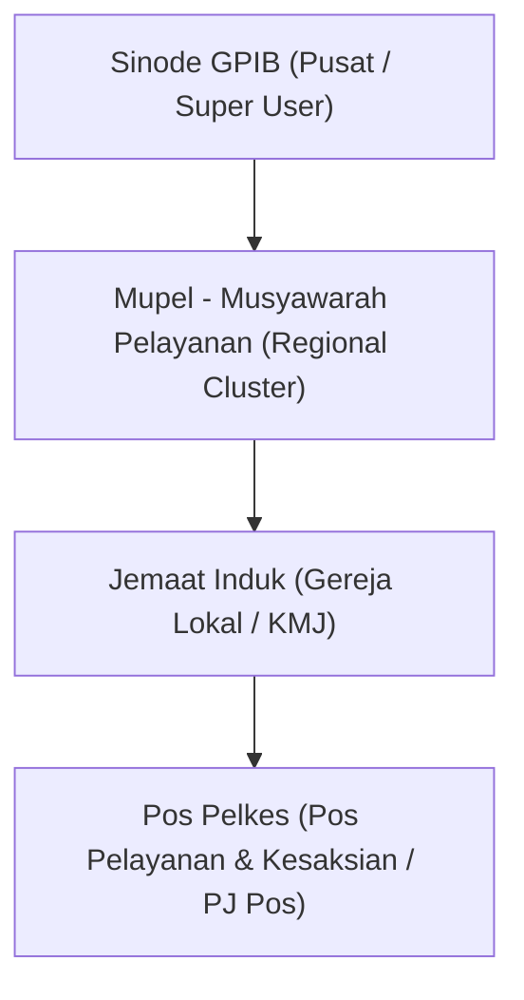
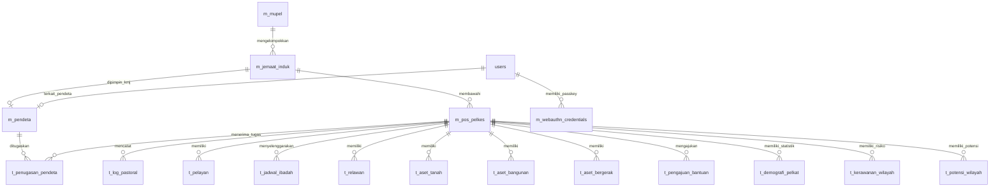

# Current State Inventory — SI GPIB v2.2

Audit menyeluruh dan inventarisasi kondisi terkini (Current State Inventory) dari codebase **SI GPIB v2.2** (*Sistem Informasi Gereja Protestan di Indonesia bagian Barat - Mobile First PWA*).

> [!NOTE]
> Laporan audit ini disusun tanpa melakukan perubahan kode maupun desain (sesuai instruksi *read-only audit*).

---

## 1. Organization Hierarchy (Hierarki Organisasi)

Hierarki organisasi GPIB pada aplikasi terstruktur dalam 4 level utama:

| Level | Entitas | Kunci Primary | Induk FK | Deskripsi & Cakupan |
| :--- | :--- | :--- | :--- | :--- |
| **Level 0** | **Sinode GPIB** | N/A | N/A | Tingkat Pusat. Cakupan nasional seluruh wilayah pelayanan GPIB. |
| **Level 1** | **Mupel** | `id_mupel` | N/A | Kluster regional yang mengoordinasikan beberapa Jemaat Induk (`m_mupel`). |
| **Level 2** | **Jemaat Induk** | `id_induk` | `id_mupel` | Gereja lokal mandiri yang dipimpin Ketua Majelis Jemaat (KMJ) (`m_jemaat_induk`). |
| **Level 3** | **Pos Pelkes** | `id_pos` | `id_induk` | Pos Pelayanan Kesaksian di daerah perintisan/pelayanan khusus di bawah Jemaat Induk (`m_pos_pelkes`). |

---

## 2. Roles & Permissions (Peran & Hak Akses / RBAC)

Sistem menggunakan **Role-Based Access Control (RBAC)** dan **Row Level Security (RLS)** pada Supabase PostgreSQL, dikombinasikan dengan pembatasan ruang lingkup (*scope-guard*) di tingkat API & Server Actions (`src/lib/utils/rbac.ts`).

### Matrix Peran (Roles)

| Role Code | Nama Role | Cakupan Akses (Scope) | Hak Akses Utama |
| :--- | :--- | :--- | :--- |
| `superadmin` / `super_user` | Super Admin / Sinode | Global (Seluruh sistem) | full CRUD seluruh Mupel, Jemaat, Pos, Pendeta, User, RLS bypass. |
| `admin_mupel` | Admin Mupel | 1 Mupel (`id_mupel`) | CRUD Jemaat & Pos di wilayah Mupelnya, kelola User Mupel, monitoring analitik. |
| `kmj` / `admin_jemaat` | Ketua Majelis Jemaat | 1 Jemaat Induk (`id_induk`) | CRUD Pos Pelkes di bawah Jemaatnya, persetujuan (approval) bantuan, penugasan PJ & Pendeta. |
| `pj_pos` / `pj` | Penanggung Jawab Pos | 1 Pos Pelkes (`id_pos`) | CRUD Log Pastoral, Demografi, Pelayan, Relawan, Aset Pos, Pengajuan Bantuan. |
| `pendeta` | Pendeta Organik / Non-Organik | Individual & Tempat Tugas | Melihat Profil 360, Riwayat Mutasi, Jabatan, Input Log Pastoral tempat bertugas. |
| `pelayan` | Presbiter / Pelayan | 1 Pos Pelkes (`id_pos`) | Input/View Log Pastoral & Jadwal Ibadah Pos. |
| `relawan` | Relawan Pos Pelkes | 1 Pos Pelkes (`id_pos`) | Input data lapangan (peta/survei/kegiatan). |
| `user` / `read_only` | Pengguna Read-Only | Terbatas sesuai asignasi | Hanya dapat melihat data (Read-Only) sesuai hierarki wilayahnya. |

---

## 3. Database Schema & Tables (Tabel Database & Relasi Data)

Database menggunakan Supabase PostgreSQL dengan 35 tabel utama yang dikelompokkan berdasarkan domain:

### Daftar Tabel Database

#### A. Master Data Hierarki & SDM
1. `m_mupel` — Master Data Mupel (`id_mupel`, `nama_mupel`, `keterangan`)
2. `m_jemaat_induk` — Master Data Jemaat Induk (`id_induk`, `id_mupel`, `nama_induk`, `alamat`, `latitude`, `longitude`, `id_kmj`, `foto_url`)
3. `m_pos_pelkes` — Master Data Pos Pelkes (`id_pos`, `id_induk`, `nama_pos`, `alamat`, `latitude`, `longitude`, `tgl_berdiri`)
4. `m_pendeta` — Master Data Pendeta (`id_pendeta`, `id_induk`, `nama_lengkap`, `no_wa`, `jabatan`, `nip`, `nik`, `status`, `is_kmj`, `is_pj`)

#### B. Auth, Pengguna & Keamanan
5. `users` — Akun pengguna terautentikasi (`id`, `email`, `no_telepon`, `id_pendeta`, `id_mupel`, `id_induk`, `id_pos`, `role`, `status`, `biometric_enabled`)
6. `m_webauthn_credentials` — Kredensial Biometrik / WebAuthn passkeys (`id`, `id_user`, `credential_id`, `public_key`, `counter`, `device_type`)
7. `webauthn_challenges` — Challenge temporary WebAuthn (`id`, `user_id`, `challenge`, `expires_at`)
8. `m_push_subscription` — Langganan Push Notification PWA (`id`, `id_user`, `endpoint`, `p256dh_key`, `auth_key`)

#### C. Penugasan, Mutasi & Profil 360 Pendeta
9. `t_pj_jemaat` — Penugasan KMJ / PJ Jemaat (`id`, `id_induk`, `id_pendeta`, `tanggal_mulai`, `tanggal_selesai`, `status`)
10. `t_penugasan_pendeta` — Penugasan Pendeta ke Pos (`id_tugas`, `id_pendeta`, `id_pos`, `tgl_mulai`, `tgl_selesai`, `status_tugas`)
11. `t_riwayat_mutasi_pendeta` — Catatan mutasi pendeta antar jemaat (`id_riwayat`, `id_pendeta`, `id_induk_lama`, `id_induk_baru`, `tgl_mutasi`, `alasan`)
12. `t_jabatan_struktural` — Riwayat Jabatan Struktural Pendeta (`id_jabatan`, `id_pendeta`, `nama_jabatan`, `tgl_mulai`, `tgl_selesai`)
13. `t_keluarga_pendeta` — Data Anggota Keluarga Pendeta (`id_keluarga`, `id_pendeta`, `nama`, `hubungan`, `tgl_lahir`, `foto_url`)
14. `t_kompetensi_pendeta` — Sertifikasi & Kompetensi Pendeta (`id_kompetensi`, `id_pendeta`, `nama_kompetensi`, `penerbit`, `dokumen_url`)
15. `t_keterlibatan_pendeta` — Keterlibatan Organisasi / Eksternal (`id_keterlibatan`, `id_pendeta`, `nama_organisasi`, `peran`)

#### D. Operasional Pelayanan Pos Pelkes
16. `t_log_pastoral` — Log kegiatan pastoral (`id_log`, `id_pos`, `id_pendeta`, `tgl`, `kegiatan`, `jml_jiwa`, `catatan`, `foto_url`)
17. `t_pelayan` — Data Pelayan & Presbiter Pos (`id_pelayan`, `id_pos`, `nama`, `no_wa`, `jabatan`, `status`)
18. `t_jadwal_ibadah` — Jadwal ibadah pos (`id_ibadah`, `id_pos`, `jenis`, `hari`, `jam`, `zona_waktu`)
19. `t_relawan` — Data relawan pos pelkes (`id_relawan`, `id_pos`, `nama`, `no_wa`, `kategori`, `pelatihan`)

#### E. Aset Pos Pelkes
20. `t_aset_tanah` — Asset Tanah (`id_tanah`, `id_pos`, `luas_m2`, `thn_perolehan`, `status_hukum`, `kondisi`, `latitude`, `longitude`)
21. `t_aset_bangunan` — Asset Bangunan (`id_bangunan`, `id_pos`, `nama_bangunan`, `fungsi`, `kondisi`, `thn_berdiri`)
22. `t_aset_bergerak` — Asset Bergerak / Kendaraan (`id_aset_b`, `id_pos`, `jenis`, `merk_tipe`, `no_polisi`, `kondisi`)
23. `t_lampiran_aset` — File foto/dokumen lampiran aset (`id_lampiran`, `id_tanah`, `id_bangunan`, `id_aset_b`, `file_path`)

#### F. Pengajuan Bantuan & Approval
24. `t_pengajuan_bantuan` — Pengajuan bantuan pos (`id_ajuan`, `id_pos`, `jenis_bantuan`, `biaya`, `urgensi`, `status`)
25. `t_approval_bantuan` — Histori persetujuan bantuan (`id`, `id_ajuan`, `approver_id`, `role_approver`, `aksi`, `catatan`)

#### G. Demografi & Geospasial Wilayah
26. `t_demografi_pelkat` — Data statistik per Pelkat (`id_pos`, `kategori_pelkat`, `jml_kk`, `laki`, `perempuan`, `profesi`, `pendidikan`)
27. `t_kerawanan_wilayah` — Pemetaan risiko/kerawanan pos (`id_risiko`, `id_pos`, `kategori`, `jenis_risiko`, `frekuensi`, `latitude`, `longitude`)
28. `t_lampiran_kerawanan` — Foto lampiran lokasi kerawanan (`id_lampiran`, `id_risiko`, `file_path`)
29. `t_potensi_wilayah` — Pemetaan potensi wilayah pos (`id_potensi`, `id_pos`, `nama_potensi`, `kategori`, `deskripsi`, `latitude`, `longitude`)
30. `t_lampiran_potensi` — Foto lampiran lokasi potensi (`id_lampiran`, `id_potensi`, `file_path`)

#### H. System Logs, Status, & Offline Support
31. `t_log_aktivitas` — Audit trail aktivitas user (`id_log`, `id_user`, `waktu`, `aktor`, `aksi`, `objek_type`, `objek_id`)
32. `t_form_draft` — Draft form lokal / offline sync (`id`, `id_user`, `form_type`, `objek_id`, `data`, `expires_at`)
33. `t_histori_perubahan_status` — Histori elevasi status pos/jemaat (`id_histori`, `id_pos`, `id_induk`, `status_lama`, `status_baru`, `catatan`)
34. `sys_transaction_logs` — System transaction logs (`id`, `tx_type`, `payload`, `status`, `error_message`)
35. `sys_telemetry` — Telemetry & metrics aplikasi (`id`, `event_name`, `metadata`, `timestamp`)

---

## 4. Route & Page Inventory (Daftar Rute & Halaman)

| Rute URL | Tipe / Group | File Halaman (`page.tsx`) | Deskripsi Fungsi |
| :--- | :--- | :--- | :--- |
| `/` | Public | `src/app/page.tsx` | Halaman landing / redirect otomatis |
| `/login` | Auth | `src/app/(auth)/login/page.tsx` | Login Email/Password & Biometrik Passkey |
| `/login/callback` | Auth | `src/app/(auth)/login/callback/page.tsx` | OAuth/Supabase Auth Callback Handler |
| `/register` | Auth | `src/app/(auth)/register/page.tsx` | Registrasi Akun Baru |
| `/forgot-password` | Auth | `src/app/(auth)/forgot-password/page.tsx` | Lupa Password & Reset Link |
| `/dashboard` | Dashboard | `src/app/(dashboard)/dashboard/page.tsx` | Beranda Dashboard Utama & Analytics Ringkasan |
| `/dashboard/peta` | Dashboard | `src/app/(dashboard)/dashboard/peta/page.tsx` | Peta Interaktif Sebaran Pos Pelkes & Mupel |
| `/dashboard/profil` | Dashboard | `src/app/(dashboard)/dashboard/profil/page.tsx` | Dashboard Profil Pelayanan & Statistik |
| `/dashboard/pastoral` | Dashboard | `src/app/(dashboard)/dashboard/pastoral/page.tsx` | Executive Dashboard Log Pastoral |
| `/dashboard/pos-pelkes` | Dashboard | `src/app/(dashboard)/dashboard/pos-pelkes/page.tsx` | Daftar Pos Pelkes |
| `/dashboard/pos-pelkes/baru` | Dashboard | `src/app/(dashboard)/dashboard/pos-pelkes/baru/page.tsx` | Form Tambah Pos Pelkes Baru |
| `/dashboard/pos-pelkes/[id_pos]` | Dashboard | `src/app/(dashboard)/dashboard/pos-pelkes/[id_pos]/page.tsx` | Detail Pos Pelkes (Multi-Tab) |
| `/dashboard/pos-pelkes/[id_pos]/edit` | Dashboard | `src/app/(dashboard)/dashboard/pos-pelkes/[id_pos]/edit/page.tsx` | Edit Data Pos Pelkes |
| `/hierarki` | Hierarki | `src/app/(dashboard)/hierarki/page.tsx` | Visualisasi Hierarki GPIB |
| `/hierarki/[id_mupel]` | Hierarki | `src/app/(dashboard)/hierarki/[id_mupel]/page.tsx` | Detail Mupel & Daftar Jemaat Induk |
| `/hierarki/[id_mupel]/[id_induk]` | Hierarki | `src/app/(dashboard)/hierarki/[id_mupel]/[id_induk]/page.tsx` | Detail Jemaat Induk & Daftar Pos Pelkes |
| `/hierarki/[id_mupel]/[id_induk]/[id_pos]` | Hierarki | `src/app/(dashboard)/hierarki/[id_mupel]/[id_induk]/[id_pos]/page.tsx` | Detail Pos Pelkes dalam Context Hierarki |
| `/mupel/[id_mupel]` | Mupel | `src/app/(dashboard)/mupel/[id_mupel]/page.tsx` | Mupel Detail Client Page |
| `/jemaat/[id_induk]` | Jemaat | `src/app/(dashboard)/jemaat/[id_induk]/page.tsx` | Jemaat Induk Detail Page |
| `/demografi/[id_pos]` | Demografi | `src/app/(dashboard)/demografi/[id_pos]/page.tsx` | Detail Demografi Pos Pelkes |
| `/demografi/[id_pos]/edit` | Demografi | `src/app/(dashboard)/demografi/[id_pos]/edit/page.tsx` | Edit Data Demografi Pelkat Pos |
| `/sdm` | SDM | `src/app/(dashboard)/sdm/page.tsx` | Landing Hub SDM (Pendeta, Pelayan, Relawan) |
| `/sdm/pendeta` | SDM | `src/app/(dashboard)/sdm/pendeta/page.tsx` | Management Data Pendeta |
| `/sdm/pendeta/baru` | SDM | `src/app/(dashboard)/sdm/pendeta/baru/page.tsx` | Form Input Pendeta Baru |
| `/sdm/pelayan` | SDM | `src/app/(dashboard)/sdm/pelayan/page.tsx` | Management Data Pelayan & Presbiter |
| `/sdm/pelayan/baru` | SDM | `src/app/(dashboard)/sdm/pelayan/baru/page.tsx` | Form Input Pelayan Baru |
| `/sdm/relawan` | SDM | `src/app/(dashboard)/sdm/relawan/page.tsx` | Management Data Relawan Pos |
| `/sdm/relawan/baru` | SDM | `src/app/(dashboard)/sdm/relawan/baru/page.tsx` | Form Input Relawan Baru |
| `/sdm/jadwal` | SDM | `src/app/(dashboard)/sdm/jadwal/page.tsx` | Management Jadwal Pelayanan/Ibadah |
| `/sdm/jadwal/baru` | SDM | `src/app/(dashboard)/sdm/jadwal/baru/page.tsx` | Form Tambah Jadwal Baru |
| `/pendeta` | Pendeta | `src/app/(dashboard)/pendeta/page.tsx` | Catalog & Filter Pendeta |
| `/pendeta/[id_pendeta]` | Pendeta | `src/app/(dashboard)/pendeta/[id_pendeta]/page.tsx` | Profil 360 Pendeta lengkap |
| `/pendeta/[id_pendeta]/jabatan` | Pendeta | `src/app/(dashboard)/pendeta/[id_pendeta]/jabatan/page.tsx` | Kelola Jabatan Struktural Pendeta |
| `/pelayan` | Pelayan | `src/app/(dashboard)/pelayan/page.tsx` | Daftar Pelayan |
| `/relawan` | Relawan | `src/app/(dashboard)/relawan/page.tsx` | Daftar Relawan |
| `/jadwal` | Jadwal | `src/app/(dashboard)/jadwal/page.tsx` | Daftar Jadwal Ibadah |
| `/pastoral` | Pastoral | `src/app/(dashboard)/pastoral/page.tsx` | Daftar & Riwayat Log Pastoral |
| `/pastoral/new` | Pastoral | `src/app/(dashboard)/pastoral/new/page.tsx` | Form Input Log Pastoral Baru (PWA/Offline) |
| `/wilayah` | Wilayah | `src/app/(dashboard)/wilayah/page.tsx` | Pemetaan Potensi & Kerawanan Wilayah |
| `/laporan` | Laporan | `src/app/(dashboard)/laporan/page.tsx` | Pusat Laporan |
| `/laporan/pastoral` | Laporan | `src/app/(dashboard)/laporan/pastoral/page.tsx` | Laporan Kegiatan Pastoral |
| `/laporan/pastoral/baru` | Laporan | `src/app/(dashboard)/laporan/pastoral/baru/page.tsx` | Form Laporan Pastoral Baru |
| `/laporan/aset` | Laporan | `src/app/(dashboard)/laporan/aset/page.tsx` | Laporan Inventaris Aset |
| `/laporan/aset/baru` | Laporan | `src/app/(dashboard)/laporan/aset/baru/page.tsx` | Form Input Aset Baru |
| `/laporan/demografi` | Laporan | `src/app/(dashboard)/laporan/demografi/page.tsx` | Laporan Aggregasi Demografi |
| `/laporan/kerawanan` | Laporan | `src/app/(dashboard)/laporan/kerawanan/page.tsx` | Laporan Risiko Kerawanan Wilayah |
| `/laporan/potensi` | Laporan | `src/app/(dashboard)/laporan/potensi/page.tsx` | Laporan Potensi Wilayah |
| `/settings` | Settings | `src/app/(dashboard)/settings/page.tsx` | Pengaturan Aplikasi |
| `/settings/profile` | Settings | `src/app/(dashboard)/settings/profile/page.tsx` | Edit Profil Pengguna & Biometrik Passkey |
| `/settings/users` | Settings | `src/app/(dashboard)/settings/users/page.tsx` | Manajemen User & Permission (Admin) |
| `/settings/users/[id]` | Settings | `src/app/(dashboard)/settings/users/[id]/page.tsx` | Edit Detail & Role User |
| `/peta-sebaran` | Public Portal | `src/app/(public)/peta-sebaran/page.tsx` | Portal Publik Peta Sebaran GPIB |
| `/peta-sebaran/[id]` | Public Portal | `src/app/(public)/peta-sebaran/[id]/page.tsx` | Portal Publik Detail Pos |
| `/offline` | System | `src/app/offline/page.tsx` | Halaman PWA Offline Fallback |

---

## 5. Components Inventory (Inventaris Komponen UI)

Komponen UI terbagi rapi berdasarkan domain dan kebutuhan visual:

### A. Core UI Components (`src/components/ui/`)
- `Modal.tsx` & `dialog.tsx` — Modal Dialog Serbaguna
- `alert-dialog.tsx` — Dialog Konfirmasi Peringatan/Hapus
- `sheet.tsx` — Slide-over Drawer & Bottom Sheet
- `button.tsx` — Dynamic Button dengan Status Loading
- `input.tsx`, `textarea.tsx`, `select.tsx`, `label.tsx` — Primitive Form Inputs
- `card.tsx`, `badge.tsx`, `avatar.tsx`, `tabs.tsx`, `skeleton.tsx` — UI Visual Blocks
- `search-bar.tsx` — Bar Pencarian dengan Debounce
- `NetworkStatusBadge.tsx` — Indicator Online/Offline Realtime
- `SecureDeleteModal.tsx` — Modal Hapus dengan Konfirmasi Teks Aman
- `PosName.tsx` — Text Chip Nama Pos Pelkes Terformat

### B. Navigation & Mobile UI (`src/components/mobile/` & `src/components/layout/`)
- `Sidebar.tsx` — Navigation Drawer/Sidebar Desktop
- `BottomNavigation.tsx` — Bottom Bar Navigasi Mobile 5-Tab
- `SuperBottomNav.tsx` & `SuperButton.tsx` — Floating Action Super Menu Button
- `MasterMenuSheet.tsx`, `MenuGroup.tsx`, `NavItem.tsx` — Bottom Sheet Menu Penuh
- `BottomSheet.tsx` — Draggable Bottom Sheet Container
- `QuickActionSheet.tsx` & `QuickPosSheet.tsx` — Quick Selector Action Sheet
- `MobileHeader.tsx` & `MobileHeaderBreadcrumb.tsx` — Header App Mobile
- `ContextChip.tsx` — Chip konteks hierarki aktif
- `NetworkBanner.tsx`, `OfflineIndicator.tsx` — Alert Banner Konektivitas
- `PullToRefresh.tsx` — Gesture Touch Refresh Halaman

### C. Maps & Geospasial (`src/components/maps/` & `src/components/wilayah/`)
- `MapWrapper.tsx` — Leaflet Map Container Client Wrapper
- `MupelClusterMap.tsx` & `MupelClusterMapInner.tsx` — Map Clustering Mupel & Pos
- `PosPelkesMap.tsx`, `PosMiniMap.tsx`, `PosThumbnailMap.tsx` — Marker Detail Pos
- `WilayahMap.tsx` & `WilayahMapInner.tsx` — Map Plotting Kerawanan & Potensi
- `PublicMap.tsx` — Peta Portal Publik
- `GpsIndicator.tsx` / `GpsInput.tsx` — Komponen Capture Geolocation Koordinat Presisi

### D. Pastoral, Pendeta & Profil 360 (`src/components/pastoral/` & `src/components/pendeta/`)
- `PastoralCard.tsx`, `PastoralDetail.tsx`, `PastoralFilter.tsx`, `PastoralStats.tsx` — Log Pastoral UI
- `LogPastoralForm.tsx`, `PastoralForm.tsx`, `PastoralFormClient.tsx` — Form Log Pastoral
- `PastoralPhotoPicker.tsx` — Picker Foto Kegiatan Pastoral
- `Profile360View.tsx`, `ProfileHeader.tsx`, `ProfileSection.tsx`, `ProfileStatsStrip.tsx` — Tab Profil 360 Pendeta
- `MutasiButton.tsx`, `MutasiForm.tsx`, `MutasiPendetaForm.tsx`, `MutationDialog.tsx`, `MutationTimeline.tsx` — Mutasi Pendeta
- `JabatanStrukturalCard.tsx`, `JabatanStrukturalForm.tsx`, `JabatanTimeline.tsx` — Jabatan Pendeta
- `DeletePendetaDialog.tsx`, `KontrakAlert.tsx`, `OrganikBadge.tsx` — Dialog & Badge Status Pendeta
- `AuditSection.tsx`, `BiometricSection.tsx`, `JabatanSection.tsx`, `KeluargaSection.tsx`, `KompetensiSection.tsx`, `KeterlibatanSection.tsx`, `MutasiSection.tsx`, `PelayananSection.tsx` — Sub-Seksi Profil 360

### E. Aset, Bantuan, Demografi & Hierarki (`src/components/aset/`, `src/components/bantuan/`, `src/components/demografi/`, `src/components/hierarki/`)
- `AsetCard.tsx`, `AsetForm.tsx`, `AsetTabs.tsx`, `CameraCapture.tsx`, `AssetFormClient.tsx` — Form & Management Aset
- `BantuanCard.tsx`, `BantuanForm.tsx`, `BantuanFormClient.tsx`, `BantuanReviewActions.tsx`, `BantuanStatusBadge.tsx`, `BantuanTimeline.tsx`, `WorkflowTimeline.tsx`, `AjukanUlangButton.tsx` — Management & Approval Bantuan
- `DemografiCard.tsx`, `DemografiChart.tsx`, `DemografiForm.tsx`, `DemografiEditFormClient.tsx`, `KategoriPelkatCard.tsx` — Demografi Pelkat
- `HierarchyTree.tsx`, `HierarchyStats.tsx`, `BreadcrumbNav.tsx`, `HierarkiNavTabs.tsx` — Visualisator Hierarki
- `MupelCard.tsx`, `JemaatCard.tsx`, `MupelFormModal.tsx`, `JemaatFormModal.tsx`, `PosFormModal.tsx`, `StatusElevationModal.tsx`, `StatusHistoryTimeline.tsx` — CRUD & Elevasi Status Hierarki
- `JemaatCascadingSelector.tsx`, `PosCascadingSelector.tsx`, `MupelSelect.tsx`, `JemaatSelect.tsx`, `PosSelect.tsx` — Multi-level Cascading Selectors

### F. Analytics & Charts (`src/components/analytics/` & `src/components/charts/`)
- `AnalyticsStatCard.tsx`, `KPICard.tsx`, `ScopeIndicator.tsx`, `DistributionChart.tsx`, `GrowthChart.tsx` — Analytics Dashboard Widgets
- `AsetKondisiChart.tsx`, `BantuanStatusChart.tsx`, `DemografiBarChart.tsx`, `DemografiDonutChart.tsx`, `DemografiStackedChart.tsx` — Visualisasi Grafik Recharts/SVG

### G. Auth & Biometrics (`src/components/auth/` & `src/components/biometric/`)
- `BiometricLogin.tsx` — Passkey / Fingerprint Login Component
- `BiometricSetup.tsx` — Passkey Registration in Settings
- `ReadOnlyNoticeBanner.tsx` — Notice Banner untuk User Read-Only

---

## 6. Navigation & Menu Inventory (Struktur Navigasi & Menu)

Navigasi aplikasi terbagi dalam 3 struktur utama (`src/lib/constants/navigation.ts`):

### A. Direct Bottom Navigation (5 Action Items Utama)
1. **Beranda** (`/dashboard`) — Icon: `Home`
2. **Peta** (`/dashboard/peta`) — Icon: `Map`
3. **Super Button (+)** — Triggers `MasterMenuSheet`
4. **Laporan** (`/laporan`) — Icon: `FileText`
5. **Profil** (`/settings/profile`) — Icon: `User`

### B. Super Button Menu Groups (Bottom Sheet Menu Inisiasi Cepat)
- **Input Cepat**:
  - Log Pastoral (`/pastoral/new`) — Color: `#3B82F6` (Blue)
  - Foto Aset (`/laporan/aset/baru`) — Color: `#10B981` (Emerald)
  - Pengajuan Bantuan (`/bantuan/new`) — Color: `#F59E0B` (Amber)
- **Data Pelayanan**:
  - Data Pelayan (`/pelayan`) — Color: `#8B5CF6` (Violet)
  - Pos Pelkes Baru (`/dashboard/pos-pelkes/baru`) — Color: `#EF4444` (Red)
  - Demografi (`/laporan/demografi`) — Color: `#06B6D4` (Cyan)
  - Jadwal Ibadah (`/jadwal`) — Color: `#EC4899` (Pink)

### C. Drawer & Sidebar Menu Groups
- **Pelayanan Utama**: Dashboard (`/dashboard`), Pos Pelkes (`/dashboard/pos-pelkes`), Hierarki GPIB (`/hierarki`)
- **SDM & Pastoral**: Pelayan & Presbiter (`/pelayan`), Log Pastoral (`/pastoral/new`)
- **Pengaturan & Bantuan**: Pengaturan (`/settings/profile`), Bantuan (`/bantuan`)

---

## 7. CRUD Operations & Server Actions Inventory (Daftar Operasi CRUD)

Semua operasi CRUD dikelola melalui Next.js **Server Actions** dan Supabase RPCs:

### Daftar File Server Actions (`'use server'`)

| Module / Domain | File Server Action | Fungsi Utama (CRUD) |
| :--- | :--- | :--- |
| **Log Pastoral** | `src/app/actions/log-pastoral.ts` & `src/lib/domains/pastoral/pastoral.service.ts` | `createLogPastoralAction`, `getLogPastoralByPos`, `deleteLogPastoralAction`, `getPastoralStats` |
| **Aset Pos** | `src/app/actions/aset.ts` & `src/lib/domains/aset/aset.service.ts` | `createAsetTanahAction`, `createAsetBangunanAction`, `createAsetBergerakAction`, `uploadLampiranAset` |
| **Pengajuan Bantuan** | `src/app/actions/bantuan.ts` & `src/lib/domains/bantuan/bantuan.service.ts` | `createPengajuanBantuanAction`, `approvePengajuanBantuanAction`, `rejectPengajuanBantuanAction` |
| **Demografi** | `src/app/actions/demografi.ts` | `upsertDemografiPelkatAction`, `getDemografiByPosAction` |
| **SDM Pendeta & 360** | `src/app/(dashboard)/sdm/pendeta/actions-360.ts` & `actions-mutasi.ts` | `addKeluargaAction`, `addKompetensiAction`, `addKeterlibatanAction`, `mutasiPendetaAction` |
| **User & Role Admin** | `src/app/(dashboard)/settings/users/actions.ts` | `createUserAction`, `updateUserRoleAction`, `updateUserStatusAction`, `deleteUserAction` |
| **Profil & Password** | `src/app/(dashboard)/settings/actions.ts` | `updateProfileAction`, `changePasswordAction`, `toggleBiometricAction` |
| **Hierarki & Pos** | `src/app/(dashboard)/hierarki/jemaat-actions.ts` & `pos-pelkes/baru/actions.ts` | `createMupelAction`, `createJemaatAction`, `createPosAction`, `elevateStatusPosAction` |
| **Auth & Account** | `src/app/(auth)/login/actions.ts` & `register/actions.ts` | `loginWithPasswordAction`, `registerAccountAction`, `resetPasswordAction` |

---

## 8. Modals & Drawers Inventory (Daftar Modal & Drawer UI)

### Modals Inventory
1. `JemaatFormModal` — Modal Tambah/Edit Jemaat Induk
2. `MupelFormModal` — Modal Tambah/Edit Mupel
3. `PosFormModal` — Modal Tambah/Edit Pos Pelkes
4. `StatusElevationModal` — Modal Elevasi Status (Pos -> Jemaat Induk / Pos Mandiri)
5. `EditProfileModal` — Modal Edit Profil Pengguna & Avatar
6. `SecureDeleteModal` — Modal Konfirmasi Hapus Data Sensitif (memerlukan ketik kata kunci)
7. `DeletePendetaDialog` — Modal Konfirmasi Hapus Pendeta
8. `MutationDialog` — Modal Konfirmasi Mutasi Pendeta

### Drawers & Bottom Sheets Inventory
1. `MasterMenuSheet` — Full-page Bottom Sheet Super Menu
2. `MobileDrawer` — Left-side Drawer Navigation Sidebar
3. `BottomSheet` — Container Draggable Bottom Sheet
4. `QuickActionSheet` — Quick Actions Selector Bottom Sheet
5. `QuickPosSheet` — Pos Selector Sheet

---

## 9. API Routes Inventory (Daftar Endpoint API)

| HTTP Method | API Endpoint Route | File Route Handler | Deskripsi Fungsi |
| :--- | :--- | :--- | :--- |
| `GET`, `POST` | `/api/admin/users` | `src/app/api/admin/users/route.ts` | Endpoint manajemen user admin |
| `GET` | `/api/auth/callback` | `src/app/api/auth/callback/route.ts` | Endpoint callback OAuth Supabase |
| `POST` | `/api/auth/logout` | `src/app/api/auth/logout/route.ts` | Endpoint session logout |
| `GET` | `/api/auth/me` | `src/app/api/auth/me/route.ts` | Endpoint status user aktif & metadata |
| `POST` | `/api/auth/webauthn/login/options` | `src/app/api/auth/webauthn/login/options/route.ts` | Generate challenge biometrik login |
| `POST` | `/api/auth/webauthn/login/verify` | `src/app/api/auth/webauthn/login/verify/route.ts` | Verifikasi signature passkey login |
| `POST` | `/api/auth/webauthn/register/options` | `src/app/api/auth/webauthn/register/options/route.ts` | Generate challenge registrasi passkey |
| `POST` | `/api/auth/webauthn/register/verify` | `src/app/api/auth/webauthn/register/verify/route.ts` | Verifikasi & simpan passkey biometrik |
| `GET` | `/api/auth/webauthn/status` | `src/app/api/auth/webauthn/status/route.ts` | Cek status ketersediaan biometrik user |

---

## 10. Summary Audit Metrics (Ringkasan Audit)

- **Total Page Routes**: 54 Halaman
- **Total API Routes**: 9 Endpoints
- **Total Server Action Files**: 19 Files
- **Total UI Components**: 130+ Komponen
- **Total Database Tables**: 35 Tabel PostgreSQL
- **Total Database Migrations**: 68 Migration Files
- **Hierarki Level**: 4 Level (Sinode -> Mupel -> Jemaat Induk -> Pos Pelkes)
- **Status Audit**: ✅ Clean, Full Match with PRD v2.2, Code Unmodified.
