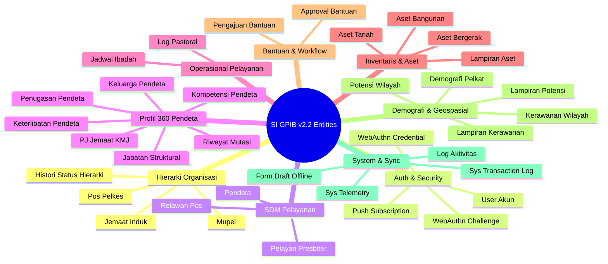

# Entity Inventory — SI GPIB v2.2

Dokumen ini berisi identifikasi dan inventarisasi **seluruh entitas (Entities)** dalam sistem aplikasi **SI GPIB v2.2**, mencakup tabel database, antarmuka TypeScript, atribut utama, kunci (*Primary Key & Foreign Key*), relasi, dan peran bisnisnya dalam aplikasi.

---

## Ringkasan Eksekutif Entitas

Seluruh sistem aplikasi SI GPIB v2.2 didukung oleh **35 Entitas Utama** yang terbagi dalam **9 Kategori Domain Business**:

---

## 1. Domain Hierarki Organisasi

### 1.1 Entitas: `Mupel` (Musyawarah Pelayanan)
- **Tabel Database**: `m_mupel`
- **Primary Key**: `id_mupel` (VARCHAR)
- **Atribut Utama**: `nama_mupel`, `keterangan`, `created_at`, `updated_at`
- **Relasi**:
  - *One-to-Many* ke `JemaatInduk` (`m_jemaat_induk.id_mupel`)
  - *One-to-Many* ke `User` (`users.id_mupel`)
- **Deskripsi**: Mewakili entitas wilayah koordinasi kluster regional gereja-gereja GPIB.

### 1.2 Entitas: `JemaatInduk` (Gereja Lokal Mandiri)
- **Tabel Database**: `m_jemaat_induk`
- **Primary Key**: `id_induk` (VARCHAR)
- **Foreign Keys**: `id_mupel` $\rightarrow$ `Mupel`, `id_kmj` $\rightarrow$ `Pendeta`
- **Atribut Utama**: `nama_induk`, `alamat`, `latitude`, `longitude`, `foto_url`, `keterangan`
- **Relasi**:
  - *Many-to-One* ke `Mupel`
  - *One-to-One* ke `Pendeta` (KMJ)
  - *One-to-Many* ke `PosPelkes` (`m_pos_pelkes.id_induk`)
- **Deskripsi**: Entitas gereja lokal GPIB mandiri yang membawahi pos-pos pelayanan.

### 1.3 Entitas: `PosPelkes` (Pos Pelayanan & Kesaksian)
- **Tabel Database**: `m_pos_pelkes`
- **Primary Key**: `id_pos` (VARCHAR)
- **Foreign Key**: `id_induk` $\rightarrow$ `JemaatInduk`
- **Atribut Utama**: `nama_pos`, `alamat`, `latitude`, `longitude`, `tgl_berdiri`, `keterangan`
- **Relasi**:
  - *Many-to-One* ke `JemaatInduk`
  - *One-to-Many* ke `LogPastoral`, `Pelayan`, `JadwalIbadah`, `Relawan`, `AsetTanah`, `AsetBangunan`, `AsetBergerak`, `PengajuanBantuan`, `DemografiPelkat`, `KerawananWilayah`, `PotensiWilayah`
- **Deskripsi**: Entitas pos pelayanan perintisan / daerah pelayanan khusus.

### 1.4 Entitas: `HistoriStatusHierarki`
- **Tabel Database**: `t_histori_perubahan_status`
- **Primary Key**: `id_histori` (SERIAL)
- **Foreign Keys**: `id_pos` $\rightarrow$ `PosPelkes`, `id_induk` $\rightarrow$ `JemaatInduk`
- **Atribut Utama**: `status_lama`, `status_baru`, `catatan`, `created_at`
- **Deskripsi**: Catatan jejak riwayat elevasi/kemandirian status pos pelkes.

---

## 2. Domain Auth, User & Keamanan

### 2.1 Entitas: `User` (Akun Pengguna)
- **Tabel Database**: `users` (terintegrasi dengan `auth.users`)
- **Type/Interface**: `ProfileAkun` (`src/types/profile.types.ts`)
- **Primary Key**: `id` (UUID)
- **Foreign Keys**: `id_pendeta`, `id_mupel`, `id_induk`, `id_pos`
- **Atribut Utama**: `email`, `no_telepon`, `role`, `status`, `biometric_enabled`, `last_login_at`
- **Relasi**: *One-to-Many* ke `WebAuthnCredential`, `PushSubscription`, `LogAktivitas`, `FormDraft`.
- **Deskripsi**: Entitas subjek autentikasi pengguna aplikasi.

### 2.2 Entitas: `WebAuthnCredential` (Passkey Biometrik)
- **Tabel Database**: `m_webauthn_credentials`
- **Type/Interface**: `DeviceBiometricItem`
- **Primary Key**: `id` (UUID)
- **Foreign Key**: `id_user` $\rightarrow$ `User`
- **Atribut Utama**: `credential_id`, `public_key`, `counter`, `device_type`, `transports`, `display_name`, `last_used_at`
- **Deskripsi**: Kredensial biometrik (sidik jari / FaceID) terdaftar per perangkat user.

### 2.3 Entitas: `WebAuthnChallenge`
- **Tabel Database**: `webauthn_challenges`
- **Primary Key**: `id` (UUID)
- **Foreign Key**: `user_id` $\rightarrow$ `User`
- **Atribut Utama**: `challenge`, `expires_at`
- **Deskripsi**: Challenge sementara untuk proses verifikasi handshake WebAuthn.

### 2.4 Entitas: `PushSubscription`
- **Tabel Database**: `m_push_subscription`
- **Primary Key**: `id` (UUID)
- **Foreign Key**: `id_user` $\rightarrow$ `User`
- **Atribut Utama**: `endpoint`, `p256dh_key`, `auth_key`, `user_agent`
- **Deskripsi**: Token langganan push notifikasi browser PWA.

---

## 3. Domain SDM & Personel Pelayanan

### 3.1 Entitas: `Pendeta`
- **Tabel Database**: `m_pendeta`
- **Type/Interface**: `ProfilePelayanan`, `Pendeta`
- **Primary Key**: `id_pendeta` (VARCHAR)
- **Foreign Key**: `id_induk` $\rightarrow$ `JemaatInduk`
- **Atribut Utama**: `nama_lengkap`, `no_wa`, `jabatan`, `status`, `nip`, `nik`, `tgl_lahir`, `gender`, `tgl_tugas`, `is_kmj`, `is_pj`, `foto_url`
- **Relasi**:
  - *Many-to-One* ke `JemaatInduk` (Homebase)
  - *One-to-Many* ke `PenugasanPendeta`, `RiwayatMutasiPendeta`, `JabatanStruktural`, `KeluargaPendeta`, `KompetensiPendeta`, `KeterlibatanPendeta`, `LogPastoral`.
- **Deskripsi**: Entitas pejabat pendeta GPIB (organik & non-organik).

### 3.2 Entitas: `Pelayan` (Presbiter & Pelayan Pos)
- **Tabel Database**: `t_pelayan`
- **Type/Interface**: `Pelayan`
- **Primary Key**: `id_pelayan` (VARCHAR)
- **Foreign Key**: `id_pos` $\rightarrow$ `PosPelkes`
- **Atribut Utama**: `nama`, `no_wa`, `jabatan`, `tgl_lahir`, `gender`, `status`, `foto_url`
- **Deskripsi**: Entitas presbiter (Penatua/Diaken) atau pelayan yang bertugas di Pos Pelkes.

### 3.3 Entitas: `Relawan`
- **Tabel Database**: `t_relawan`
- **Type/Interface**: `Relawan`
- **Primary Key**: `id_relawan` (VARCHAR)
- **Foreign Key**: `id_pos` $\rightarrow$ `PosPelkes`
- **Atribut Utama**: `nama`, `no_wa`, `tgl_lahir`, `gender`, `kategori`, `pelatihan`, `foto_url`
- **Deskripsi**: Entitas tenaga relawan pendukung pelayanan pos pelkes.

---

## 4. Domain Profil 360 Pendeta

### 4.1 Entitas: `PenugasanPendeta`
- **Tabel Database**: `t_penugasan_pendeta`
- **Primary Key**: `id_tugas` (VARCHAR)
- **Foreign Keys**: `id_pendeta` $\rightarrow$ `Pendeta`, `id_pos` $\rightarrow$ `PosPelkes`
- **Atribut Utama**: `tgl_mulai`, `tgl_selesai`, `status_tugas`
- **Deskripsi**: Penugasan spesifik pendeta di pos pelkes.

### 4.2 Entitas: `PjJemaat` (Penugasan KMJ/PJ Jemaat)
- **Tabel Database**: `t_pj_jemaat`
- **Primary Key**: `id` (SERIAL)
- **Foreign Keys**: `id_induk` $\rightarrow$ `JemaatInduk`, `id_pendeta` $\rightarrow$ `Pendeta`
- **Atribut Utama**: `tanggal_mulai`, `tanggal_selesai`, `status`
- **Deskripsi**: SK Penunjukan Pendeta sebagai Ketua Majelis Jemaat.

### 4.3 Entitas: `RiwayatMutasiPendeta`
- **Tabel Database**: `t_riwayat_mutasi_pendeta`
- **Type/Interface**: `RiwayatMutasiItem`
- **Primary Key**: `id_riwayat` (VARCHAR)
- **Foreign Keys**: `id_pendeta` $\rightarrow$ `Pendeta`, `id_induk_lama` $\rightarrow$ `JemaatInduk`, `id_induk_baru` $\rightarrow$ `JemaatInduk`
- **Atribut Utama**: `tgl_mutasi`, `jenis_mutasi`, `alasan`
- **Deskripsi**: Catatan historis alih tugas / mutasi pendeta antar jemaat.

### 4.4 Entitas: `JabatanStruktural`
- **Tabel Database**: `t_jabatan_struktural`
- **Primary Key**: `id_jabatan` (VARCHAR)
- **Foreign Key**: `id_pendeta` $\rightarrow$ `Pendeta`
- **Atribut Utama**: `nama_jabatan`, `tgl_mulai`, `tgl_selesai`, `keterangan`
- **Deskripsi**: Jabatan kepengurusan struktural pendeta di majelis / mupel / sinode.

### 4.5 Entitas: `KeluargaPendeta`
- **Tabel Database**: `t_keluarga_pendeta`
- **Primary Key**: `id_keluarga` (VARCHAR)
- **Foreign Key**: `id_pendeta` $\rightarrow$ `Pendeta`
- **Atribut Utama**: `nama`, `hubungan`, `tgl_lahir`, `foto_url`
- **Deskripsi**: Anggota keluarga inti pendeta (pasangan & anak).

### 4.6 Entitas: `KompetensiPendeta`
- **Tabel Database**: `t_kompetensi_pendeta`
- **Primary Key**: `id_kompetensi` (VARCHAR)
- **Foreign Key**: `id_pendeta` $\rightarrow$ `Pendeta`
- **Atribut Utama**: `nama_kompetensi`, `penerbit`, `thn_perolehan`, `dokumen_url`
- **Deskripsi**: Sertifikasi, pelatihan formal, dan kompetensi pendeta.

### 4.7 Entitas: `KeterlibatanPendeta`
- **Tabel Database**: `t_keterlibatan_pendeta`
- **Primary Key**: `id_keterlibatan` (VARCHAR)
- **Foreign Key**: `id_pendeta` $\rightarrow$ `Pendeta`
- **Atribut Utama**: `nama_organisasi`, `peran`, `thn_mulai`, `thn_selesai`
- **Deskripsi**: Rekam jejak keaktifan pendeta dalam organisasi eksternal.

---

## 5. Domain Operasional Pelayanan

### 5.1 Entitas: `LogPastoral`
- **Tabel Database**: `t_log_pastoral`
- **Type/Interface**: `LogPastoral`, `LogPastoralRingkasItem`
- **Primary Key**: `id_log` (VARCHAR)
- **Foreign Keys**: `id_pos` $\rightarrow$ `PosPelkes`, `id_pendeta` $\rightarrow$ `Pendeta`
- **Atribut Utama**: `tgl`, `kegiatan`, `jml_jiwa`, `catatan`, `keterangan`, `foto_url`
- **Deskripsi**: Catatan rekap kegiatan penggembalaan, ibadah, & pelayanan lapangan.

### 5.2 Entitas: `JadwalIbadah`
- **Tabel Database**: `t_jadwal_ibadah`
- **Type/Interface**: `JadwalIbadah`
- **Primary Key**: `id_ibadah` (VARCHAR)
- **Foreign Key**: `id_pos` $\rightarrow$ `PosPelkes`
- **Atribut Utama**: `jenis`, `hari`, `jam`, `zona_waktu`, `keterangan`
- **Deskripsi**: Agenda jadwal ibadah rutin di pos pelkes.

---

## 6. Domain Inventaris & Aset

### 6.1 Entitas: `AsetTanah`
- **Tabel Database**: `t_aset_tanah`
- **Primary Key**: `id_tanah` (VARCHAR)
- **Foreign Key**: `id_pos` $\rightarrow$ `PosPelkes`
- **Atribut Utama**: `luas_m2`, `thn_perolehan`, `status_hukum`, `kondisi`, `potensi_sda`, `latitude`, `longitude`
- **Relasi**: *One-to-Many* ke `LampiranAset`.
- **Deskripsi**: Data aset tidak bergerak berupa bidang tanah milik/dikelola pos pelkes.

### 6.2 Entitas: `AsetBangunan`
- **Tabel Database**: `t_aset_bangunan`
- **Primary Key**: `id_bangunan` (VARCHAR)
- **Foreign Key**: `id_pos` $\rightarrow$ `PosPelkes`
- **Atribut Utama**: `nama_bangunan`, `fungsi`, `kondisi`, `thn_berdiri`
- **Relasi**: *One-to-Many* ke `LampiranAset`.
- **Deskripsi**: Data aset fisik bangunan gedung gereja / pastori pos.

### 6.3 Entitas: `AsetBergerak`
- **Tabel Database**: `t_aset_bergerak`
- **Primary Key**: `id_aset_b` (VARCHAR)
- **Foreign Key**: `id_pos` $\rightarrow$ `PosPelkes`
- **Atribut Utama**: `jenis`, `merk_tipe`, `thn_perolehan`, `no_polisi`, `tgl_pajak`, `kondisi`
- **Relasi**: *One-to-Many* ke `LampiranAset`.
- **Deskripsi**: Data aset bergerak berupa kendaraan operasional atau alat inventaris pos.

### 6.4 Entitas: `LampiranAset`
- **Tabel Database**: `t_lampiran_aset`
- **Primary Key**: `id_lampiran` (VARCHAR)
- **Foreign Keys**: `id_tanah`, `id_bangunan`, `id_aset_b`
- **Atribut Utama**: `nama_file`, `file_path`, `tipe_file`, `ukuran_file`
- **Deskripsi**: File sertifikat, foto fisik, atau dokumen pendukung aset.

---

## 7. Domain Pengajuan Bantuan & Workflow

### 7.1 Entitas: `PengajuanBantuan`
- **Tabel Database**: `t_pengajuan_bantuan`
- **Type/Interface**: `PengajuanBantuan`
- **Primary Key**: `id_ajuan` (VARCHAR)
- **Foreign Keys**: `id_pos` $\rightarrow$ `PosPelkes`, `id_tanah`, `id_bangunan`, `id_aset_b`
- **Atribut Utama**: `jenis_bantuan`, `biaya`, `urgensi`, `status` (`Draft`, `Diajukan`, `Disetujui_KMJ`, `Disetujui_Mupel`, `Ditolak`)
- **Relasi**: *One-to-Many* ke `ApprovalBantuan`.
- **Deskripsi**: Permohonan dana/bantuan operasional atau fisik dari Pos Pelkes.

### 7.2 Entitas: `ApprovalBantuan`
- **Tabel Database**: `t_approval_bantuan`
- **Primary Key**: `id` (SERIAL)
- **Foreign Keys**: `id_ajuan` $\rightarrow$ `PengajuanBantuan`, `approver_id` $\rightarrow$ `User`
- **Atribut Utama**: `role_approver`, `aksi` (`Approve`, `Reject`, `Revision`), `catatan`, `created_at`
- **Deskripsi**: Catatan keputusan persetujuan berjenjang dari KMJ dan Mupel.

---

## 8. Domain Demografi & Geospasial Wilayah

### 8.1 Entitas: `DemografiPelkat`
- **Tabel Database**: `t_demografi_pelkat`
- **Type/Interface**: `DemografiPelkat`
- **Composite Primary Key**: `(id_pos, kategori_pelkat)`
- **Foreign Key**: `id_pos` $\rightarrow$ `PosPelkes`
- **Atribut Utama**: `kategori_pelkat` (`PA`, `PT`, `GP`, `PKP`, `PKB`, `PKLU`), `jml_kk`, `laki`, `perempuan`, `profesi`, `pendidikan`
- **Deskripsi**: Data populasi jemaat terpisahkan per kategori Pelayanan Kategorial.

### 8.2 Entitas: `KerawananWilayah`
- **Tabel Database**: `t_kerawanan_wilayah`
- **Primary Key**: `id_risiko` (VARCHAR)
- **Foreign Key**: `id_pos` $\rightarrow$ `PosPelkes`
- **Atribut Utama**: `kategori`, `jenis_risiko`, `frekuensi`, `latitude`, `longitude`
- **Relasi**: *One-to-Many* ke `LampiranKerawanan`.
- **Deskripsi**: Pemetaan potensi titik kerawanan bencana / tantangan sosial di wilayah pos.

### 8.3 Entitas: `LampiranKerawanan`
- **Tabel Database**: `t_lampiran_kerawanan`
- **Primary Key**: `id_lampiran` (VARCHAR)
- **Foreign Key**: `id_risiko` $\rightarrow$ `KerawananWilayah`
- **Atribut Utama**: `nama_file`, `file_path`
- **Deskripsi**: Foto bukti lokasi titik kerawanan.

### 8.4 Entitas: `PotensiWilayah`
- **Tabel Database**: `t_potensi_wilayah`
- **Primary Key**: `id_potensi` (VARCHAR)
- **Foreign Key**: `id_pos` $\rightarrow$ `PosPelkes`
- **Atribut Utama**: `nama_potensi`, `kategori`, `deskripsi`, `latitude`, `longitude`
- **Relasi**: *One-to-Many* ke `LampiranPotensi`.
- **Deskripsi**: Pemetaan titik potensi ekonomi, sumber daya alam, dan kemitraan di wilayah pos.

### 8.5 Entitas: `LampiranPotensi`
- **Tabel Database**: `t_lampiran_potensi`
- **Primary Key**: `id_lampiran` (VARCHAR)
- **Foreign Key**: `id_potensi` $\rightarrow$ `PotensiWilayah`
- **Atribut Utama**: `nama_file`, `file_path`
- **Deskripsi**: Foto bukti lokasi potensi wilayah.

---

## 9. Domain Audit, System & Offline Sync

### 9.1 Entitas: `LogAktivitas` (Audit Trail)
- **Tabel Database**: `t_log_aktivitas`
- **Type/Interface**: `AktivitasUserItem`
- **Primary Key**: `id_log` (VARCHAR)
- **Foreign Key**: `id_user` $\rightarrow$ `User`
- **Atribut Utama**: `waktu`, `aktor`, `aksi`, `objek_type`, `objek_id`, `keterangan`
- **Deskripsi**: Audit trail keamanan pencatatan seluruh aksi perubahan data oleh user.

### 9.2 Entitas: `FormDraft` (Offline Sync Buffer)
- **Tabel Database**: `t_form_draft`
- **Type/Interface**: `DraftUserItem`
- **Primary Key**: `id` (UUID)
- **Foreign Key**: `id_user` $\rightarrow$ `User`
- **Atribut Utama**: `form_type`, `objek_id`, `data` (JSONB), `expires_at`
- **Deskripsi**: Tempat penampungan draft form lokal sebelum tersinkronisasi ke server saat online.

### 9.3 Entitas: `SysTransactionLog`
- **Tabel Database**: `sys_transaction_logs`
- **Primary Key**: `id` (SERIAL)
- **Atribut Utama**: `tx_type`, `payload`, `status`, `error_message`, `created_at`
- **Deskripsi**: Log transaksi sistem internal untuk background jobs & sync queues.

### 9.4 Entitas: `SysTelemetry`
- **Tabel Database**: `sys_telemetry`
- **Primary Key**: `id` (SERIAL)
- **Atribut Utama**: `event_name`, `metadata` (JSONB), `timestamp`
- **Deskripsi**: Metrik telemetri performa PWA & penggunaan fitur.
