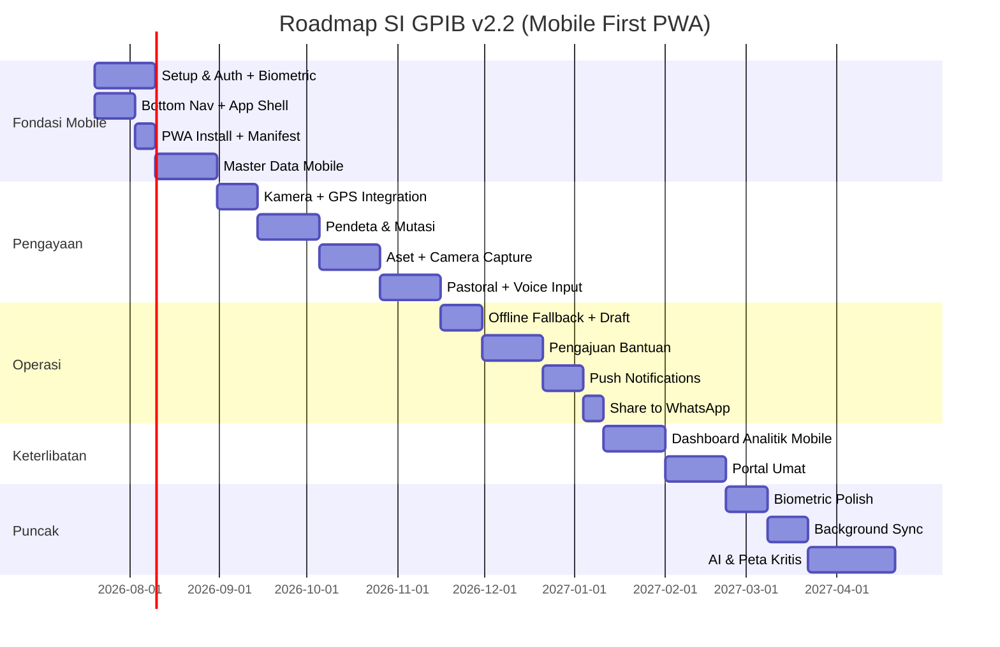

# 📋 SI GPIB v2.2 — Blueprint Dokumen (Mobile First PWA Edition)

> **Sistem Informasi Pos Pelayanan Kesaksian (SI Pos Pelkes) GPIB**
> Versi: 2.2 | Tanggal: 20 Juli 2026 | Status: *Planning Phase*
> **Arsitektur: Online-First + Mobile First PWA + Biometric Auth**

---

## 📑 Daftar Isi

1. [Ringkasan Eksekutif](#1-ringkasan-eksekutif)
2. [Visi, Misi & Tujuan](#2-visi-misi--tujuan)
3. [Arsitektur Sistem](#3-arsitektur-sistem)
4. [Stack Teknologi](#4-stack-teknologi)
5. [Model Data & Skema Database](#5-model-data--skema-database)
6. [Hierarki Role & Security](#6-hierarki-role--security)
7. [Modul Aplikasi](#7-modul-aplikasi)
8. [Struktur Folder](#8-struktur-folder)
9. [Business Rules](#9-business-rules)
10. [UI/UX Guidelines](#10-uiux-guidelines)
11. [📱 Mobile First PWA Strategy](#11--mobile-first-pwa-strategy)
12. [🔐 Biometric Authentication](#12-biometric-authentication)
13. [Roadmap Pengembangan](#13-roadmap-pengembangan)
14. [Deployment & Infrastructure](#14-deployment--infrastructure)
15. [Testing Strategy](#15-testing-strategy)
16. [Maintenance & Monitoring](#16-maintenance--monitoring)
17. [Risk Management](#17-risk-management)
18. [Strategi Mitigasi Sinyal Terbatas](#18-strategi-mitigasi-sinyal-terbatas)

---

## 1. Ringkasan Eksekutif

**SI GPIB v2.2** adalah platform digital **Mobile First PWA** terintegrasi untuk mengelola data hierarki gereja GPIB. Sistem ini dirancang sebagai **Single Source of Truth** untuk seluruh Bidang Pelayanan dengan pendekatan **mobile-first** karena 90%+ pendeta GPIB mengakses sistem via HP, termasuk di daerah terpencil dengan sinyal terbatas.

### 🎯 Key Deliverables

| Aspek | Target |
|-------|--------|
| **Cakupan** | 25 Mupel, 350+ Jemaat Induk, 500+ Pos Pelkes |
| **Pengguna** | 300+ Pendeta, Admin Mupel, Super User Sinode |
| **Platform Utama** | 📱 **Mobile PWA** (bukan desktop) |
| **Uptime** | 99.9% (SLA) |
| **Response Time** | < 1.5 detik mobile, < 2 detik desktop (P95) |
| **Bundle Size** | < 100KB JS (mobile), < 200KB (desktop) |
| **Konektivitas** | Online-first dengan PWA caching + Form Draft |
| **Autentikasi** | 🆕 **Biometric (Fingerprint/Face ID) + OTP** |
| **Lifecycle** | 30–50 tahun (bulletproof architecture) |

### 🔄 Evolusi Versi

| Versi | Fokus | Status |
|-------|-------|--------|
| v2.0 | Offline-first + Sync Engine | ❌ Dibatalkan (terlalu kompleks) |
| v2.1 | Online-first + PWA dasar | ✅ Direvisi → v2.2 |
| **v2.2** | **Mobile First PWA + Biometric** | ✅ **Current** |

---

## 2. Visi, Misi & Tujuan

### ✝️ Visi
> *"Menjadi ekosistem digital paripurna yang mendukung pelayanan GPIB berbasis data, transparan, dan berdampak kekal — demi kemuliaan Tuhan (Lux Dei)."*

### 🎯 Misi
1. Menyediakan **Single Source of Truth** untuk seluruh data pelayanan GPIB
2. Memfasilitasi **pengambilan keputusan berbasis data** di setiap level hierarki
3. Mendukung **paradigma pelayanan missional** — dari internal-focused ke eksternal-focused
4. Membangun **arsitektur mobile-first** yang dapat diakses pendeta di lapangan
5. Mengimplementasikan **biometric auth** untuk keamanan & kemudahan akses

### 📌 Tujuan Strategis

```
┌─────────────────────────────────────────────────────────┐
│  DATA  →  HIKMAT  →  KEPUTUSAN  →  PELAYANAN NYATA   │
└─────────────────────────────────────────────────────────┘
```

---

## 3. Arsitektur Sistem

### 🏗️ High-Level Architecture

```
┌──────────────────────────────────────────────────────────────┐
│                   CLIENT LAYER (Mobile First)                │
│  ┌────────────┐  ┌────────────┐  ┌────────────────────────┐ │
│  │  Mobile    │  │  Web PWA   │  │  Service Worker Cache  │ │
│  │  PWA App   │  │  (Desktop) │  │  + Form Draft Manager  │ │
│  │  (Primary) │  │  (Fallback)│  │  + Biometric Auth      │ │
│  └─────┬──────┘  └─────┬──────┘  └───────────┬────────────┘ │
└────────┼───────────────┼─────────────────────┼──────────────┘
         │               │                     │
         ▼               ▼                     ▼
┌──────────────────────────────────────────────────────────────┐
│                      API / BFF LAYER                         │
│  ┌────────────────────────────────────────────────────────┐ │
│  │  Next.js API Routes + Server Actions + Edge Functions  │ │
│  │  (TypeScript, Zod, Rate Limiting, WebAuthn)            │ │
│  └────────────────────────────────────────────────────────┘ │
└──────────────────────────┬───────────────────────────────────┘
                           │
                           ▼
┌──────────────────────────────────────────────────────────────┐
│                    DATA & SERVICE LAYER                      │
│  ┌──────────────┐  ┌──────────────┐  ┌──────────────────┐  │
│  │  Supabase    │  │  Supabase    │  │  Supabase        │  │
│  │  PostgreSQL  │  │  Auth + RLS  │  │  Storage         │  │
│  │  + PostGIS   │  │  + WebAuthn  │  │  (Assets/Docs)   │  │
│  └──────────────┘  └──────────────┘  └──────────────────┘  │
└──────────────────────────────────────────────────────────────┘
```

### 🧱 Pilar Arsitektur Bulletproof

| Pilar | Implementasi |
|-------|--------------|
| **Mobile First** | Touch-friendly, bottom nav, safe area, PWA installable |
| **Secure** | RLS, JWT, Biometric (WebAuthn), 2FA |
| **Scalable** | Serverless (Vercel + Supabase), horizontal scaling |
| **Resilient** | PWA caching, form draft, auto-retry, graceful degradation |

---

## 4. Stack Teknologi

### 🛠️ Core Stack

| Layer | Teknologi | Versi | Alasan |
|-------|-----------|-------|--------|
| **Framework** | Next.js | 15+ | App Router, Server Components, SSR/SSG |
| **UI Library** | React | 19+ | Ecosystem luas, concurrent features |
| **Styling** | Tailwind CSS | 4+ | Utility-first, rapid development |
| **Language** | TypeScript | 5+ | Type safety, auto-generate dari DB schema |
| **Backend/BaaS** | Supabase | Latest | PostgreSQL + Auth + Storage + Realtime |

### 📦 Library Pendukung (Mobile First Edition)

| Kategori | Library | Fungsi |
|----------|---------|--------|
| **UI Components** | shadcn/ui | Tabel, form, dialog, dll |
| **Form Handling** | React Hook Form + Zod | Validasi form kompleks |
| **Data Fetching** | TanStack Query | Caching, pagination, mutation queue |
| **Mapping** | React-Leaflet | Visualisasi geospasial (ringan) |
| **ORM** | Drizzle ORM | Type-safe queries |
| **Charts** | Recharts | Dashboard analitik (mobile-friendly) |
| **Date Handling** | date-fns | Manipulasi tanggal |
| **Icons** | Lucide React | Icon set modern |
| **State Management** | Zustand | Global state ringan |
| **File Upload** | react-dropzone | Upload lampiran + **camera capture** |
| **🆕 PWA** | next-pwa + Workbox | Service Worker, offline caching |
| **🆕 Biometric** | @simplewebauthn/browser + server | WebAuthn API |
| **🆕 Camera** | react-webcam + exifr | Capture foto + EXIF GPS |
| **🆕 Geolocation** | Browser Geolocation API | Auto-fill koordinat |
| **🆕 Haptic** | navigator.vibrate() | Feedback sentuhan |
| **🆕 Share** | Web Share API | Share native ke WhatsApp |
| **🆕 Pull Refresh** | @use-gesture | Pull-to-refresh gesture |
| **🆕 Skeleton** | shadcn/ui Skeleton | UX loading |

---

## 5. Model Data & Skema Database

*(Tetap sama dengan v2.1 — lihat DB_SCHEMA.html untuk detail lengkap)*

### 🔑 Modifikasi Khusus (KMJ & PJ)

```sql
-- Jemaat Induk memiliki 1 KMJ (Ketua Majelis Jemaat)
ALTER TABLE m_jemaat_induk 
ADD COLUMN id_kmj VARCHAR(20) REFERENCES m_pendeta(id_pendeta);

-- Pendeta ditandai sebagai KMJ/PJ
ALTER TABLE m_pendeta
ADD COLUMN is_kmj BOOLEAN DEFAULT FALSE,
ADD COLUMN is_pj BOOLEAN DEFAULT FALSE;

-- Tabel penugasan PJ (1 Jemaat bisa punya >1 PJ)
CREATE TABLE t_pj_jemaat (
    id SERIAL PRIMARY KEY,
    id_induk VARCHAR(20) REFERENCES m_jemaat_induk(id_induk),
    id_pendeta VARCHAR(20) REFERENCES m_pendeta(id_pendeta),
    tanggal_mulai DATE NOT NULL,
    tanggal_selesai DATE,
    status VARCHAR(20) DEFAULT 'Aktif'
);

-- 🆕 Tabel untuk WebAuthn credentials (Biometric)
CREATE TABLE m_webauthn_credentials (
    id UUID PRIMARY KEY DEFAULT gen_random_uuid(),
    id_user UUID REFERENCES auth.users(id) ON DELETE CASCADE,
    credential_id TEXT NOT NULL UNIQUE,
    public_key TEXT NOT NULL,
    counter BIGINT DEFAULT 0,
    device_type VARCHAR(50), -- 'single_device' | 'multi_device'
    backed_up BOOLEAN DEFAULT FALSE,
    transports TEXT[], -- ['usb', 'ble', 'nfc', 'internal']
    display_name VARCHAR(100), -- "iPhone 15 Pro" / "Laptop Kantor"
    last_used_at TIMESTAMPTZ,
    created_at TIMESTAMPTZ DEFAULT NOW()
);

CREATE INDEX idx_webauthn_user ON m_webauthn_credentials(id_user);
```

---

## 6. Hierarki Role & Security

*(Tetap sama dengan v2.1)*

### 🔐 JWT Custom Claims + Biometric

```json
{
  "sub": "uuid-user",
  "role": "kmj",
  "id_pendeta": "PDT-19060024",
  "id_induk": "02-01-BM",
  "id_mupel": "M - 02",
  "is_kmj": true,
  "is_pj": false,
  "auth_method": "biometric",  // 🆕 "password" | "biometric" | "otp"
  "device_id": "iphone-15-pro-abc123"  // 🆕
}
```

---

## 7. Modul Aplikasi

### 📦 Daftar Modul (Mobile First Edition)

| # | Modul | Fase | Prioritas | Mobile |
|---|-------|------|-----------|--------|
| 1 | Autentikasi + **Biometric** | 1 | 🔴 Critical | ✅ |
| 2 | Manajemen Mupel & Jemaat Induk | 1 | 🔴 Critical | ✅ |
| 3 | Manajemen Pos Pelkes + **Geospasial + Kamera** | 1 | 🔴 Critical | ✅ |
| 4 | Manajemen Pendeta (KMJ/PJ) | 1 | 🔴 Critical | ✅ |
| 5 | **🆕 Bottom Navigation + App Shell** | 1 | 🔴 Critical | ✅ |
| 6 | **🆕 PWA Install Prompt (A2HS)** | 1 | 🔴 Critical | ✅ |
| 7 | Mutasi & Penugasan Pendeta | 2 | 🟠 High | ✅ |
| 8 | Log Pastoral + **Voice Input** | 2 | 🟠 High | ✅ |
| 9 | Demografi Pelkat | 2 | 🟠 High | ✅ |
| 10 | Inventaris Aset + **Kamera + GPS** | 2 | 🟠 High | ✅ |
| 11 | **🆕 Offline Fallback Page** | 2 | 🟠 High | ✅ |
| 12 | **🆕 Form Draft Auto-Save** | 2 | 🟠 High | ✅ |
| 13 | Pengajuan Bantuan (Workflow) | 3 | 🟡 Medium | ✅ |
| 14 | Pelayan & Relawan | 3 | 🟡 Medium | ✅ |
| 15 | Jadwal Ibadah | 3 | 🟡 Medium | ✅ |
| 16 | **🆕 Push Notifications** | 3 | 🟡 Medium | ✅ |
| 17 | **🆕 Share to WhatsApp** | 3 | 🟡 Medium | ✅ |
| 18 | Kerawanan & Potensi Wilayah | 3 | 🟡 Medium | ✅ |
| 19 | Dashboard Analitik | 4 | 🟢 Enhancement | ✅ |
| 20 | Portal Umat (Public) | 4 | 🟢 Enhancement | ✅ |
| 21 | **🆕 Badge Counter** | 4 | 🟢 Enhancement | ✅ |
| 22 | **🆕 Background Sync** | 4 | 🟢 Enhancement | ✅ |

---

## 8. Struktur Folder

```
si-gpib-v2/
├── src/
│   ├── app/
│   │   ├── (auth)/
│   │   │   ├── login/
│   │   │   │   ├── page.tsx
│   │   │   │   └── biometric/page.tsx  # 🆕 Halaman biometric
│   │   │   ├── register/
│   │   │   └── forgot-password/
│   │   ├── (dashboard)/
│   │   │   ├── layout.tsx              # 🆕 Bottom nav + safe area
│   │   │   ├── page.tsx                # 🆕 Dashboard mobile-first
│   │   │   ├── mupel/
│   │   │   ├── jemaat/
│   │   │   ├── pos-pelkes/
│   │   │   │   ├── page.tsx
│   │   │   │   ├── [id]/
│   │   │   │   │   ├── page.tsx
│   │   │   │   │   └── map/page.tsx    # 🆕 Peta fullscreen mobile
│   │   │   │   └── new/
│   │   │   │       └── page.tsx        # 🆕 Form + kamera + GPS
│   │   │   ├── pendeta/
│   │   │   ├── mutasi/
│   │   │   ├── pastoral/
│   │   │   │   ├── page.tsx
│   │   │   │   └── new/
│   │   │   │       └── page.tsx        # 🆕 Voice input + draft
│   │   │   ├── aset/
│   │   │   │   ├── page.tsx
│   │   │   │   └── new/
│   │   │   │       └── page.tsx        # 🆕 Camera capture
│   │   │   ├── bantuan/
│   │   │   ├── demografi/
│   │   │   └── settings/
│   │   │       ├── page.tsx
│   │   │       ├── biometric/page.tsx  # 🆕 Manage biometric devices
│   │   │       └── notifications/page.tsx  # 🆕
│   │   ├── (public)/
│   │   │   ├── dashboard/
│   │   │   └── peta-sebaran/
│   │   ├── offline/page.tsx            # 🆕 Offline fallback
│   │   ├── api/
│   │   │   ├── auth/
│   │   │   │   ├── webauthn/           # 🆕 WebAuthn endpoints
│   │   │   │   │   ├── register/options/route.ts
│   │   │   │   │   ├── register/verify/route.ts
│   │   │   │   │   ├── login/options/route.ts
│   │   │   │   │   └── login/verify/route.ts
│   │   │   ├── webhooks/
│   │   │   └── upload/
│   │   └── layout.tsx
│   ├── components/
│   │   ├── ui/                         # shadcn/ui
│   │   ├── mobile/                     # 🆕 Mobile-specific
│   │   │   ├── BottomNavigation.tsx
│   │   │   ├── SafeArea.tsx
│   │   │   ├── PullToRefresh.tsx
│   │   │   ├── NetworkBanner.tsx
│   │   │   ├── InstallPrompt.tsx
│   │   │   ├── SwipeableCard.tsx
│   │   │   ├── SkeletonList.tsx
│   │   │   ├── TouchButton.tsx         # 44x44px minimum
│   │   │   └── BadgeCounter.tsx
│   │   ├── offline/                    # 🆕 Offline handling
│   │   │   ├── OfflineFallback.tsx
│   │   │   ├── FormDraftManager.tsx
│   │   │   ├── PendingSubmissions.tsx
│   │   │   └── RetryButton.tsx
│   │   ├── camera/                     # 🆕 Camera integration
│   │   │   ├── CameraCapture.tsx
│   │   │   ├── ImageCompressor.tsx
│   │   │   └── EXIFExtractor.tsx
│   │   ├── biometric/                  # 🆕 Biometric
│   │   │   ├── BiometricLogin.tsx
│   │   │   ├── BiometricSetup.tsx
│   │   │   └── BiometricStatus.tsx
│   │   ├── maps/
│   │   ├── charts/
│   │   ├── forms/
│   │   ├── tables/
│   │   └── layout/
│   ├── lib/
│   │   ├── supabase/
│   │   │   ├── client.ts
│   │   │   ├── server.ts
│   │   │   └── middleware.ts
│   │   ├── webauthn/                   # 🆕 WebAuthn helpers
│   │   │   ├── browser.ts
│   │   │   ├── server.ts
│   │   │   └── utils.ts
│   │   ├── db/
│   │   ├── draft/                      # 🆕 Form draft
│   │   │   ├── localStorage.ts
│   │   │   ├── autoSave.ts
│   │   │   └── conflictResolver.ts
│   │   ├── camera/                     # 🆕 Camera helpers
│   │   │   ├── capture.ts
│   │   │   ├── compress.ts
│   │   │   └── exif.ts
│   │   ├── geolocation/                # 🆕
│   │   │   └── getCurrentPosition.ts
│   │   ├── share/                      # 🆕 Web Share API
│   │   │   └── shareToWhatsApp.ts
│   │   ├── haptic/                     # 🆕 Haptic feedback
│   │   │   └── vibrate.ts
│   │   ├── validations/
│   │   ├── utils/
│   │   └── constants/
│   ├── hooks/
│   │   ├── use-auth.ts
│   │   ├── use-pos-pelkes.ts
│   │   ├── use-geolocation.ts
│   │   ├── use-network-status.ts       # 🆕
│   │   ├── use-form-draft.ts           # 🆕
│   │   ├── use-install-prompt.ts       # 🆕
│   │   ├── use-biometric.ts            # 🆕
│   │   ├── use-camera.ts               # 🆕
│   │   ├── use-pull-to-refresh.ts      # 🆕
│   │   ├── use-share.ts                # 🆕
│   │   └── use-haptic.ts               # 🆕
│   ├── stores/
│   ├── types/
│   └── styles/
│       └── globals.css
├── public/
│   ├── manifest.json                   # 🆕 PWA manifest
│   ├── sw.js                           # 🆕 Service Worker
│   ├── icons/
│   │   ├── icon-192.png
│   │   ├── icon-512.png
│   │   ├── icon-maskable.png
│   │   └── apple-touch-icon.png
│   ├── screenshots/                    # 🆕 PWA screenshots
│   │   ├── mobile-1.png
│   │   └── mobile-2.png
│   └── sounds/                         # 🆕 Notification sounds
├── supabase/
│   ├── migrations/
│   ├── functions/
│   └── seed.sql
├── docs/
├── .env.local
├── next.config.js
├── tailwind.config.ts
├── tsconfig.json
└── package.json
```

---

## 9. Business Rules

*(Tetap sama dengan v2.1, ditambah aturan baru)*

### 📜 Aturan Bisnis Baru (Mobile)

| # | Rule | Enforcement |
|---|------|-------------|
| 13 | **Biometric** hanya bisa diaktifkan setelah login password sukses pertama kali | Client-side + server validation |
| 14 | **1 user = max 5 perangkat biometric** | Database constraint |
| 15 | **Biometric auto-expire** setelah 90 hari tidak digunakan | Cron job |
| 16 | **Foto aset** wajib ada EXIF GPS (kecuali manual override) | Client validation |
| 17 | **Form draft** auto-delete setelah 30 hari | Client-side cleanup |
| 18 | **Pull-to-refresh** hanya di halaman list (bukan form) | UX rule |

---

## 10. UI/UX Guidelines

### 🎨 Design System (Mobile First)

| Aspek | Standar Mobile | Standar Desktop |
|-------|----------------|-----------------|
| **Touch Target** | **44x44px minimum** | 32x32px |
| **Font Size** | 16px minimum (body) | 14px minimum |
| **Padding** | 16px (mobile), 24px (tablet) | 32px |
| **Spacing** | 8px grid | 8px grid |
| **Border Radius** | 12px (cards), 8px (buttons) | 8px (cards), 4px (buttons) |
| **Navigation** | **Bottom Navigation** | Sidebar |
| **Safe Area** | env(safe-area-inset-*) | N/A |
| **Color Palette** | Primary: GPIB Blue (#1E40AF), Accent: Gold (#F59E0B) |
| **Typography** | Inter (UI), Merriweather (Headings) |
| **Dark Mode** | Supported via `next-themes` |

### 📱 Mobile-First UI Patterns

#### 1. **Bottom Navigation (Thumb Zone)**
```tsx
<BottomNavigation>
  <NavItem icon={Home} label="Beranda" href="/dashboard" />
  <NavItem icon={Map} label="Peta" href="/pos-pelkes" />
  <NavItem icon={Plus} label="Input" href="/quick-action" isMain />
  <NavItem icon={FileText} label="Laporan" href="/pastoral" />
  <NavItem icon={User} label="Profil" href="/settings" />
</BottomNavigation>
```

#### 2. **Quick Action Sheet (FAB)**
```tsx
<FloatingActionButton>
  <ActionSheet>
    <Action icon={Camera} label="Foto Aset" onClick={...} />
    <Action icon={MapPin} label="Input Log Pastoral" onClick={...} />
    <Action icon={FileText} label="Pengajuan Bantuan" onClick={...} />
    <Action icon={Users} label="Tambah Pelayan" onClick={...} />
  </ActionSheet>
</FloatingActionButton>
```

#### 3. **Card-Based Layout**
```tsx
<PosPelkesCard>
  <CardHeader>
    <h3>Pos Pelkes Eben Haezer</h3>
    <Badge>26 KK • 99 Jiwa</Badge>
  </CardHeader>
  <CardBody>
    <MapPreview lat={...} lng={...} />
    <PendetaInfo nama="Pdt. Otniel..." />
  </CardBody>
  <CardFooter>
    <Button variant="ghost">Detail</Button>
    <Button variant="primary">Log Pastoral</Button>
  </CardFooter>
</PosPelkesCard>
```

#### 4. **Swipe Gestures**
```tsx
<SwipeableCard
  onSwipeLeft={() => deletePos()}
  onSwipeRight={() => editPos()}
>
  <PosPelkesContent />
</SwipeableCard>
```

### ♿ Accessibility (Mobile-Specific)

- ✅ Touch target 44x44px minimum (Apple HIG & Material Design)
- ✅ Safe area handling (notch, home indicator)
- ✅ High contrast mode support
- ✅ Reduce motion support
- ✅ Screen reader optimized (ARIA)
- ✅ VoiceOver / TalkBack compatible
- ✅ Minimum 16px font size (iOS requirement)

---

## 11. 📱 Mobile First PWA Strategy

### 🎯 Prinsip Mobile First

> *"Mobile bukan versi kecil dari desktop. Mobile adalah pengalaman utama."*

### 📊 Target Device

| Device | Share | Prioritas |
|--------|-------|-----------|
| **HP Android** (mid-range) | 60% | 🔴 Primary |
| **iPhone** (SE - 15) | 25% | 🔴 Primary |
| **Tablet** (iPad/Android) | 10% | 🟠 Secondary |
| **Desktop/Laptop** | 5% | 🟢 Tertiary |

### 🏗️ Arsitektur PWA

#### 1. **PWA Manifest** (`public/manifest.json`)
```json
{
  "name": "SI GPIB v2.0",
  "short_name": "SI GPIB",
  "description": "Sistem Informasi Pos Pelkes GPIB",
  "start_url": "/dashboard",
  "scope": "/",
  "display": "standalone",
  "orientation": "portrait-primary",
  "theme_color": "#1E40AF",
  "background_color": "#ffffff",
  "lang": "id-ID",
  "categories": ["productivity", "lifestyle", "social"],
  "icons": [
    {
      "src": "/icons/icon-192.png",
      "sizes": "192x192",
      "type": "image/png",
      "purpose": "any"
    },
    {
      "src": "/icons/icon-512.png",
      "sizes": "512x512",
      "type": "image/png",
      "purpose": "any"
    },
    {
      "src": "/icons/icon-maskable.png",
      "sizes": "512x512",
      "type": "image/png",
      "purpose": "maskable"
    }
  ],
  "screenshots": [
    {
      "src": "/screenshots/mobile-1.png",
      "sizes": "1080x1920",
      "type": "image/png",
      "form_factor": "narrow"
    }
  ],
  "shortcuts": [
    {
      "name": "Input Log Pastoral",
      "short_name": "Log Pastoral",
      "description": "Catat kegiatan pastoral",
      "url": "/pastoral/new",
      "icons": [{ "src": "/icons/shortcut-log.png", "sizes": "96x96" }]
    },
    {
      "name": "Foto Aset",
      "short_name": "Foto Aset",
      "description": "Dokumentasi aset Pos Pelkes",
      "url": "/aset/new",
      "icons": [{ "src": "/icons/shortcut-aset.png", "sizes": "96x96" }]
    },
    {
      "name": "Peta Sebaran",
      "short_name": "Peta",
      "description": "Lihat peta Pos Pelkes",
      "url": "/pos-pelkes/map",
      "icons": [{ "src": "/icons/shortcut-map.png", "sizes": "96x96" }]
    }
  ]
}
```

#### 2. **Service Worker Strategy** (`lib/sw/strategies.ts`)
```typescript
export const CACHE_STRATEGIES = {
  // App Shell - Cache First (selamanya)
  appShell: {
    matcher: /^\/(dashboard|_next\/static|icons)/,
    strategy: 'CacheFirst',
    cacheName: 'app-shell-v2',
    expiration: { maxEntries: 100, maxAgeSeconds: 30 * 24 * 60 * 60 }
  },
  
  // Master Data - Stale While Revalidate (24 jam)
  masterData: {
    matcher: /\/api\/(mupel|jemaat|pos-pelkes|pendeta)/,
    strategy: 'StaleWhileRevalidate',
    cacheName: 'master-data-v2',
    expiration: { maxAgeSeconds: 24 * 60 * 60 }
  },
  
  // Images - Cache First dengan compression
  images: {
    matcher: /\.(png|jpg|jpeg|webp|avif)$/,
    strategy: 'CacheFirst',
    cacheName: 'images-v2',
    expiration: { maxEntries: 300, maxAgeSeconds: 7 * 24 * 60 * 60 }
  },
  
  // Fonts - Cache First
  fonts: {
    matcher: /\.(woff2|woff|ttf)$/,
    strategy: 'CacheFirst',
    cacheName: 'fonts-v2',
    expiration: { maxEntries: 10, maxAgeSeconds: 365 * 24 * 60 * 60 }
  },
  
  // API POST - Network Only (tidak di-cache)
  mutations: {
    matcher: /\/api\/.*\/(create|update|delete)/,
    strategy: 'NetworkOnly'
  }
};
```

#### 3. **Install Prompt (Add to Home Screen)**
```typescript
// hooks/use-install-prompt.ts
import { useState, useEffect } from 'react';

export function useInstallPrompt() {
  const [deferredPrompt, setDeferredPrompt] = useState<any>(null);
  const [isInstalled, setIsInstalled] = useState(false);

  useEffect(() => {
    // Check if already installed
    if (window.matchMedia('(display-mode: standalone)').matches) {
      setIsInstalled(true);
      return;
    }

    const handler = (e: any) => {
      e.preventDefault();
      setDeferredPrompt(e);
    };

    window.addEventListener('beforeinstallprompt', handler);
    return () => window.removeEventListener('beforeinstallprompt', handler);
  }, []);

  const install = async () => {
    if (!deferredPrompt) return false;
    
    deferredPrompt.prompt();
    const { outcome } = await deferredPrompt.userChoice;
    
    if (outcome === 'accepted') {
      trackEvent('pwa_installed');
      setIsInstalled(true);
    }
    
    setDeferredPrompt(null);
    return outcome === 'accepted';
  };

  return { canInstall: !!deferredPrompt && !isInstalled, install, isInstalled };
}
```

```tsx
// components/mobile/InstallPrompt.tsx
export function InstallPromptBanner() {
  const { canInstall, install, isInstalled } = useInstallPrompt();
  const [dismissed, setDismissed] = useState(false);

  if (!canInstall || isInstalled || dismissed) return null;

  return (
    <div className="fixed bottom-20 left-4 right-4 bg-blue-600 text-white rounded-xl p-4 shadow-lg z-50">
      <div className="flex items-start gap-3">
        <Icon name="download" className="w-6 h-6 flex-shrink-0" />
        <div className="flex-1">
          <h3 className="font-semibold">Pasang Aplikasi SI GPIB</h3>
          <p className="text-sm opacity-90 mt-1">
            Akses cepat dari home screen, seperti aplikasi native
          </p>
        </div>
      </div>
      <div className="flex gap-2 mt-3">
        <Button onClick={() => setDismissed(true)} variant="ghost" size="sm">
          Nanti
        </Button>
        <Button onClick={install} size="sm" className="flex-1">
          Pasang Sekarang
        </Button>
      </div>
    </div>
  );
}
```

#### 4. **Offline Fallback Page**
```tsx
// app/offline/page.tsx
'use client';

import { WifiOff, RefreshCw, FileText, Map } from 'lucide-react';
import { useNetworkStatus } from '@/hooks/use-network-status';
import { usePendingQueue } from '@/hooks/use-form-draft';

export default function OfflinePage() {
  const { isOnline, retry } = useNetworkStatus();
  const { pendingCount, retryAll } = usePendingQueue();

  return (
    <div className="min-h-screen flex flex-col items-center justify-center p-6 bg-gradient-to-b from-blue-50 to-white">
      <div className="w-20 h-20 bg-amber-100 rounded-full flex items-center justify-center mb-4">
        <WifiOff className="w-10 h-10 text-amber-600" />
      </div>
      
      <h1 className="text-2xl font-bold mb-2 text-center">
        Anda Sedang Offline
      </h1>
      
      <p className="text-gray-600 text-center mb-6 max-w-sm">
        Data yang sudah dilihat tetap bisa diakses. 
        Form yang sedang diisi tersimpan otomatis.
      </p>

      {pendingCount > 0 && (
        <div className="bg-amber-50 border border-amber-200 rounded-lg p-4 mb-6 w-full max-w-sm">
          <div className="flex items-center gap-2 text-amber-800">
            <FileText className="w-5 h-5" />
            <span className="font-medium">
              {pendingCount} data menunggu pengiriman
            </span>
          </div>
          <Button 
            onClick={retryAll} 
            variant="outline" 
            size="sm" 
            className="w-full mt-3"
          >
            <RefreshCw className="w-4 h-4 mr-2" />
            Kirim Ulang Semua
          </Button>
        </div>
      )}

      <div className="w-full max-w-sm space-y-3">
        <Button onClick={() => window.location.href = '/pos-pelkes'} className="w-full">
          <Map className="w-4 h-4 mr-2" />
          Lihat Data Pos Pelkes Tersimpan
        </Button>
        
        <Button onClick={retry} variant="outline" className="w-full">
          <RefreshCw className="w-4 h-4 mr-2" />
          Cek Koneksi Internet
        </Button>
      </div>

      <p className="text-xs text-gray-400 mt-8 text-center">
        Tip: Aktifkan mode pesawat lalu matikan lagi untuk refresh koneksi
      </p>
    </div>
  );
}
```

#### 5. **Camera Integration**
```tsx
// components/camera/CameraCapture.tsx
'use client';

import { useRef, useState } from 'react';
import Webcam from 'react-webcam';
import { Camera, X, Check, FlipHorizontal } from 'lucide-react';
import { compressImage } from '@/lib/camera/compress';
import { extractGPS } from '@/lib/camera/exif';

interface CameraCaptureProps {
  onCapture: (file: File, gps?: { lat: number; lng: number }) => void;
  onCancel: () => void;
  enableGPS?: boolean;
}

export function CameraCapture({ onCapture, onCancel, enableGPS = true }: CameraCaptureProps) {
  const webcamRef = useRef<Webcam>(null);
  const [capturedImage, setCapturedImage] = useState<string | null>(null);
  const [facingMode, setFacingMode] = useState<'user' | 'environment'>('environment');

  const capture = async () => {
    const imageSrc = webcamRef.current?.getScreenshot();
    if (!imageSrc) return;

    // Compress image (max 1MB untuk upload cepat di sinyal lemah)
    const compressedBlob = await compressImage(imageSrc, {
      maxWidth: 1920,
      maxHeight: 1920,
      quality: 0.8,
      maxSizeKB: 1024
    });

    // Extract GPS from EXIF if available
    let gps: { lat: number; lng: number } | undefined;
    if (enableGPS) {
      gps = await extractGPS(imageSrc);
    }

    setCapturedImage(imageSrc);
    
    const file = new File([compressedBlob], `foto-${Date.now()}.jpg`, {
      type: 'image/jpeg'
    });

    onCapture(file, gps);
  };

  if (capturedImage) {
    return (
      <div className="fixed inset-0 bg-black z-50 flex flex-col">
        <div className="flex-1 flex items-center justify-center p-4">
          
        </div>
        <div className="bg-black/80 p-4 flex gap-4 justify-center">
          <Button onClick={() => setCapturedImage(null)} variant="ghost" size="lg">
            <X className="w-6 h-6 mr-2" />
            Ulangi
          </Button>
          <Button onClick={() => onCapture(capturedImage)} size="lg">
            <Check className="w-6 h-6 mr-2" />
            Gunakan
          </Button>
        </div>
      </div>
    );
  }

  return (
    <div className="fixed inset-0 bg-black z-50 flex flex-col">
      <div className="flex-1 relative">
        <Webcam
          ref={webcamRef}
          audio={false}
          screenshotFormat="image/jpeg"
          videoConstraints={{
            facingMode,
            width: { ideal: 1920 },
            height: { ideal: 1920 }
          }}
          className="w-full h-full object-cover"
        />
        
        <Button
          onClick={onCancel}
          variant="ghost"
          size="icon"
          className="absolute top-4 right-4 bg-black/50 text-white"
        >
          <X className="w-6 h-6" />
        </Button>
      </div>
      
      <div className="bg-black/80 p-6 flex items-center justify-center gap-8">
        <Button
          onClick={() => setFacingMode(f => f === 'user' ? 'environment' : 'user')}
          variant="ghost"
          size="icon"
          className="text-white"
        >
          <FlipHorizontal className="w-6 h-6" />
        </Button>
        
        <Button
          onClick={capture}
          size="lg"
          className="w-20 h-20 rounded-full bg-white text-blue-600 hover:bg-gray-200"
        >
          <Camera className="w-8 h-8" />
        </Button>
        
        <div className="w-14" /> {/* Spacer for centering */}
      </div>
    </div>
  );
}
```

#### 6. **Geolocation Auto-Fill**
```typescript
// lib/geolocation/getCurrentPosition.ts
export async function getCurrentPosition(): Promise<{
  lat: number;
  lng: number;
  accuracy: number;
} | null> {
  if (!navigator.geolocation) return null;

  return new Promise((resolve) => {
    navigator.geolocation.getCurrentPosition(
      (position) => {
        resolve({
          lat: position.coords.latitude,
          lng: position.coords.longitude,
          accuracy: position.coords.accuracy
        });
      },
      (error) => {
        console.warn('Geolocation error:', error);
        resolve(null);
      },
      {
        enableHighAccuracy: true,
        timeout: 10000,
        maximumAge: 300000 // 5 minutes cache
      }
    );
  });
}
```

```tsx
// hooks/use-geolocation.ts
import { useState, useEffect } from 'react';
import { getCurrentPosition } from '@/lib/geolocation/getCurrentPosition';

export function useGeolocation() {
  const [location, setLocation] = useState<{
    lat: number;
    lng: number;
    accuracy: number;
  } | null>(null);
  const [loading, setLoading] = useState(false);
  const [error, setError] = useState<string | null>(null);

  const refresh = async () => {
    setLoading(true);
    setError(null);
    
    const pos = await getCurrentPosition();
    if (pos) {
      setLocation(pos);
    } else {
      setError('Tidak dapat mengakses lokasi');
    }
    
    setLoading(false);
  };

  return { location, loading, error, refresh };
}
```

#### 7. **Pull-to-Refresh**
```tsx
// components/mobile/PullToRefresh.tsx
'use client';

import { useState } from 'react';
import { RefreshCw } from 'lucide-react';
import { usePullToRefresh as useGesture } from '@use-gesture/react';

interface PullToRefreshProps {
  onRefresh: () => Promise<void>;
  children: React.ReactNode;
}

export function PullToRefresh({ onRefresh, children }: PullToRefreshProps) {
  const [refreshing, setRefreshing] = useState(false);
  const [pullDistance, setPullDistance] = useState(0);

  const bind = useGesture({
    onDrag: ({ movement: [, y], last }) => {
      if (y > 0 && window.scrollY === 0) {
        setPullDistance(Math.min(y / 2, 80));
      }
      if (last && pullDistance > 60) {
        handleRefresh();
      } else if (last) {
        setPullDistance(0);
      }
    }
  });

  const handleRefresh = async () => {
    setRefreshing(true);
    setPullDistance(60);
    await onRefresh();
    setRefreshing(false);
    setPullDistance(0);
  };

  return (
    <div {...bind()} className="relative">
      <div
        className="absolute top-0 left-0 right-0 flex items-center justify-center transition-transform"
        style={{
          transform: `translateY(${pullDistance - 40}px)`,
          opacity: pullDistance > 0 ? 1 : 0
        }}
      >
        <RefreshCw className={`w-6 h-6 text-blue-600 ${refreshing ? 'animate-spin' : ''}`} />
      </div>
      <div style={{ paddingTop: pullDistance }}>
        {children}
      </div>
    </div>
  );
}
```

#### 8. **Network Status Banner**
```tsx
// components/mobile/NetworkBanner.tsx
'use client';

import { useNetworkStatus } from '@/hooks/use-network-status';
import { Wifi, WifiOff } from 'lucide-react';

export function NetworkBanner() {
  const { isOnline, pendingCount } = useNetworkStatus();

  if (isOnline && pendingCount === 0) return null;

  return (
    <div className={`fixed top-0 left-0 right-0 z-50 px-4 py-2 text-sm text-center ${
      isOnline ? 'bg-green-100 text-green-800' : 'bg-amber-100 text-amber-800'
    }`}>
      <div className="flex items-center justify-center gap-2">
        {isOnline ? (
          <>
            <Wifi className="w-4 h-4" />
            <span>Online</span>
            {pendingCount > 0 && (
              <span className="ml-2 bg-amber-500 text-white rounded-full px-2 py-0.5 text-xs">
                {pendingCount} pending
              </span>
            )}
          </>
        ) : (
          <>
            <WifiOff className="w-4 h-4" />
            <span>Offline — {pendingCount} data menunggu</span>
          </>
        )}
      </div>
    </div>
  );
}
```

#### 9. **Haptic Feedback**
```typescript
// lib/haptic/vibrate.ts
export function haptic(pattern: 'light' | 'medium' | 'heavy' | 'success' | 'error' | number[]) {
  if (!('vibrate' in navigator)) return;

  const patterns = {
    light: [10],
    medium: [20],
    heavy: [30],
    success: [10, 50, 10],
    error: [50, 100, 50]
  };

  navigator.vibrate(typeof pattern === 'number' ? pattern : patterns[pattern]);
}
```

#### 10. **Share to WhatsApp**
```typescript
// lib/share/shareToWhatsApp.ts
export async function shareToWhatsApp(data: {
  title: string;
  text: string;
  url?: string;
}) {
  const message = `*${data.title}*\n\n${data.text}${data.url ? `\n\n${data.url}` : ''}`;
  
  // Try Web Share API first (native share sheet)
  if (navigator.share) {
    try {
      await navigator.share({
        title: data.title,
        text: message,
        url: data.url
      });
      return true;
    } catch (err) {
      if ((err as Error).name === 'AbortError') return false;
    }
  }
  
  // Fallback to WhatsApp direct link
  const waUrl = `https://wa.me/?text=${encodeURIComponent(message)}`;
  window.open(waUrl, '_blank');
  return true;
}
```

### 📊 Performance Budget (Mobile)

| Metric | Target | Measurement |
|--------|--------|-------------|
| **First Contentful Paint** | < 1.5s | Lighthouse |
| **Largest Contentful Paint** | < 2.5s | Lighthouse |
| **Total Blocking Time** | < 200ms | Lighthouse |
| **Cumulative Layout Shift** | < 0.1 | Lighthouse |
| **JS Bundle Size** | < 100KB (gzipped) | Build output |
| **CSS Size** | < 30KB (gzipped) | Build output |
| **Image Size** | < 200KB per image | Upload validation |
| **Font Size** | < 50KB per font | Build output |
| **Time to Interactive** | < 3.5s | Lighthouse |
| **Speed Index** | < 3.0s | Lighthouse |

### ✅ Mobile First PWA Checklist

#### 🔴 Wajib (Fase 1-2)
- [x] Touch target 44x44px minimum
- [x] Bottom navigation (thumb zone)
- [x] Safe area handling (notch, home indicator)
- [x] PWA manifest lengkap + shortcuts
- [x] Offline fallback page
- [x] App shell architecture
- [x] Image optimization (next/image + WebP/AVIF)
- [x] Font subsetting (Latin + Indonesia only)
- [x] Viewport meta tag yang benar
- [x] Install prompt (A2HS)
- [x] Camera capture untuk foto aset
- [x] Geolocation API auto-fill
- [x] Network status banner
- [x] Form draft auto-save

#### 🟠 Penting (Fase 3)
- [ ] Pull-to-refresh
- [ ] Skeleton loading
- [ ] Push notifications
- [ ] Share API native
- [ ] Swipe gestures
- [ ] Data saver mode
- [ ] Haptic feedback

#### 🟢 Enhancement (Fase 4-5)
- [ ] Biometric authentication
- [ ] Badge counter
- [ ] Background sync
- [ ] Periodic background updates
- [ ] Orientation lock per halaman
- [ ] Native-like page transitions
- [ ] Voice input (untuk log pastoral)

---

## 12. 🔐 Biometric Authentication

### 🎯 Mengapa Biometric?

| Aspek | Password | Biometric |
|-------|----------|-----------|
| **Kecepatan Login** | 5-10 detik | < 1 detik |
| **Keamanan** | Medium (phishing risk) | High (device-bound) |
| **UX Mobile** | Ribet (ketik password) | Sentuh saja |
| **Adopsi User** | 100% | ~85% (perlu setup) |
| **Cocok untuk Pendeta** | ❌ | ✅ (di lapangan) |

### 🏗️ Arsitektur WebAuthn

```
┌─────────────────────────────────────────────────────────┐
│                    CLIENT (Browser)                      │
│  ┌──────────────────────────────────────────────────┐  │
│  │  @simplewebauthn/browser                         │  │
│  │  - navigator.credentials.create()                │  │
│  │  - navigator.credentials.get()                   │  │
│  └──────────────────────────────────────────────────┘  │
└──────────────────────────┬──────────────────────────────┘
                           │
                           ▼
┌─────────────────────────────────────────────────────────┐
│                    SERVER (Next.js API)                  │
│  ┌──────────────────────────────────────────────────┐  │
│  │  @simplewebauthn/server                          │  │
│  │  - generateRegistrationOptions()                 │  │
│  │  - verifyRegistrationResponse()                  │  │
│  │  - generateAuthenticationOptions()               │  │
│  │  - verifyAuthenticationResponse()                │  │
│  └──────────────────────────────────────────────────┘  │
│                           │                            │
│                           ▼                            │
│  ┌──────────────────────────────────────────────────┐  │
│  │  Supabase: m_webauthn_credentials                │  │
│  │  - credential_id                                 │  │
│  │  - public_key                                    │  │
│  │  - counter                                       │  │
│  └──────────────────────────────────────────────────┘  │
└─────────────────────────────────────────────────────────┘
```

### 📱 Flow Registrasi Biometric

```
1. User login dengan password/OTP (sukses)
   ↓
2. User klik "Aktifkan Biometric" di Settings
   ↓
3. Client minta registration options ke server
   GET /api/auth/webauthn/register/options
   ↓
4. Server generate challenge + return options
   ↓
5. Client panggil navigator.credentials.create()
   → User sentuh fingerprint / Face ID
   ↓
6. Client kirim response ke server
   POST /api/auth/webauthn/register/verify
   ↓
7. Server verify + simpan credential ke DB
   ↓
8. Client simpan "biometric enabled" flag
   ↓
9. ✅ Selesai! Login berikutnya tinggal sentuh
```

### 🔧 Implementasi

#### Server-side (`app/api/auth/webauthn/register/options/route.ts`)
```typescript
import { NextRequest, NextResponse } from 'next/server';
import {
  generateRegistrationOptions,
  VerifiedRegistrationResponse,
  verifyRegistrationResponse
} from '@simplewebauthn/server';
import { createClient } from '@/lib/supabase/server';

export async function GET(req: NextRequest) {
  const supabase = createClient();
  const { data: { user } } = await supabase.auth.getUser();
  
  if (!user) {
    return NextResponse.json({ error: 'Unauthorized' }, { status: 401 });
  }

  const options = await generateRegistrationOptions({
    rpName: 'SI GPIB v2.0',
    rpID: process.env.NEXT_PUBLIC_APP_URL?.replace(/^https?:\/\//, '') || 'localhost',
    userID: user.id,
    userName: user.email || user.phone || user.id,
    userDisplayName: user.user_metadata?.full_name || user.email || 'User GPIB',
    timeout: 60000,
    attestationType: 'none',
    authenticatorSelection: {
      // Prefer device-bound (biometric) authenticators
      residentKey: 'preferred',
      userVerification: 'preferred',
      authenticatorAttachment: 'platform' // Device biometric
    },
    supportedAlgorithmIDs: [-7, -257] // ES256, RS256
  });

  // Store challenge in session
  await supabase.from('webauthn_challenges').upsert({
    id_user: user.id,
    challenge: options.challenge,
    expires_at: new Date(Date.now() + 5 * 60 * 1000).toISOString()
  });

  return NextResponse.json(options);
}
```

#### Client-side (`components/biometric/BiometricSetup.tsx`)
```tsx
'use client';

import { useState } from 'react';
import { startRegistration } from '@simplewebauthn/browser';
import { Fingerprint, CheckCircle, AlertCircle } from 'lucide-react';
import { haptic } from '@/lib/haptic/vibrate';

export function BiometricSetup() {
  const [status, setStatus] = useState<'idle' | 'loading' | 'success' | 'error'>('idle');
  const [errorMessage, setErrorMessage] = useState<string>('');

  const register = async () => {
    try {
      setStatus('loading');
      
      // 1. Get registration options from server
      const optionsRes = await fetch('/api/auth/webauthn/register/options');
      const options = await optionsRes.json();
      
      // 2. Start biometric registration (fingerprint/face)
      const attestationResponse = await startRegistration(options);
      
      // 3. Verify with server
      const verifyRes = await fetch('/api/auth/webauthn/register/verify', {
        method: 'POST',
        headers: { 'Content-Type': 'application/json' },
        body: JSON.stringify(attestationResponse)
      });
      
      if (!verifyRes.ok) throw new Error('Verifikasi gagal');
      
      // 4. Success!
      setStatus('success');
      haptic('success');
      
    } catch (err) {
      setStatus('error');
      setErrorMessage((err as Error).message);
      haptic('error');
    }
  };

  return (
    <div className="bg-white rounded-xl p-6 shadow-sm">
      <div className="flex items-start gap-4 mb-4">
        <div className="w-12 h-12 bg-blue-100 rounded-full flex items-center justify-center">
          <Fingerprint className="w-6 h-6 text-blue-600" />
        </div>
        <div className="flex-1">
          <h3 className="font-semibold text-lg">Login dengan Biometrik</h3>
          <p className="text-sm text-gray-600 mt-1">
            Gunakan sidik jari atau Face ID untuk login lebih cepat dan aman
          </p>
        </div>
      </div>

      {status === 'idle' && (
        <Button onClick={register} className="w-full">
          <Fingerprint className="w-4 h-4 mr-2" />
          Aktifkan Biometrik
        </Button>
      )}

      {status === 'loading' && (
        <div className="text-center py-4">
          <div className="animate-pulse text-blue-600">
            Sentuh sensor biometrik Anda...
          </div>
        </div>
      )}

      {status === 'success' && (
        <div className="bg-green-50 border border-green-200 rounded-lg p-4 flex items-center gap-3">
          <CheckCircle className="w-5 h-5 text-green-600" />
          <span className="text-green-800">Biometrik berhasil diaktifkan!</span>
        </div>
      )}

      {status === 'error' && (
        <div className="bg-red-50 border border-red-200 rounded-lg p-4 flex items-center gap-3">
          <AlertCircle className="w-5 h-5 text-red-600" />
          <span className="text-red-800">{errorMessage}</span>
        </div>
      )}
    </div>
  );
}
```

### 🔒 Keamanan Biometric

| Aspek | Implementasi |
|-------|--------------|
| **Challenge** | Random 32-byte, expire 5 menit |
| **Credential Storage** | Encrypted di Supabase, tidak pernah diekspos |
| **Counter** | Anti-replay attack (setiap use increment) |
| **Device Binding** | Credential terikat ke device tertentu |
| **Max Devices** | 5 perangkat per user |
| **Auto-Expire** | 90 hari tidak dipakai → auto-revoke |
| **Fallback** | Tetap bisa login dengan password/OTP |
| **Revocation** | User bisa revoke device kapan saja |

---

## 13. Roadmap Pengembangan

### 🗓️ Timeline (Mobile First Edition)



### 🎯 Milestones

| Fase | Periode | Deliverables |
|------|---------|--------------|
| **Fase 1: Fondasi Mobile** | Jul–Agu 2026 | Auth + Biometric, Bottom Nav, PWA Install, Master Data |
| **Fase 2: Pengayaan** | Sep–Okt 2026 | Kamera + GPS, Pendeta, Aset, Log Pastoral + Voice |
| **Fase 3: Operasi** | Nov–Des 2026 | Offline Fallback, Draft, Pengajuan Bantuan, Push Notif |
| **Fase 4: Keterlibatan** | Jan–Feb 2027 | Dashboard Mobile, Portal Umat |
| **Fase 5: Puncak** | Feb–Mar 2027 | Biometric Polish, Background Sync, AI |

---

## 14. Deployment & Infrastructure

*(Tetap sama dengan v2.1, ditambah)*

### 🌐 Environment Variables (Update)

```env
# Supabase
NEXT_PUBLIC_SUPABASE_URL=
NEXT_PUBLIC_SUPABASE_ANON_KEY=
SUPABASE_SERVICE_ROLE_KEY=

# App
NEXT_PUBLIC_APP_URL=
NEXT_PUBLIC_APP_NAME="SI GPIB v2.0"

# 🆕 WebAuthn
NEXT_PUBLIC_RP_NAME="SI GPIB v2.0"
NEXT_PUBLIC_RP_ID="pospelkes-gpib.vercel.app"

# 🆕 PWA
NEXT_PUBLIC_ENABLE_PWA=true
NEXT_PUBLIC_PWA_CACHE_VERSION=v2

# 🆕 Camera
NEXT_PUBLIC_CAMERA_MAX_SIZE_KB=1024
NEXT_PUBLIC_CAMERA_ENABLE_GPS=true

# 🆕 Biometric
NEXT_PUBLIC_BIOMETRIC_ENABLED=true
NEXT_PUBLIC_BIOMETRIC_MAX_DEVICES=5
NEXT_PUBLIC_BIOMETRIC_EXPIRE_DAYS=90

# Feature Flags
NEXT_PUBLIC_ENABLE_OFFLINE_MODE=false
NEXT_PUBLIC_ENABLE_AI_ANALYTICS=false
NEXT_PUBLIC_ENABLE_PUSH_NOTIFICATIONS=false
```

---

## 15. Testing Strategy

### 🎯 Critical Test Scenarios (Mobile-Specific)

#### PWA Tests
- [ ] Install prompt muncul di device yang support
- [ ] Service Worker register dengan benar
- [ ] Offline fallback page tampil saat offline
- [ ] Form draft tersimpan di localStorage
- [ ] Pending submission retry saat online

#### Biometric Tests
- [ ] Registrasi biometric sukses (fingerprint/face)
- [ ] Login dengan biometric < 1 detik
- [ ] Biometric auto-expire setelah 90 hari
- [ ] Max 5 devices per user
- [ ] Fallback ke password jika biometric gagal

#### Camera Tests
- [ ] Capture foto dari kamera belakang/depan
- [ ] Image compression < 1MB
- [ ] EXIF GPS extraction (jika ada)
- [ ] Upload foto ke Supabase Storage

#### Mobile UX Tests
- [ ] Touch target 44x44px di semua tombol
- [ ] Bottom navigation responsive
- [ ] Safe area handling di iPhone notch
- [ ] Pull-to-refresh berfungsi
- [ ] Swipe gesture di card list

#### Performance Tests
- [ ] Lighthouse mobile score > 90
- [ ] JS bundle < 100KB gzipped
- [ ] First Contentful Paint < 1.5s
- [ ] Time to Interactive < 3.5s

---

## 16. Maintenance & Monitoring

### 📈 KPI Monitoring (Update)

```yaml
performance:
  - page_load_time_mobile: "< 1.5s"
  - page_load_time_desktop: "< 2s"
  - api_response_time: "< 500ms"
  - database_query_time: "< 100ms"
  - lighthouse_mobile_score: "> 90"
  
reliability:
  - uptime: "99.9%"
  - error_rate: "< 0.1%"
  
mobile:
  - pwa_install_rate: "> 60%"
  - biometric_adoption: "> 70%"
  - camera_capture_success: "> 95%"
  - form_draft_recovery: "> 90%"
  
usage:
  - daily_active_users: "tracked"
  - mobile_vs_desktop_ratio: "tracked"
  - data_completeness: "> 95%"
```

---

## 17. Risk Management

### ⚠️ Risk Matrix (Update)

| Risk | Impact | Probability | Mitigation |
|------|--------|-------------|------------|
| **🆕 Biometric tidak support di device lama** | 🟡 Medium | 🟡 Medium | Fallback ke password/OTP |
| **🆕 Camera permission ditolak user** | 🟡 Medium | 🟡 Medium | Manual upload dari galeri |
| **🆕 Geolocation tidak akurat** | 🟡 Medium | 🟠 High | Manual input koordinat |
| **🆕 PWA install rate rendah** | 🟡 Medium | 🟡 Medium | Edukasi user + onboarding |
| **🆕 localStorage quota exceeded** | 🟡 Medium | 🟢 Low | Auto-cleanup + max 5MB |
| Data Loss | 🔴 Critical | 🟢 Low | Daily backup |
| Security Breach | 🔴 Critical | 🟢 Low | RLS, 2FA, biometric |
| Performance Degradation | 🟠 High | 🟡 Medium | Query optimization, caching |
| Sinyal Terbatas di Pos Pelkes | 🟠 High | 🔴 High | PWA caching + Form Draft |
| Scope Creep | 🟡 Medium | 🔴 High | Strict roadmap |
| Vendor Lock-in | 🟡 Medium | 🟢 Low | Standard SQL, portable code |
| User Adoption | 🟠 High | 🟡 Medium | Training, documentation |

---

## 18. Strategi Mitigasi Sinyal Terbatas

*(Tetap sama dengan v2.1 — 5 lapis mitigasi)*

1. **PWA Caching** (Read-only offline)
2. **Form Draft Auto-Save** (localStorage)
3. **Pending Submission Queue** (TanStack Query)
4. **Network Status UI** (Banner)
5. **WhatsApp Fallback** (Opsional Fase 3+)

---

## 📝 Penutup

> *"Data yang dikumpulkan dengan benar adalah pelita hikmat."*

Blueprint v2.2 ini adalah fondasi untuk membangun **SI GPIB v2.0** — sebuah ekosistem digital **mobile-first** yang:

✅ **Mobile First** — 90%+ pendeta akses via HP
✅ **PWA Installable** — Terasa seperti app native
✅ **Biometric Auth** — Login < 1 detik, aman
✅ **Camera + GPS** — Foto aset langsung dari lapangan
✅ **Offline-Ready** — Form draft + pending queue
✅ **Performance Optimized** — < 100KB JS, < 1.5s FCP
✅ **Bulletproof** — 30-50 tahun lifecycle

### ✅ Next Steps

1. **Review & Approval** blueprint v2.2 oleh stakeholder
2. **Setup repository** GitHub + Supabase project
3. **Kick-off meeting** dengan tim development
4. **Mulai Fase 1** (Fondasi Mobile) — target 20 Juli 2026

---

**Dokumen ini adalah living document** — akan diperbarui seiring perkembangan proyek.

📅 *Terakhir diperbarui: 20 Juli 2026*
✍️ *Disusun oleh: Tim Development SI GPIB v2.0*
🔗 *Versi: 2.2 (Mobile First PWA + Biometric)*
🔗 *Referensi: DB_SCHEMA.html, GPIB_Reach_Out_V2.0.html, GPIB.xlsx*

---

## 🎯 Ringkasan Perubahan v2.1 → v2.2

| Aspek | v2.1 | v2.2 |
|-------|------|------|
| **Pendekatan** | Online-first + PWA dasar | **Mobile First PWA** |
| **Primary Device** | Desktop + Mobile | **Mobile (90%+)** |
| **Navigation** | Sidebar | **Bottom Navigation** |
| **Auth** | Password + OTP | **Password + OTP + Biometric** |
| **Camera** | Upload manual | **Camera capture + GPS** |
| **Share** | Copy link | **Web Share API + WhatsApp** |
| **Feedback** | Visual only | **Haptic + Visual** |
| **Gesture** | Click only | **Swipe + Pull-to-refresh** |
| **Performance** | < 200KB JS | **< 100KB JS** |
| **PWA** | Basic manifest | **Full PWA + shortcuts + screenshots** |
| **Timeline** | 7 bulan | **7 bulan** (fitur lebih banyak) |

---
