# 📊 SI GPIB v2.2 — New Entity Relationship Diagram (ERD)

> **Versi Dokumen:** 2.2 | **Tanggal:** 20 Juli 2026
> **Referensi:** Blueprint v2.2, PRD v2.2, DB_SCHEMA.html
> **Status:** Ready for Implementation
> **Penanda:** 🆕 = Tabel baru di v2.2 | 🔄 = Kolom baru/dimodifikasi di v2.2

---

## 📑 Daftar Isi

1. [ERD Diagram (Mermaid)](#1-erd-diagram-mermaid)
2. [Ringkasan Perubahan dari v1.0](#2-ringkasan-perubahan-dari-v10)
3. [Master Tables (m_*)](#3-master-tables-m_)
4. [Auth & Security Tables 🆕](#4-auth--security-tables-)
5. [KMJ & PJ Assignment Tables 🆕](#5-kmj--pj-assignment-tables-)
6. [Transaction Tables (t_*)](#6-transaction-tables-t_)
7. [Audit & Workflow Tables 🆕](#7-audit--workflow-tables-)
8. [Business Rules](#8-business-rules)
9. [Indexes](#9-indexes)
10. [RLS Policies Overview](#10-rls-policies-overview)

---

## 1. ERD Diagram (Mermaid)

```mermaid
erDiagram
    %% ========================================
    %% MASTER TABLES
    %% ========================================
    m_mupel ||--o{ m_jemaat_induk : "membawahi (1:N)"
    m_jemaat_induk ||--o{ m_pos_pelkes : "membawahi (1:N)"
    m_jemaat_induk ||--o{ m_pendeta : "memiliki (1:N)"
    
    %% ========================================
    %% KMJ & PJ ASSIGNMENT (NEW in v2.2)
    %% ========================================
    m_jemaat_induk ||--o| m_pendeta : "1 KMJ (id_kmj)"
    m_jemaat_induk ||--o{ t_pj_jemaat : "memiliki PJ (0:N)"
    m_pendeta ||--o{ t_pj_jemaat : "ditugaskan sebagai PJ"
    
    %% ========================================
    %% PENUGASAN PENDETA
    %% ========================================
    m_pendeta ||--o{ t_penugasan_pendeta : "ditugaskan ke"
    m_pos_pelkes ||--o{ t_penugasan_pendeta : "menerima tugas"
    m_pendeta ||--o{ t_riwayat_mutasi_pendeta : "riwayat mutasi"
    m_jemaat_induk ||--o{ t_riwayat_mutasi_pendeta : "asal/tujuan"
    
    %% ========================================
    %% SDM & KEGIATAN
    %% ========================================
    m_pos_pelkes ||--o{ t_pelayan : "memiliki"
    m_pos_pelkes ||--o{ t_jadwal_ibadah : "menyelenggarakan"
    m_pos_pelkes ||--o{ t_relawan : "memiliki"
    m_pos_pelkes ||--o{ t_log_pastoral : "mencatat"
    m_pendeta ||--o{ t_log_pastoral : "melakukan"
    
    %% ========================================
    %% ASET & LAMPIRAN
    %% ========================================
    m_pos_pelkes ||--o{ t_aset_tanah : "memiliki"
    m_pos_pelkes ||--o{ t_aset_bangunan : "memiliki"
    m_pos_pelkes ||--o{ t_aset_bergerak : "memiliki"
    t_aset_tanah ||--o{ t_lampiran_aset : "memiliki file"
    t_aset_bangunan ||--o{ t_lampiran_aset : "memiliki file"
    t_aset_bergerak ||--o{ t_lampiran_aset : "memiliki file"
    
    %% ========================================
    %% BANTUAN & WORKFLOW
    %% ========================================
    m_pos_pelkes ||--o{ t_pengajuan_bantuan : "mengajukan"
    t_aset_tanah ||--o| t_pengajuan_bantuan : "referensi (nullable)"
    t_aset_bangunan ||--o| t_pengajuan_bantuan : "referensi (nullable)"
    t_aset_bergerak ||--o| t_pengajuan_bantuan : "referensi (nullable)"
    t_pengajuan_bantuan ||--o{ t_approval_bantuan : "melalui workflow"
    users ||--o{ t_approval_bantuan : "memberi approval"
    
    %% ========================================
    %% DEMOGRAFI & WILAYAH
    %% ========================================
    m_pos_pelkes ||--o{ t_demografi_pelkat : "profil demografi"
    m_pos_pelkes ||--o{ t_kerawanan_wilayah : "identifikasi risiko"
    m_pos_pelkes ||--o{ t_potensi_wilayah : "identifikasi potensi"
    
    %% ========================================
    %% AUTH & SECURITY (NEW in v2.2)
    %% ========================================
    users ||--o{ m_webauthn_credentials : "memiliki (max 5)"
    users ||--o{ m_push_subscription : "berlangganan"
    users ||--o{ t_log_aktivitas : "melakukan aksi"
    users ||--o{ t_form_draft : "menyimpan draft"
    
    %% ========================================
    %% STRUKTUR TABEL
    %% ========================================
    m_mupel {
        VARCHAR id_mupel PK
        VARCHAR nama_mupel
        TEXT keterangan
        TIMESTAMPTZ created_at
        TIMESTAMPTZ updated_at
    }
    
    m_jemaat_induk {
        VARCHAR id_induk PK
        VARCHAR id_mupel FK
        VARCHAR nama_induk
        TEXT alamat
        DECIMAL latitude
        DECIMAL longitude
        VARCHAR id_kmj FK "🔄 NEW: KMJ (Pendeta)"
        TEXT keterangan
        TIMESTAMPTZ created_at
        TIMESTAMPTZ updated_at
    }
    
    m_pos_pelkes {
        VARCHAR id_pos PK
        VARCHAR id_induk FK
        VARCHAR nama_pos
        TEXT alamat
        DECIMAL latitude
        DECIMAL longitude
        DATE tgl_berdiri
        TEXT keterangan
        TIMESTAMPTZ created_at
        TIMESTAMPTZ updated_at
    }
    
    m_pendeta {
        VARCHAR id_pendeta PK
        VARCHAR id_induk FK
        VARCHAR nama_lengkap
        VARCHAR no_wa
        VARCHAR jabatan
        VARCHAR status
        DATE tgl_lahir
        VARCHAR gender
        DATE tgl_tugas
        BOOLEAN is_kmj "🔄 NEW: Flag KMJ"
        BOOLEAN is_pj "🔄 NEW: Flag PJ"
        TEXT keterangan
        TIMESTAMPTZ created_at
        TIMESTAMPTZ updated_at
    }
    
    %% ========================================
    %% NEW TABLES in v2.2
    %% ========================================
    users {
        UUID id PK "🆕 Supabase auth.users"
        VARCHAR no_telepon UK
        VARCHAR email UK
        VARCHAR password_hash
        VARCHAR id_pendeta FK "nullable"
        VARCHAR id_mupel FK "nullable: Admin Mupel"
        VARCHAR role "super_user|admin_mupel|kmj|pj|user"
        VARCHAR status "Aktif|Nonaktif"
        BOOLEAN biometric_enabled "🆕"
        TIMESTAMPTZ last_login_at
        TIMESTAMPTZ created_at
        TIMESTAMPTZ updated_at
    }
    
    m_webauthn_credentials {
        UUID id PK "🆕"
        UUID id_user FK
        TEXT credential_id UK
        TEXT public_key
        BIGINT counter
        VARCHAR device_type "platform|cross-platform"
        BOOLEAN backed_up
        TEXT transports[]
        VARCHAR display_name
        TIMESTAMPTZ last_used_at
        TIMESTAMPTZ created_at
    }
    
    m_push_subscription {
        UUID id PK "🆕"
        UUID id_user FK
        TEXT endpoint UK
        TEXT p256dh_key
        TEXT auth_key
        VARCHAR user_agent
        TIMESTAMPTZ created_at
    }
    
    t_pj_jemaat {
        SERIAL id PK "🆕"
        VARCHAR id_induk FK
        VARCHAR id_pendeta FK
        DATE tanggal_mulai
        DATE tanggal_selesai "nullable"
        VARCHAR status "Aktif|Selesai"
        TIMESTAMPTZ created_at
        TIMESTAMPTZ updated_at
    }
    
    t_penugasan_pendeta {
        VARCHAR id_tugas PK
        VARCHAR id_pendeta FK
        VARCHAR id_pos FK
        DATE tgl_mulai
        DATE tgl_selesai "nullable"
        VARCHAR status_tugas "Aktif|Selesai"
        TIMESTAMPTZ created_at
        TIMESTAMPTZ updated_at
    }
    
    t_riwayat_mutasi_pendeta {
        VARCHAR id_riwayat PK
        VARCHAR id_pendeta FK
        VARCHAR id_induk_lama FK "nullable"
        VARCHAR id_induk_baru FK
        DATE tgl_mutasi
        VARCHAR jenis_mutasi "🆕 MUTASI|PENGANGKATAN_KMJ|PENGANGKATAN_PJ"
        TEXT alasan
        TIMESTAMPTZ created_at
    }
    
    t_log_pastoral {
        VARCHAR id_log PK
        VARCHAR id_pos FK
        VARCHAR id_pendeta FK
        DATE tgl
        VARCHAR kegiatan
        INT jml_jiwa
        TEXT catatan
        TEXT keterangan
        TIMESTAMPTZ created_at
        TIMESTAMPTZ updated_at
    }
    
    t_pelayan {
        VARCHAR id_pelayan PK
        VARCHAR id_pos FK
        VARCHAR nama
        VARCHAR no_wa
        VARCHAR jabatan
        DATE tgl_lahir
        VARCHAR gender
        VARCHAR status
        TEXT keterangan
        TIMESTAMPTZ created_at
        TIMESTAMPTZ updated_at
    }
    
    t_jadwal_ibadah {
        VARCHAR id_ibadah PK
        VARCHAR id_pos FK
        VARCHAR jenis
        VARCHAR hari
        TIME jam
        TEXT keterangan
        TIMESTAMPTZ created_at
        TIMESTAMPTZ updated_at
    }
    
    t_relawan {
        VARCHAR id_relawan PK
        VARCHAR id_pos FK
        VARCHAR nama
        VARCHAR no_wa
        DATE tgl_lahir
        VARCHAR gender
        VARCHAR kategori
        VARCHAR pelatihan
        TEXT keterangan
        TIMESTAMPTZ created_at
        TIMESTAMPTZ updated_at
    }
    
    t_aset_tanah {
        VARCHAR id_tanah PK
        VARCHAR id_pos FK
        DECIMAL luas_m2
        INT thn_perolehan
        VARCHAR status_hukum
        VARCHAR kondisi
        VARCHAR potensi_sda
        TEXT keterangan
        TIMESTAMPTZ created_at
        TIMESTAMPTZ updated_at
    }
    
    t_aset_bangunan {
        VARCHAR id_bangunan PK
        VARCHAR id_pos FK
        VARCHAR fungsi
        VARCHAR kondisi
        INT thn_berdiri
        TEXT keterangan
        TIMESTAMPTZ created_at
        TIMESTAMPTZ updated_at
    }
    
    t_aset_bergerak {
        VARCHAR id_aset_b PK
        VARCHAR id_pos FK
        VARCHAR jenis
        VARCHAR merk_tipe
        INT thn_perolehan
        VARCHAR no_polisi
        DATE tgl_pajak
        TEXT keterangan
        TIMESTAMPTZ created_at
        TIMESTAMPTZ updated_at
    }
    
    t_lampiran_aset {
        VARCHAR id_lampiran PK
        VARCHAR id_tanah FK "nullable"
        VARCHAR id_bangunan FK "nullable"
        VARCHAR id_aset_b FK "nullable"
        VARCHAR nama_file
        VARCHAR file_path
        VARCHAR tipe_file
        DECIMAL ukuran_file
        TEXT keterangan
        TIMESTAMPTZ created_at
    }
    
    t_pengajuan_bantuan {
        VARCHAR id_ajuan PK
        VARCHAR id_pos FK
        VARCHAR jenis_bantuan
        VARCHAR id_tanah FK "nullable"
        VARCHAR id_bangunan FK "nullable"
        VARCHAR id_aset_b FK "nullable"
        DECIMAL biaya
        VARCHAR urgensi
        VARCHAR status "Draft|Pending|Approved|Rejected"
        TEXT keterangan
        TIMESTAMPTZ created_at
        TIMESTAMPTZ updated_at
    }
    
    t_approval_bantuan {
        SERIAL id PK "🆕"
        VARCHAR id_ajuan FK
        VARCHAR approver_id FK "users.id"
        VARCHAR role_approver "kmj|admin_mupel|super_user"
        VARCHAR aksi "approve|reject|revision"
        TEXT catatan
        TIMESTAMPTZ created_at
    }
    
    t_demografi_pelkat {
        VARCHAR id_pos PK,FK
        VARCHAR kategori_pelkat PK
        INT jml_kk
        INT laki
        INT perempuan
        VARCHAR profesi
        VARCHAR pendidikan
        TEXT keterangan
        TIMESTAMPTZ created_at
        TIMESTAMPTZ updated_at
    }
    
    t_kerawanan_wilayah {
        VARCHAR id_risiko PK
        VARCHAR id_pos FK
        VARCHAR kategori
        VARCHAR jenis_risiko
        VARCHAR frekuensi
        TEXT keterangan
        TIMESTAMPTZ created_at
        TIMESTAMPTZ updated_at
    }
    
    t_potensi_wilayah {
        VARCHAR id_potensi PK
        VARCHAR id_pos FK
        VARCHAR nama_potensi
        VARCHAR kategori
        TEXT deskripsi
        TEXT keterangan
        TIMESTAMPTZ created_at
        TIMESTAMPTZ updated_at
    }
    
    t_log_aktivitas {
        VARCHAR id_log PK "🆕 LOG-{timestamp}-{random}"
        UUID id_user FK "🆕 nullable untuk sistem"
        TIMESTAMPTZ waktu
        VARCHAR aktor "🆕 no_telepon atau 'Sistem'"
        VARCHAR aksi "🆕 LOGIN|CREATE|EDIT|DELETE|APPROVE"
        VARCHAR objek_type "🆕 jemaat|pos|pendeta|aset|bantuan"
        VARCHAR objek_id "🆕 ID objek yang diaksi"
        TEXT keterangan
    }
    
    t_form_draft {
        UUID id PK "🆕"
        UUID id_user FK
        VARCHAR form_type "log_pastoral|aset|bantuan|demografi"
        VARCHAR objek_id "nullable: untuk edit"
        JSONB data
        TIMESTAMPTZ created_at
        TIMESTAMPTZ updated_at
        TIMESTAMPTZ expires_at "🆕 auto-delete 30 hari"
    }
```



---

## 2. Ringkasan Perubahan dari v1.0

### 🔄 Tabel yang Dimodifikasi

| Tabel | Perubahan | Alasan |
|-------|-----------|--------|
| `m_jemaat_induk` | 🔄 Tambah kolom `id_kmj` | Relasi 1 Jemaat = 1 KMJ (Pendeta) |
| `m_pendeta` | 🔄 Tambah kolom `is_kmj`, `is_pj` | Flag untuk query cepat & validasi |
| `t_riwayat_mutasi_pendeta` | 🔄 Tambah kolom `jenis_mutasi` | Bedakan mutasi vs pengangkatan KMJ/PJ |
| `t_pengajuan_bantuan` | 🔄 Tambah status `Draft` | Support form draft |

### 🆕 Tabel Baru

| Tabel | Kategori | Fungsi |
|-------|----------|--------|
| `users` | Auth | Extended user profile (Supabase Auth) |
| `m_webauthn_credentials` | Auth | Biometric credentials (WebAuthn) |
| `m_push_subscription` | Notification | Push notification subscriptions |
| `t_pj_jemaat` | Assignment | Penugasan PJ ke Jemaat Induk (0:N) |
| `t_approval_bantuan` | Workflow | Multi-level approval pengajuan bantuan |
| `t_log_aktivitas` | Audit | Audit trail semua aktivitas user |
| `t_form_draft` | Offline | Cross-device form draft sync |

---

## 3. Master Tables (m_*)

### 📋 `m_mupel` — Musyawarah Pelayanan

| Column | Type | Constraint | Description |
|--------|------|------------|-------------|
| `id_mupel` | VARCHAR(20) | **PK** | ID Mupel (contoh: `M - 01`) |
| `nama_mupel` | VARCHAR(100) | NOT NULL | Nama Mupel |
| `keterangan` | TEXT | | Keterangan tambahan |
| `created_at` | TIMESTAMPTZ | DEFAULT NOW() | Timestamp pembuatan |
| `updated_at` | TIMESTAMPTZ | DEFAULT NOW() | Timestamp update |

**Data Awal:** 25 Mupel (dari `GPIB.xlsx`)

---

### 📋 `m_jemaat_induk` — Gereja Induk

| Column | Type | Constraint | Description |
|--------|------|------------|-------------|
| `id_induk` | VARCHAR(20) | **PK** | ID Jemaat Induk (contoh: `02-01-BM`) |
| `id_mupel` | VARCHAR(20) | **FK** → `m_mupel` | Mupel induk |
| `nama_induk` | VARCHAR(150) | NOT NULL | Nama Jemaat |
| `alamat` | TEXT | | Alamat lengkap |
| `latitude` | DECIMAL(10,7) | NOT NULL | Koordinat GPS |
| `longitude` | DECIMAL(10,7) | NOT NULL | Koordinat GPS |
| `id_kmj` | VARCHAR(20) | **FK** → `m_pendeta`, UNIQUE | 🔄 **NEW:** KMJ yang memimpin |
| `keterangan` | TEXT | | Keterangan tambahan |
| `created_at` | TIMESTAMPTZ | DEFAULT NOW() | |
| `updated_at` | TIMESTAMPTZ | DEFAULT NOW() | |

**Business Rules:**
- 1 Jemaat = tepat 1 KMJ (atau NULL jika belum ada)
- KMJ harus seorang Pendeta yang terdaftar di Jemaat tersebut
- `id_kmj` harus UNIQUE (1 Jemaat tidak boleh punya 2 KMJ)

---

### 📋 `m_pos_pelkes` — Pos Pelayanan Kesaksian

| Column | Type | Constraint | Description |
|--------|------|------------|-------------|
| `id_pos` | VARCHAR(20) | **PK** | ID Pos Pelkes (contoh: `POS-13055`) |
| `id_induk` | VARCHAR(20) | **FK** → `m_jemaat_induk` | Jemaat Induk |
| `nama_pos` | VARCHAR(150) | NOT NULL | Nama Pos Pelkes |
| `alamat` | TEXT | | Alamat lengkap |
| `latitude` | DECIMAL(10,7) | | Koordinat GPS |
| `longitude` | DECIMAL(10,7) | | Koordinat GPS |
| `tgl_berdiri` | DATE | | Tanggal berdiri |
| `keterangan` | TEXT | | |
| `created_at` | TIMESTAMPTZ | DEFAULT NOW() | |
| `updated_at` | TIMESTAMPTZ | DEFAULT NOW() | |

**Data Awal:** 500+ Pos Pelkes (dari `GPIB.xlsx`)

---

### 📋 `m_pendeta` — Data Pendeta

| Column | Type | Constraint | Description |
|--------|------|------------|-------------|
| `id_pendeta` | VARCHAR(20) | **PK** | ID Pendeta (contoh: `PDT-19060024`) |
| `id_induk` | VARCHAR(20) | **FK** → `m_jemaat_induk` | Jemaat Induk tempat terdaftar |
| `nama_lengkap` | VARCHAR(150) | NOT NULL | Nama lengkap |
| `no_wa` | VARCHAR(20) | | Nomor WhatsApp |
| `jabatan` | VARCHAR(100) | | Jabatan |
| `status` | VARCHAR(50) | DEFAULT 'Aktif' | Status (Aktif/Non-aktif) |
| `tgl_lahir` | DATE | | Tanggal lahir |
| `gender` | VARCHAR(10) | | Gender |
| `tgl_tugas` | DATE | | Tanggal mulai bertugas |
| `is_kmj` | BOOLEAN | 🔄 **NEW:** DEFAULT FALSE | Flag: sedang jadi KMJ |
| `is_pj` | BOOLEAN | 🔄 **NEW:** DEFAULT FALSE | Flag: sedang jadi PJ |
| `keterangan` | TEXT | | |
| `created_at` | TIMESTAMPTZ | DEFAULT NOW() | |
| `updated_at` | TIMESTAMPTZ | DEFAULT NOW() | |

**Business Rules:**
- `is_kmj = TRUE` → hanya 1 pendeta per Jemaat (partial unique index)
- `is_pj = TRUE` → bisa >1 pendeta per Jemaat (via `t_pj_jemaat`)
- Saat mutasi, flag `is_kmj` dan `is_pj` harus di-reset

---

## 4. Auth & Security Tables 🆕

### 📋 `users` — Extended User Profile

> *Extend dari `auth.users` Supabase*

| Column | Type | Constraint | Description |
|--------|------|------------|-------------|
| `id` | UUID | **PK** | Supabase auth user ID |
| `no_telepon` | VARCHAR(20) | UNIQUE | Nomor telepon/WhatsApp |
| `email` | VARCHAR(150) | UNIQUE | Email |
| `password_hash` | TEXT | | Hash password |
| `id_pendeta` | VARCHAR(20) | **FK** → `m_pendeta`, nullable | Link ke pendeta |
| `id_mupel` | VARCHAR(20) | **FK** → `m_mupel`, nullable | Scope untuk Admin Mupel |
| `role` | VARCHAR(20) | NOT NULL | `super_user` / `admin_mupel` / `kmj` / `pj` / `user` |
| `status` | VARCHAR(20) | DEFAULT 'Aktif' | Status akun |
| `biometric_enabled` | BOOLEAN | 🆕 DEFAULT FALSE | Flag biometric aktif |
| `last_login_at` | TIMESTAMPTZ | | Login terakhir |
| `created_at` | TIMESTAMPTZ | DEFAULT NOW() | |
| `updated_at` | TIMESTAMPTZ | DEFAULT NOW() | |

**Data Awal:** 100+ users (dari `GPIB.xlsx`)

---

### 📋 `m_webauthn_credentials` — Biometric Credentials 🆕

| Column | Type | Constraint | Description |
|--------|------|------------|-------------|
| `id` | UUID | **PK** DEFAULT gen_random_uuid() | |
| `id_user` | UUID | **FK** → `users.id` ON DELETE CASCADE | User pemilik |
| `credential_id` | TEXT | UNIQUE, NOT NULL | WebAuthn credential ID |
| `public_key` | TEXT | NOT NULL | Public key |
| `counter` | BIGINT | DEFAULT 0 | Anti-replay counter |
| `device_type` | VARCHAR(50) | | `platform` / `cross-platform` |
| `backed_up` | BOOLEAN | DEFAULT FALSE | |
| `transports` | TEXT[] | | `['internal', 'ble', 'nfc']` |
| `display_name` | VARCHAR(100) | | "iPhone 15 Pro" / "Laptop Kantor" |
| `last_used_at` | TIMESTAMPTZ | | Terakhir dipakai |
| `created_at` | TIMESTAMPTZ | DEFAULT NOW() | |

**Business Rules:**
- 1 user = max 5 credentials
- Auto-expire setelah 90 hari tidak dipakai (`last_used_at`)
- Counter increment setiap login (anti-replay)

---

### 📋 `m_push_subscription` — Push Notification Subscriptions 🆕

| Column | Type | Constraint | Description |
|--------|------|------------|-------------|
| `id` | UUID | **PK** DEFAULT gen_random_uuid() | |
| `id_user` | UUID | **FK** → `users.id` ON DELETE CASCADE | |
| `endpoint` | TEXT | UNIQUE, NOT NULL | Push endpoint |
| `p256dh_key` | TEXT | NOT NULL | Encryption key |
| `auth_key` | TEXT | NOT NULL | Auth key |
| `user_agent` | VARCHAR(200) | | Browser/device info |
| `created_at` | TIMESTAMPTZ | DEFAULT NOW() | |

---

## 5. KMJ & PJ Assignment Tables 🆕

### 📋 `t_pj_jemaat` — Penugasan PJ ke Jemaat 🆕

| Column | Type | Constraint | Description |
|--------|------|------------|-------------|
| `id` | SERIAL | **PK** | Auto-increment |
| `id_induk` | VARCHAR(20) | **FK** → `m_jemaat_induk` ON DELETE CASCADE | Jemaat Induk |
| `id_pendeta` | VARCHAR(20) | **FK** → `m_pendeta` ON DELETE CASCADE | Pendeta yang jadi PJ |
| `tanggal_mulai` | DATE | NOT NULL, DEFAULT CURRENT_DATE | |
| `tanggal_selesai` | DATE | nullable | NULL = masih aktif |
| `status` | VARCHAR(20) | DEFAULT 'Aktif' | |
| `created_at` | TIMESTAMPTZ | DEFAULT NOW() | |
| `updated_at` | TIMESTAMPTZ | DEFAULT NOW() | |

**Business Rules:**
- 1 Jemaat bisa punya **0 atau lebih PJ**
- 1 Pendeta bisa jadi PJ di **1 Jemaat aktif** (partial unique index)
- Riwayat penugasan tercatat via `tanggal_selesai`

**Indexes:**
```sql
-- 1 pendeta hanya bisa jadi PJ aktif di 1 jemaat
CREATE UNIQUE INDEX idx_pj_aktif_unik 
ON t_pj_jemaat(id_induk, id_pendeta) 
WHERE tanggal_selesai IS NULL;

-- Query cepat PJ aktif per jemaat
CREATE INDEX idx_pj_aktif ON t_pj_jemaat(id_induk) 
WHERE tanggal_selesai IS NULL;
```

---

## 6. Transaction Tables (t_*)

### 📋 `t_penugasan_pendeta` — Penugasan ke Pos Pelkes

| Column | Type | Constraint | Description |
|--------|------|------------|-------------|
| `id_tugas` | VARCHAR(30) | **PK** | |
| `id_pendeta` | VARCHAR(20) | **FK** → `m_pendeta` | |
| `id_pos` | VARCHAR(20) | **FK** → `m_pos_pelkes` | |
| `tgl_mulai` | DATE | NOT NULL | |
| `tgl_selesai` | DATE | nullable | NULL = aktif |
| `status_tugas` | VARCHAR(20) | DEFAULT 'Aktif' | |
| `created_at` | TIMESTAMPTZ | DEFAULT NOW() | |
| `updated_at` | TIMESTAMPTZ | DEFAULT NOW() | |

---

### 📋 `t_riwayat_mutasi_pendeta` — Riwayat Mutasi

| Column | Type | Constraint | Description |
|--------|------|------------|-------------|
| `id_riwayat` | VARCHAR(30) | **PK** | |
| `id_pendeta` | VARCHAR(20) | **FK** → `m_pendeta` ON DELETE CASCADE | |
| `id_induk_lama` | VARCHAR(20) | **FK** → `m_jemaat_induk`, nullable | NULL untuk pendeta baru |
| `id_induk_baru` | VARCHAR(20) | **FK** → `m_jemaat_induk` | |
| `tgl_mutasi` | DATE | NOT NULL | |
| `jenis_mutasi` | VARCHAR(30) | 🔄 **NEW:** DEFAULT 'MUTASI' | `MUTASI` / `PENGANGKATAN_KMJ` / `PENGANGKATAN_PJ` |
| `alasan` | TEXT | | |
| `created_at` | TIMESTAMPTZ | DEFAULT NOW() | |

---

### 📋 `t_log_pastoral` — Log Kegiatan Pastoral

| Column | Type | Constraint | Description |
|--------|------|------------|-------------|
| `id_log` | VARCHAR(30) | **PK** | |
| `id_pos` | VARCHAR(20) | **FK** → `m_pos_pelkes` | |
| `id_pendeta` | VARCHAR(20) | **FK** → `m_pendeta` | |
| `tgl` | DATE | NOT NULL | |
| `kegiatan` | VARCHAR(200) | NOT NULL | Jenis kegiatan |
| `jml_jiwa` | INT | | Jumlah jiwa dilayani |
| `catatan` | TEXT | | |
| `keterangan` | TEXT | | |
| `created_at` | TIMESTAMPTZ | DEFAULT NOW() | |
| `updated_at` | TIMESTAMPTZ | DEFAULT NOW() | |

---

### 📋 `t_pelayan` — Data Pelayan di Pos Pelkes

| Column | Type | Constraint | Description |
|--------|------|------------|-------------|
| `id_pelayan` | VARCHAR(30) | **PK** | |
| `id_pos` | VARCHAR(20) | **FK** → `m_pos_pelkes` | |
| `nama` | VARCHAR(150) | NOT NULL | |
| `no_wa` | VARCHAR(20) | | |
| `jabatan` | VARCHAR(100) | | |
| `tgl_lahir` | DATE | | |
| `gender` | VARCHAR(10) | | |
| `status` | VARCHAR(50) | DEFAULT 'Aktif' | |
| `keterangan` | TEXT | | |
| `created_at` | TIMESTAMPTZ | DEFAULT NOW() | |
| `updated_at` | TIMESTAMPTZ | DEFAULT NOW() | |

---

### 📋 `t_jadwal_ibadah` — Jadwal Ibadah Rutin

| Column | Type | Constraint | Description |
|--------|------|------------|-------------|
| `id_ibadah` | VARCHAR(30) | **PK** | |
| `id_pos` | VARCHAR(20) | **FK** → `m_pos_pelkes` | |
| `jenis` | VARCHAR(100) | NOT NULL | Jenis ibadah |
| `hari` | VARCHAR(20) | NOT NULL | Hari pelaksanaan |
| `jam` | TIME | NOT NULL | Jam pelaksanaan |
| `keterangan` | TEXT | | |
| `created_at` | TIMESTAMPTZ | DEFAULT NOW() | |
| `updated_at` | TIMESTAMPTZ | DEFAULT NOW() | |

---

### 📋 `t_relawan` — Data Relawan

| Column | Type | Constraint | Description |
|--------|------|------------|-------------|
| `id_relawan` | VARCHAR(30) | **PK** | |
| `id_pos` | VARCHAR(20) | **FK** → `m_pos_pelkes` | |
| `nama` | VARCHAR(150) | NOT NULL | |
| `no_wa` | VARCHAR(20) | | |
| `tgl_lahir` | DATE | | |
| `gender` | VARCHAR(10) | | |
| `kategori` | VARCHAR(100) | | |
| `pelatihan` | VARCHAR(200) | | |
| `keterangan` | TEXT | | |
| `created_at` | TIMESTAMPTZ | DEFAULT NOW() | |
| `updated_at` | TIMESTAMPTZ | DEFAULT NOW() | |

---

### 📋 `t_aset_tanah` — Aset Tanah

| Column | Type | Constraint | Description |
|--------|------|------------|-------------|
| `id_tanah` | VARCHAR(30) | **PK** | |
| `id_pos` | VARCHAR(20) | **FK** → `m_pos_pelkes` | |
| `luas_m2` | DECIMAL(12,2) | | Luas dalam m² |
| `thn_perolehan` | INT | | |
| `status_hukum` | VARCHAR(100) | | SHM/HGB/dll |
| `kondisi` | VARCHAR(50) | | |
| `potensi_sda` | VARCHAR(200) | | |
| `keterangan` | TEXT | | |
| `created_at` | TIMESTAMPTZ | DEFAULT NOW() | |
| `updated_at` | TIMESTAMPTZ | DEFAULT NOW() | |

---

### 📋 `t_aset_bangunan` — Aset Bangunan

| Column | Type | Constraint | Description |
|--------|------|------------|-------------|
| `id_bangunan` | VARCHAR(30) | **PK** | |
| `id_pos` | VARCHAR(20) | **FK** → `m_pos_pelkes` | |
| `fungsi` | VARCHAR(100) | | Fungsi bangunan |
| `kondisi` | VARCHAR(50) | | |
| `thn_berdiri` | INT | | |
| `keterangan` | TEXT | | |
| `created_at` | TIMESTAMPTZ | DEFAULT NOW() | |
| `updated_at` | TIMESTAMPTZ | DEFAULT NOW() | |

---

### 📋 `t_aset_bergerak` — Aset Bergerak

| Column | Type | Constraint | Description |
|--------|------|------------|-------------|
| `id_aset_b` | VARCHAR(30) | **PK** | |
| `id_pos` | VARCHAR(20) | **FK** → `m_pos_pelkes` | |
| `jenis` | VARCHAR(100) | | Jenis aset |
| `merk_tipe` | VARCHAR(100) | | |
| `thn_perolehan` | INT | | |
| `no_polisi` | VARCHAR(20) | | |
| `tgl_pajak` | DATE | | |
| `keterangan` | TEXT | | |
| `created_at` | TIMESTAMPTZ | DEFAULT NOW() | |
| `updated_at` | TIMESTAMPTZ | DEFAULT NOW() | |

---

### 📋 `t_lampiran_aset` — Lampiran Dokumen Aset

| Column | Type | Constraint | Description |
|--------|------|------------|-------------|
| `id_lampiran` | VARCHAR(30) | **PK** | |
| `id_tanah` | VARCHAR(30) | **FK** → `t_aset_tanah` ON DELETE CASCADE, nullable | |
| `id_bangunan` | VARCHAR(30) | **FK** → `t_aset_bangunan` ON DELETE CASCADE, nullable | |
| `id_aset_b` | VARCHAR(30) | **FK** → `t_aset_bergerak` ON DELETE CASCADE, nullable | |
| `nama_file` | VARCHAR(200) | NOT NULL | |
| `file_path` | VARCHAR(500) | NOT NULL | Path di Supabase Storage |
| `tipe_file` | VARCHAR(100) | | MIME type |
| `ukuran_file` | DECIMAL(10,2) | | Dalam KB |
| `keterangan` | TEXT | | |
| `created_at` | TIMESTAMPTZ | DEFAULT NOW() | |

**Business Rules:**
- 1 lampiran terkait **salah satu** jenis aset (tanah/bangunan/bergerak)
- Aset dihapus → lampiran CASCADE terhapus
- CHECK constraint: minimal 1 FK harus NOT NULL

---

### 📋 `t_pengajuan_bantuan` — Pengajuan Bantuan

| Column | Type | Constraint | Description |
|--------|------|------------|-------------|
| `id_ajuan` | VARCHAR(30) | **PK** | |
| `id_pos` | VARCHAR(20) | **FK** → `m_pos_pelkes` | |
| `jenis_bantuan` | VARCHAR(150) | NOT NULL | |
| `id_tanah` | VARCHAR(30) | **FK** → `t_aset_tanah` ON DELETE SET NULL, nullable | |
| `id_bangunan` | VARCHAR(30) | **FK** → `t_aset_bangunan` ON DELETE SET NULL, nullable | |
| `id_aset_b` | VARCHAR(30) | **FK** → `t_aset_bergerak` ON DELETE SET NULL, nullable | |
| `biaya` | DECIMAL(15,2) | | Estimasi biaya |
| `urgensi` | VARCHAR(50) | | Rendah/Sedang/Tinggi/Kritis |
| `status` | VARCHAR(50) | 🔄 DEFAULT 'Draft' | `Draft` / `Pending_KMJ` / `Pending_Mupel` / `Pending_Sinode` / `Approved` / `Rejected` |
| `keterangan` | TEXT | | |
| `created_at` | TIMESTAMPTZ | DEFAULT NOW() | |
| `updated_at` | TIMESTAMPTZ | DEFAULT NOW() | |

---

### 📋 `t_demografi_pelkat` — Demografi per Kategori Pelkat

| Column | Type | Constraint | Description |
|--------|------|------------|-------------|
| `id_pos` | VARCHAR(20) | **PK, FK** → `m_pos_pelkes` | Composite PK |
| `kategori_pelkat` | VARCHAR(50) | **PK** | Composite PK (Pemuda/Wanita/Anak/dll) |
| `jml_kk` | INT | | Jumlah KK |
| `laki` | INT | | |
| `perempuan` | INT | | |
| `profesi` | VARCHAR(200) | | Profesi dominan |
| `pendidikan` | VARCHAR(200) | | Pendidikan dominan |
| `keterangan` | TEXT | | |
| `created_at` | TIMESTAMPTZ | DEFAULT NOW() | |
| `updated_at` | TIMESTAMPTZ | DEFAULT NOW() | |

---

### 📋 `t_kerawanan_wilayah` — Kerawanan Wilayah

| Column | Type | Constraint | Description |
|--------|------|------------|-------------|
| `id_risiko` | VARCHAR(30) | **PK** | |
| `id_pos` | VARCHAR(20) | **FK** → `m_pos_pelkes` | |
| `kategori` | VARCHAR(100) | | |
| `jenis_risiko` | VARCHAR(150) | | |
| `frekuensi` | VARCHAR(50) | | |
| `keterangan` | TEXT | | |
| `created_at` | TIMESTAMPTZ | DEFAULT NOW() | |
| `updated_at` | TIMESTAMPTZ | DEFAULT NOW() | |

---

### 📋 `t_potensi_wilayah` — Potensi Wilayah

| Column | Type | Constraint | Description |
|--------|------|------------|-------------|
| `id_potensi` | VARCHAR(30) | **PK** | |
| `id_pos` | VARCHAR(20) | **FK** → `m_pos_pelkes` | |
| `nama_potensi` | VARCHAR(150) | | |
| `kategori` | VARCHAR(100) | | |
| `deskripsi` | TEXT | | |
| `keterangan` | TEXT | | |
| `created_at` | TIMESTAMPTZ | DEFAULT NOW() | |
| `updated_at` | TIMESTAMPTZ | DEFAULT NOW() | |

---

## 7. Audit & Workflow Tables 🆕

### 📋 `t_log_aktivitas` — Audit Trail 🆕

| Column | Type | Constraint | Description |
|--------|------|------------|-------------|
| `id_log` | VARCHAR(50) | **PK** | Format: `LOG-{timestamp}-{random}` |
| `id_user` | UUID | **FK** → `users.id`, nullable | NULL = aksi sistem |
| `waktu` | TIMESTAMPTZ | NOT NULL, DEFAULT NOW() | |
| `aktor` | VARCHAR(50) | NOT NULL | No telepon atau 'Sistem' |
| `aksi` | VARCHAR(30) | NOT NULL | `LOGIN` / `CREATE` / `EDIT` / `DELETE` / `APPROVE` / `REJECT` |
| `objek_type` | VARCHAR(30) | | `jemaat` / `pos` / `pendeta` / `aset` / `bantuan` / `pastoral` |
| `objek_id` | VARCHAR(30) | | ID objek yang diaksi |
| `keterangan` | TEXT | | Deskripsi aksi |

**Data Awal:** 500+ log (dari `GPIB.xlsx`)

---

### 📋 `t_approval_bantuan` — Workflow Approval 🆕

| Column | Type | Constraint | Description |
|--------|------|------------|-------------|
| `id` | SERIAL | **PK** | |
| `id_ajuan` | VARCHAR(30) | **FK** → `t_pengajuan_bantuan` ON DELETE CASCADE | |
| `approver_id` | UUID | **FK** → `users.id` | User yang approve |
| `role_approver` | VARCHAR(20) | NOT NULL | `kmj` / `admin_mupel` / `super_user` |
| `aksi` | VARCHAR(20) | NOT NULL | `approve` / `reject` / `revision` |
| `catatan` | TEXT | | Catatan approval |
| `created_at` | TIMESTAMPTZ | DEFAULT NOW() | |

**Workflow:**
```
Pos Pelkes → KMJ → Admin Mupel → Super User Sinode
   ↓          ↓         ↓              ↓
 Draft    Pending_KMJ  Pending_Mupel  Pending_Sinode → Approved/Rejected
```

---

### 📋 `t_form_draft` — Cross-Device Form Draft 🆕

| Column | Type | Constraint | Description |
|--------|------|------------|-------------|
| `id` | UUID | **PK** DEFAULT gen_random_uuid() | |
| `id_user` | UUID | **FK** → `users.id` ON DELETE CASCADE | |
| `form_type` | VARCHAR(30) | NOT NULL | `log_pastoral` / `aset` / `bantuan` / `demografi` |
| `objek_id` | VARCHAR(30) | nullable | ID objek (untuk edit) |
| `data` | JSONB | NOT NULL | Data form |
| `created_at` | TIMESTAMPTZ | DEFAULT NOW() | |
| `updated_at` | TIMESTAMPTZ | DEFAULT NOW() | |
| `expires_at` | TIMESTAMPTZ | 🆕 NOT NULL | Auto-delete setelah 30 hari |

**Business Rules:**
- Auto-delete via cron job setiap hari
- Max 50 draft per user
- Data di-encrypt sebelum disimpan

---

## 8. Business Rules

### 📜 Aturan Inti

| # | Rule | Enforcement |
|---|------|-------------|
| 1 | **Hierarki**: Mupel (1) → (N) Jemaat Induk (1) → (N) Pos Pelkes | Foreign Key |
| 2 | **1 Jemaat = tepat 1 KMJ** (atau NULL) | `id_kmj` UNIQUE di `m_jemaat_induk` |
| 3 | **KMJ harus Pendeta** | FK ke `m_pendeta` |
| 4 | **1 Pendeta = max 1 KMJ** | Partial unique index `WHERE is_kmj = TRUE` |
| 5 | **1 Jemaat = 0+ PJ** | Tabel `t_pj_jemaat` |
| 6 | **PJ harus Pendeta** | FK ke `m_pendeta` |
| 7 | **Mutasi Pendeta** tercatat di `t_riwayat_mutasi_pendeta` | Database Function (RPC) |
| 8 | **Aset dihapus** → lampiran CASCADE terhapus | `ON DELETE CASCADE` |
| 9 | **Pengajuan bantuan** bisa terkait aset atau tidak | Nullable FK + `ON DELETE SET NULL` |
| 10 | **Demografi Pelkat** per kategori (Composite PK) | `(id_pos, kategori_pelkat)` |
| 11 | **Geospasial** wajib untuk Jemaat Induk | NOT NULL |
| 12 | **Biometric** max 5 device per user | Database constraint |
| 13 | **Biometric** auto-expire 90 hari | Cron job |
| 14 | **Form draft** auto-delete 30 hari | Cron job + `expires_at` |
| 15 | **Workflow bantuan**: Pos → KMJ → Mupel → Sinode | Status enum + `t_approval_bantuan` |

### 🔄 Atomic Operations (Database Functions)

```sql
-- 1. Set KMJ (atomic)
CREATE FUNCTION set_kmj(p_id_induk VARCHAR, p_id_pendeta VARCHAR) RETURNS VOID

-- 2. Assign PJ (atomic)
CREATE FUNCTION assign_pj(p_id_induk VARCHAR, p_id_pendeta VARCHAR) RETURNS VOID

-- 3. Mutasi Pendeta (atomic)
CREATE FUNCTION mutasi_pendeta(
    p_id_pendeta VARCHAR,
    p_id_induk_baru VARCHAR,
    p_alasan TEXT
) RETURNS VOID

-- 4. Submit Bantuan (start workflow)
CREATE FUNCTION submit_bantuan(p_id_ajuan VARCHAR) RETURNS VOID
```

---

## 9. Indexes

### 🚀 Performance Indexes

| Index | Table | Column(s) | Purpose |
|-------|-------|-----------|---------|
| `idx_jemaat_induk_mupel` | `m_jemaat_induk` | `id_mupel` | Query by Mupel |
| `idx_jemaat_kmj` | `m_jemaat_induk` | `id_kmj` | Query KMJ |
| `idx_pos_pelkes_induk` | `m_pos_pelkes` | `id_induk` | Query by Jemaat |
| `idx_pos_pelkes_geo` | `m_pos_pelkes` | `latitude, longitude` | Geospasial query |
| `idx_pendeta_induk` | `m_pendeta` | `id_induk` | Query by Jemaat |
| `idx_pendeta_kmj_unik` | `m_pendeta` | `id_induk` | `WHERE is_kmj = TRUE` |
| `idx_penugasan_pendeta` | `t_penugasan_pendeta` | `id_pendeta` | Query by Pendeta |
| `idx_penugasan_pos` | `t_penugasan_pendeta` | `id_pos` | Query by Pos |
| `idx_pj_aktif_unik` | `t_pj_jemaat` | `(id_induk, id_pendeta)` | `WHERE tanggal_selesai IS NULL` |
| `idx_pj_aktif` | `t_pj_jemaat` | `id_induk` | `WHERE tanggal_selesai IS NULL` |
| `idx_log_pastoral_pos` | `t_log_pastoral` | `id_pos` | Query by Pos |
| `idx_log_pastoral_pendeta` | `t_log_pastoral` | `id_pendeta` | Query by Pendeta |
| `idx_log_pastoral_tgl` | `t_log_pastoral` | `tgl` | Query by Tanggal |
| `idx_riwayat_mutasi_pendeta` | `t_riwayat_mutasi_pendeta` | `id_pendeta` | Query by Pendeta |
| `idx_riwayat_mutasi_tgl` | `t_riwayat_mutasi_pendeta` | `tgl_mutasi` | Query by Tanggal |
| `idx_webauthn_user` | `m_webauthn_credentials` | `id_user` | Query by User |
| `idx_push_user` | `m_push_subscription` | `id_user` | Query by User |
| `idx_log_aktivitas_user` | `t_log_aktivitas` | `id_user` | Query by User |
| `idx_log_aktivitas_waktu` | `t_log_aktivitas` | `waktu` | Query by Time |
| `idx_form_draft_user` | `t_form_draft` | `id_user` | Query by User |
| `idx_form_draft_expires` | `t_form_draft` | `expires_at` | Cleanup job |
| `idx_approval_ajuan` | `t_approval_bantuan` | `id_ajuan` | Query by Ajuan |

---

## 10. RLS Policies Overview

### 🔐 Row Level Security per Role

| Role | Scope | Implementasi |
|------|-------|--------------|
| **Super User** | Global | `auth.jwt() ->> 'role' = 'super_user'` |
| **Admin Mupel** | Mupel tertentu | `id_mupel = auth.jwt() ->> 'id_mupel'` |
| **KMJ** | Jemaat yang dipimpin + semua Pos di bawahnya | `id_induk IN (SELECT id_induk FROM m_jemaat_induk WHERE id_kmj = ...)` |
| **PJ** | Jemaat + Pos yang ditugaskan | Via `t_pj_jemaat` atau `t_penugasan_pendeta` |
| **User** | Hanya Pos yang ditugaskan | Via `t_penugasan_pendeta` |
| **Anonymous** | Read-only data publik | Dashboard publik |

### 📝 Contoh RLS Policy

```sql
-- KMJ bisa akses Jemaat yang dipimpinnya
CREATE POLICY "KMJ akses jemaat yang dipimpinnya"
ON m_jemaat_induk FOR ALL
USING (
    id_induk IN (
        SELECT id_induk FROM m_jemaat_induk 
        WHERE id_kmj = (SELECT id_pendeta FROM users WHERE id = auth.uid())
    )
);

-- PJ bisa akses Jemaat tempatnya melayani
CREATE POLICY "PJ akses jemaat tempatnya melayani"
ON m_jemaat_induk FOR ALL
USING (
    id_induk IN (
        SELECT id_induk FROM t_pj_jemaat 
        WHERE id_pendeta = (SELECT id_pendeta FROM users WHERE id = auth.uid())
        AND tanggal_selesai IS NULL
    )
);

-- User hanya bisa akses Pos yang ditugaskan
CREATE POLICY "User akses pos yang ditugaskan"
ON m_pos_pelkes FOR ALL
USING (
    id_pos IN (
        SELECT id_pos FROM t_penugasan_pendeta 
        WHERE id_pendeta = (SELECT id_pendeta FROM users WHERE id = auth.uid())
        AND tgl_selesai IS NULL
    )
);
```

---

## 📊 Statistik ERD

| Kategori | Jumlah |
|----------|--------|
| **Master Tables** | 4 |
| **Auth & Security Tables** 🆕 | 3 |
| **KMJ/PJ Assignment Tables** 🆕 | 1 |
| **Transaction Tables** | 14 |
| **Audit & Workflow Tables** 🆕 | 3 |
| **TOTAL TABEL** | **25** |
| **Tabel Baru di v2.2** 🆕 | **7** |
| **Tabel Dimodifikasi di v2.2** 🔄 | **3** |

---

## 📝 Penutup

ERD v2.2 ini merupakan evolusi dari skema v1.0 dengan penambahan fokus pada:

✅ **KMJ & PJ Management** — Relasi yang jelas antara Jemaat dan Pendeta
✅ **Biometric Auth** — WebAuthn credentials untuk login cepat
✅ **Workflow Approval** — Multi-level approval pengajuan bantuan
✅ **Audit Trail** — Log aktivitas lengkap untuk compliance
✅ **Form Draft** — Cross-device sync untuk offline scenario
✅ **Push Notifications** — Subscription untuk notifikasi real-time

### ✅ Next Steps

1. **Review ERD** oleh Tech Lead & Stakeholder
2. **Generate SQL Migration** dari ERD ini
3. **Setup Supabase** dengan skema baru
4. **Generate TypeScript types** via `supabase gen types`
5. **Implementasi RLS policies** sesuai role hierarchy

---

📅 *Tanggal: 20 Juli 2026*
✍️ *Disusun oleh: Tim Development SI GPIB v2.0*
🔗 *Versi: 2.2 (berdasarkan Blueprint & PRD v2.2)*
🔗 *Referensi: DB_SCHEMA.html, GPIB.xlsx, Blueprint v2.2, PRD v2.2*

---
