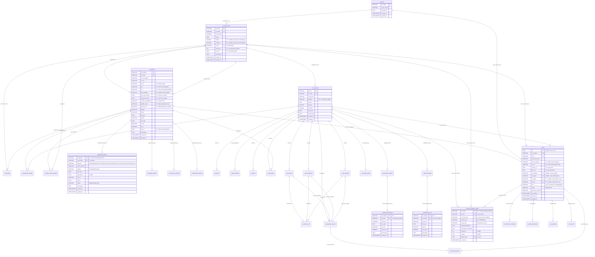

# 📊 SI GPIB v2.2 — New Entity Relationship Diagram (ERD)

> **Versi Dokumen:** 2.2.3 | **Tanggal:** 3 Agustus 2026 (Updated for EIA v0.1.1)
> **Referensi:** Blueprint v2.2.2, PRD v2.2.1, EIA v0.1.1, DB_SCHEMA.html, Supabase Migrations (20260720–20260831)
> **Status:** Synchronized & Up-to-Date
> **Penanda:** 🆕 = Tabel baru di v2.2 | 🔄 = Kolom baru/dimodifikasi di v2.2

---

## 📑 Daftar Isi

1. [ERD Diagram (Mermaid)](#1-erd-diagram-mermaid)
2. [Ringkasan Perubahan Skema Database](#2-ringkasan-perubahan-skema-database)
3. [Master Tables (m_*)](#3-master-tables-m_)
4. [Auth & Security Tables](#4-auth--security-tables)
5. [KMJ & PJ Assignment Tables](#5-kmj--pj-assignment-tables)
6. [Transaction & Dimension Tables (t_*)](#6-transaction--dimension-tables-t_)
7. [Audit, Workflow & Status History Tables](#7-audit-workflow--status-history-tables)
8. [Unified Identity Model & Business Rules](#8-unified-identity-model--business-rules)
9. [Atomic Database Functions (RPC)](#9-atomic-database-functions-rpc)
10. [Storage Buckets & Policies](#10-storage-buckets--policies)
11. [Performance Indexes](#11-performance-indexes)
12. [Row Level Security (RLS) Policies](#12-row-level-security-rls-policies)

---

## 1. ERD Diagram (Mermaid)


```mermaid
erDiagram
    %% ========================================
    %% MASTER TABLES
    %% ========================================
    m_mupel ||--o{ m_jemaat_induk : "membawahi (1:N)"
    m_jemaat_induk ||--o{ m_pos_pelkes : "membawahi (1:N)"
    m_jemaat_induk ||--o{ m_pendeta : "memiliki (1:N)"
    
    %% ========================================
    %% KMJ & PJ ASSIGNMENT
    %% ========================================
    m_jemaat_induk ||--o| m_pendeta : "1 KMJ (id_kmj)"
    m_jemaat_induk ||--o{ t_pj_jemaat : "memiliki PJ (0:N)"
    m_pendeta ||--o{ t_pj_jemaat : "ditugaskan sebagai PJ"
    
    %% ========================================
    %% PENUGASAN, JABATAN & MUTASI PENDETA
    %% ========================================
    m_pendeta ||--o{ t_penugasan_pendeta : "ditugaskan ke"
    m_pos_pelkes ||--o{ t_penugasan_pendeta : "menerima tugas"
    m_pendeta ||--o{ t_riwayat_mutasi_pendeta : "riwayat mutasi"
    m_jemaat_induk ||--o{ t_riwayat_mutasi_pendeta : "asal/tujuan"
    m_pendeta ||--o{ t_jabatan_struktural : "memiliki jabatan (🆕)"
    
    %% ========================================
    %% PROFILE 360° DIMENSI PENDETA
    %% ========================================
    m_pendeta ||--o{ t_keluarga_pendeta : "anggota keluarga"
    m_pendeta ||--o{ t_kompetensi_pendeta : "kompetensi/karunia"
    m_pendeta ||--o{ t_keterlibatan_pendeta : "keterlibatan organisasi"
    
    %% ========================================
    %% SDM & KEGIATAN
    %% ========================================
    m_pos_pelkes ||--o{ t_pelayan : "memiliki"
    m_pos_pelkes ||--o{ t_jadwal_ibadah : "menyelenggarakan"
    m_pos_pelkes ||--o{ t_relawan : "memiliki"
    m_pos_pelkes ||--o{ t_log_pastoral : "mencatat"
    m_pendeta ||--o{ t_log_pastoral : "melakukan"
    
    %% ========================================
    %% ASET & LAMPIRAN
    %% ========================================
    m_pos_pelkes ||--o{ t_aset_tanah : "memiliki"
    m_pos_pelkes ||--o{ t_aset_bangunan : "memiliki"
    m_pos_pelkes ||--o{ t_aset_bergerak : "memiliki"
    t_aset_tanah ||--o{ t_lampiran_aset : "memiliki file"
    t_aset_bangunan ||--o{ t_lampiran_aset : "memiliki file"
    t_aset_bergerak ||--o{ t_lampiran_aset : "memiliki file"
    
    %% ========================================
    %% BANTUAN & WORKFLOW
    %% ========================================
    m_pos_pelkes ||--o{ t_pengajuan_bantuan : "mengajukan"
    t_aset_tanah ||--o| t_pengajuan_bantuan : "referensi (nullable)"
    t_aset_bangunan ||--o| t_pengajuan_bantuan : "referensi (nullable)"
    t_aset_bergerak ||--o| t_pengajuan_bantuan : "referensi (nullable)"
    t_pengajuan_bantuan ||--o{ t_approval_bantuan : "melalui workflow"
    users ||--o{ t_approval_bantuan : "memberi approval"
    
    %% ========================================
    %% DEMOGRAFI & WILAYAH
    %% ========================================
    m_pos_pelkes ||--o{ t_demografi_pelkat : "profil demografi"
    m_pos_pelkes ||--o{ t_kerawanan_wilayah : "identifikasi risiko"
    m_pos_pelkes ||--o{ t_potensi_wilayah : "identifikasi potensi"
    t_kerawanan_wilayah ||--o{ t_lampiran_kerawanan : "memiliki lampiran (🆕)"
    t_potensi_wilayah ||--o{ t_lampiran_potensi : "memiliki lampiran (🆕)"
    
    %% ========================================
    %% ELEVASI & HISTORI STATUS (NEW)
    %% ========================================
    m_pos_pelkes ||--o{ t_histori_perubahan_status : "histori elevasi (🆕)"
    m_jemaat_induk ||--o{ t_histori_perubahan_status : "tujuan elevasi (🆕)"
    users ||--o{ t_histori_perubahan_status : "diubah oleh (🆕)"

    %% ========================================
    %% AUTH & SECURITY
    %% ========================================
    users ||--o{ m_webauthn_credentials : "memiliki (max 5)"
    users ||--o{ m_push_subscription : "berlangganan"
    users ||--o{ t_log_aktivitas : "melakukan aksi"
    users ||--o{ t_form_draft : "menyimpan draft"
    m_pendeta ||--o| users : "link akun pengguna"
    m_mupel ||--o{ users : "scope admin mupel"
    m_jemaat_induk ||--o{ users : "scope admin jemaat"
    m_pos_pelkes ||--o{ users : "scope admin pos"

    %% ========================================
    %% STRUKTUR DETAIL ENTITAS
    %% ========================================
    m_mupel {
        VARCHAR id_mupel PK
        VARCHAR nama_mupel
        TEXT keterangan
        TIMESTAMPTZ created_at
        TIMESTAMPTZ updated_at
    }
    
    m_jemaat_induk {
        VARCHAR id_induk PK
        VARCHAR id_mupel FK
        VARCHAR nama_induk
        TEXT alamat
        DECIMAL latitude "🔄 Nullable (opsional saat draft/legacy)"
        DECIMAL longitude "🔄 Nullable (opsional saat draft/legacy)"
        VARCHAR id_kmj FK "KMJ (Pendeta)"
        INT jemaat_ke "🔄 Urutan jemaat di GPIB"
        TEXT foto_url "🔄 Foto gereja induk"
        TEXT keterangan
        TIMESTAMPTZ created_at
        TIMESTAMPTZ updated_at
    }
    
    m_pos_pelkes {
        VARCHAR id_pos PK
        VARCHAR id_induk FK
        VARCHAR nama_pos
        VARCHAR kategori "🔄 'Pos Pelkes' | 'Bajem'"
        TEXT alamat
        DECIMAL latitude
        DECIMAL longitude
        DATE tgl_berdiri
        TEXT keterangan
        TIMESTAMPTZ created_at
        TIMESTAMPTZ updated_at
    }
    
    m_pendeta {
        VARCHAR id_pendeta PK
        VARCHAR id_induk FK
        VARCHAR nama_lengkap
        VARCHAR no_wa
        VARCHAR email "🔄 Email pendeta"
        VARCHAR nip "🔄 Nomor Induk Pegawai"
        VARCHAR nik "🔄 Nomor Induk Kependudukan"
        VARCHAR jenis_pendeta "🔄 'Organik' | 'Non-Organik'"
        DATE tgl_mulai_kontrak "🔄 Untuk non-organik"
        DATE tgl_akhir_kontrak "🔄 Untuk non-organik"
        VARCHAR sumber_pembiayaan "🔄 Sumber dana"
        BOOLEAN eligible_rotasi "🔄 Status kelayakan rotasi"
        VARCHAR gereja_asal "🔄 Afiliasi pendeta non-organik"
        VARCHAR jabatan
        VARCHAR status
        DATE tgl_lahir
        VARCHAR gender
        DATE tgl_tugas
        BOOLEAN is_kmj
        BOOLEAN is_pj
        TEXT foto_url "🔄 URL foto profil pendeta"
        TEXT keterangan
        TIMESTAMPTZ created_at
        TIMESTAMPTZ updated_at
    }
    
    users {
        UUID id PK "Supabase auth.users"
        VARCHAR no_telepon UK
        VARCHAR email UK
        VARCHAR password_hash
        VARCHAR nama_lengkap "🔄 Display name pengguna"
        VARCHAR no_hp "🔄 Nomor WhatsApp/HP aktif"
        TEXT avatar_url "🔄 Avatar URL"
        TEXT foto_url "🔄 Foto profil URL"
        VARCHAR id_pendeta FK "nullable: Link ke pendeta"
        VARCHAR id_mupel FK "nullable: Scope Admin Mupel"
        VARCHAR id_induk FK "🔄 nullable: Scope Admin Jemaat"
        VARCHAR id_pos FK "🔄 nullable: Scope Admin Pos"
        VARCHAR role "super_user|admin_mupel|kmj|pj|user"
        VARCHAR status "Aktif|Nonaktif"
        BOOLEAN biometric_enabled
        TIMESTAMPTZ last_login_at
        TIMESTAMPTZ created_at
        TIMESTAMPTZ updated_at
    }

    t_jabatan_struktural {
        VARCHAR id_jabatan PK "🆕 JBT-{timestamp}-{random}"
        VARCHAR id_pendeta FK "m_pendeta"
        VARCHAR kategori "BP Mupel|Kepanitiaan Sinode|Kepanitiaan Mupel|Kepanitiaan Jemaat|Unit Misioner|Pokja|Lainnya"
        VARCHAR nama_jabatan
        VARCHAR tingkat "Sinode|Mupel|Jemaat"
        DATE tgl_mulai
        DATE tgl_selesai "nullable"
        VARCHAR no_sk
        DATE tgl_sk
        VARCHAR status "Aktif|Selesai|Nonaktif"
        TEXT keterangan
        TIMESTAMPTZ created_at
        TIMESTAMPTZ updated_at
    }

    t_histori_perubahan_status {
        VARCHAR id_histori PK "🆕 HIS-{timestamp}-{random}"
        VARCHAR id_pos FK "m_pos_pelkes"
        VARCHAR id_induk_baru FK "m_jemaat_induk (nullable)"
        VARCHAR status_lama "Pos Pelkes|Bajem"
        VARCHAR status_baru "Bajem|Jemaat Induk"
        DATE tanggal_perubahan
        TEXT keterangan_perubahan
        INT jemaat_ke "nullable"
        TEXT catatan "nullable"
        UUID diubah_oleh FK "users.id"
        TIMESTAMPTZ created_at
    }

    t_lampiran_kerawanan {
        VARCHAR id_lampiran PK "🆕"
        VARCHAR id_risiko FK "t_kerawanan_wilayah"
        VARCHAR nama_file
        TEXT file_path
        VARCHAR tipe_file
        NUMERIC ukuran_file
        TEXT keterangan
        TIMESTAMPTZ created_at
    }

    t_lampiran_potensi {
        VARCHAR id_lampiran PK "🆕"
        VARCHAR id_potensi FK "t_potensi_wilayah"
        VARCHAR nama_file
        TEXT file_path
        VARCHAR tipe_file
        NUMERIC ukuran_file
        TEXT keterangan
        TIMESTAMPTZ created_at
    }
```

---

## 2. Ringkasan Perubahan Skema Database

### 🔄 Tabel yang Dimodifikasi
| Tabel | Perubahan Kolom / Constraints | Alasan & Deskripsi |
|-------|-------------------------------|--------------------|
| `m_pendeta` | 🔄 Tambah `jenis_pendeta`, `tgl_mulai_kontrak`, `tgl_akhir_kontrak`, `sumber_pembiayaan`, `eligible_rotasi`, `gereja_asal`, `foto_url`, `email`, `nip`, `nik` | Pemisahan Pendeta Organik vs Non-Organik, identifikasi resmi (NIP/NIK), foto profil & 360° |
| `users` | 🔄 Tambah `nama_lengkap`, `no_hp`, `avatar_url`, `foto_url`, `id_induk`, `id_pos` | Profiling pengguna universal (non-pendeta/pendeta) & scoping hierarki bertingkat |
| `m_pos_pelkes` | 🔄 Tambah `kategori` ('Pos Pelkes' / 'Bajem') | Formalisasi status pos pelayanan vs bakal jemaat |
| `m_jemaat_induk` | 🔄 Tambah `jemaat_ke`, `foto_url`, drop NOT NULL pada `latitude`/`longitude` | Penomoran urutan jemaat GPIB, dokumentasi visual, flexibilitas data legacy/draft |
| `t_log_pastoral` | 🔄 Tambah `foto_url` | Dokumentasi foto bukti pelayanan pastoral |
| `t_jadwal_ibadah` | 🔄 Tambah `zona_waktu` (DEFAULT 'WIB') | Penanganan zona waktu ibadah di seluruh wilayah GPIB (WIB/WITA/WIT) |
| `t_pelayan` & `t_relawan` | 🔄 Tambah `foto_url` | Foto profil pelayan & relawan |
| `t_aset_tanah`, `t_aset_bangunan`, `t_aset_bergerak` | 🔄 Tambah `latitude`, `longitude`, `nama_bangunan`, `kondisi` | Geospasial spesifik aset & detail fisik |
| `t_keluarga_pendeta` | 🔄 Tambah `foto_url` | Foto anggota keluarga pendeta |
| `t_kompetensi_pendeta` | 🔄 Tambah `dokumen_url` | URL bukti sertifikat/dokumen kompetensi |
| `t_kerawanan_wilayah` & `t_potensi_wilayah` | 🔄 Tambah `latitude`, `longitude`, `updated_by` | Koordinat titik rawan/potensi & jejak pengubah |

### 🆕 Tabel Baru
| Tabel | Kategori | Fungsi Utama |
|-------|----------|--------------|
| `t_jabatan_struktural` | Organisasi | Mencatat penugasan jabatan pendeta di BP Mupel, Sinode, Mupel, Kepanitiaan & Pokja |
| `t_histori_perubahan_status` | Status & Workflow | Audit trail perubahan status Pos Pelkes $\rightarrow$ Bajem $\rightarrow$ Jemaat Induk Mandiri |
| `t_lampiran_kerawanan` | Media & Lampiran | Menyimpan file foto & dokumen pendukung titik kerawanan wilayah |
| `t_lampiran_potensi` | Media & Lampiran | Menyimpan file foto & dokumen pendukung potensi wilayah |

---

## 3. Master Tables (m_*)

### 📋 `m_mupel` — Musyawarah Pelayanan
| Column | Type | Constraint | Description |
|--------|------|------------|-------------|
| `id_mupel` | VARCHAR(20) | **PK** | ID Mupel (contoh: `M - 01`) |
| `nama_mupel` | VARCHAR(100) | NOT NULL | Nama Mupel |
| `keterangan` | TEXT | | Keterangan tambahan |
| `created_at` | TIMESTAMPTZ | DEFAULT NOW() | Timestamp pembuatan |
| `updated_at` | TIMESTAMPTZ | DEFAULT NOW() | Timestamp update |

---

### 📋 `m_jemaat_induk` — Gereja Induk
| Column | Type | Constraint | Description |
|--------|------|------------|-------------|
| `id_induk` | VARCHAR(20) | **PK** | ID Jemaat Induk (contoh: `02-01-BM`) |
| `id_mupel` | VARCHAR(20) | **FK** → `m_mupel` | Mupel induk |
| `nama_induk` | VARCHAR(150) | NOT NULL | Nama Jemaat |
| `alamat` | TEXT | | Alamat lengkap |
| `latitude` | DECIMAL(10,7) | 🔄 Nullable | Koordinat GPS (opsional saat draf/legacy) |
| `longitude` | DECIMAL(10,7) | 🔄 Nullable | Koordinat GPS (opsional saat draf/legacy) |
| `id_kmj` | VARCHAR(20) | **FK** → `m_pendeta`, UNIQUE | KMJ yang memimpin |
| `jemaat_ke` | INTEGER | 🔄 Nullable | Nomor urut Jemaat GPIB (contoh: 325) |
| `foto_url` | TEXT | 🔄 Nullable | URL foto gedung gereja |
| `keterangan` | TEXT | | Keterangan tambahan |
| `created_at` | TIMESTAMPTZ | DEFAULT NOW() | |
| `updated_at` | TIMESTAMPTZ | DEFAULT NOW() | |

---

### 📋 `m_pos_pelkes` — Pos Pelayanan Kesaksian & Bajem
| Column | Type | Constraint | Description |
|--------|------|------------|-------------|
| `id_pos` | VARCHAR(20) | **PK** | ID Pos Pelkes (contoh: `POS-13055`) |
| `id_induk` | VARCHAR(20) | **FK** → `m_jemaat_induk` | Jemaat Induk Pengampu |
| `nama_pos` | VARCHAR(150) | NOT NULL | Nama Pos Pelkes / Bajem |
| `kategori` | VARCHAR(50) | 🔄 DEFAULT 'Pos Pelkes' | `'Pos Pelkes'` / `'Bajem'` |
| `alamat` | TEXT | | Alamat lengkap |
| `latitude` | DECIMAL(10,7) | | Koordinat GPS |
| `longitude` | DECIMAL(10,7) | | Koordinat GPS |
| `tgl_berdiri` | DATE | | Tanggal berdiri |
| `keterangan` | TEXT | | Keterangan tambahan |
| `created_at` | TIMESTAMPTZ | DEFAULT NOW() | |
| `updated_at` | TIMESTAMPTZ | DEFAULT NOW() | |

---

### 📋 `m_pendeta` — Data Pendeta GPIB
| Column | Type | Constraint | Description |
|--------|------|------------|-------------|
| `id_pendeta` | VARCHAR(20) | **PK** | ID Pendeta (contoh: `PDT-19060024`) |
| `id_induk` | VARCHAR(20) | **FK** → `m_jemaat_induk` | Jemaat Induk tempat terdaftar |
| `nama_lengkap` | VARCHAR(150) | NOT NULL | SSOT Nama resmi Pendeta beserta gelar |
| `nip` | TEXT | 🔄 Nullable | Nomor Induk Pegawai Sinode |
| `nik` | TEXT | 🔄 Nullable | Nomor Induk Kependudukan |
| `jenis_pendeta` | VARCHAR(20) | 🔄 DEFAULT 'Organik' | CHECK (`'Organik'`, `'Non-Organik'`) |
| `tgl_mulai_kontrak` | DATE | 🔄 Nullable | Mulai kontrak (Non-Organik) |
| `tgl_akhir_kontrak` | DATE | 🔄 Nullable | Akhir kontrak (Non-Organik) |
| `sumber_pembiayaan` | VARCHAR(100) | 🔄 Nullable | Sumber dana gaji/pelayanan |
| `eligible_rotasi` | BOOLEAN | 🔄 DEFAULT TRUE | Status kelayakan rotasi/mutasi |
| `gereja_asal` | VARCHAR(150) | 🔄 Nullable | Gereja asal pendeta non-organik |
| `no_wa` | VARCHAR(20) | | Nomor WhatsApp |
| `email` | VARCHAR(150) | 🔄 Nullable | Email resmi pendeta |
| `foto_url` | TEXT | 🔄 Nullable | Foto profil pendeta |
| `jabatan` | VARCHAR(100) | | Jabatan struktural/fungsional |
| `status` | VARCHAR(50) | DEFAULT 'Aktif' | Status (`Aktif` / `Non-aktif` / `Emeritus`) |
| `tgl_lahir` | DATE | | Tanggal lahir |
| `gender` | VARCHAR(10) | | Gender (`L` / `P`) |
| `tgl_tugas` | DATE | | Tanggal mulai bertugas |
| `is_kmj` | BOOLEAN | DEFAULT FALSE | Flag: sedang menjabat KMJ |
| `is_pj` | BOOLEAN | DEFAULT FALSE | Flag: sedang menjabat PJ |
| `keterangan` | TEXT | | Keterangan tambahan |
| `created_at` | TIMESTAMPTZ | DEFAULT NOW() | |
| `updated_at` | TIMESTAMPTZ | DEFAULT NOW() | |

---

## 4. Auth & Security Tables

### 📋 `users` — Extended User Profile (Supabase Auth Link)
| Column | Type | Constraint | Description |
|--------|------|------------|-------------|
| `id` | UUID | **PK** | Linked ke `auth.users.id` |
| `no_telepon` | VARCHAR(20) | UNIQUE, nullable | Nomor telepon login |
| `email` | VARCHAR(150) | UNIQUE, nullable | Email login |
| `password_hash` | TEXT | nullable | Hash password (jika menggunakan custom auth) |
| `nama_lengkap` | VARCHAR(150) | 🔄 Nullable | Display name pengguna (Non-Pendeta / Cache Pendeta) |
| `no_hp` | VARCHAR(30) | 🔄 Nullable | Nomor HP kontak aktif |
| `avatar_url` | TEXT | 🔄 Nullable | Avatar thumbnail URL |
| `foto_url` | TEXT | 🔄 Nullable | Foto profil penuh URL |
| `id_pendeta` | VARCHAR(20) | **FK** → `m_pendeta`, nullable | FK jika pengguna adalah Pendeta |
| `id_mupel` | VARCHAR(20) | **FK** → `m_mupel`, nullable | Scope Admin Mupel |
| `id_induk` | VARCHAR(20) | **FK** → `m_jemaat_induk`, nullable | Scope Admin Jemaat |
| `id_pos` | VARCHAR(20) | **FK** → `m_pos_pelkes`, nullable | Scope Admin Pos Pelkes |
| `role` | VARCHAR(20) | NOT NULL | `super_user` / `admin_mupel` / `kmj` / `pj` / `user` |
| `status` | VARCHAR(20) | DEFAULT 'Aktif' | Status akun (`Aktif` / `Nonaktif`) |
| `biometric_enabled` | BOOLEAN | DEFAULT FALSE | Status keaktifan login biometrik |
| `last_login_at` | TIMESTAMPTZ | | Timestamp login terakhir |
| `created_at` | TIMESTAMPTZ | DEFAULT NOW() | |
| `updated_at` | TIMESTAMPTZ | DEFAULT NOW() | |

---

## 5. KMJ & PJ Assignment Tables

### 📋 `t_pj_jemaat` — Penugasan Pendeta Jemaat (PJ)
| Column | Type | Constraint | Description |
|--------|------|------------|-------------|
| `id` | SERIAL | **PK** | Auto-increment ID |
| `id_induk` | VARCHAR(20) | **FK** → `m_jemaat_induk` ON DELETE CASCADE | Jemaat Induk tempat penugasan |
| `id_pendeta` | VARCHAR(20) | **FK** → `m_pendeta` ON DELETE CASCADE | Pendeta yang ditugaskan sebagai PJ |
| `tanggal_mulai` | DATE | NOT NULL, DEFAULT CURRENT_DATE | Tanggal awal penugasan |
| `tanggal_selesai` | DATE | nullable | NULL = Masih aktif bertugas |
| `status` | VARCHAR(20) | DEFAULT 'Aktif' | Status penugasan |
| `created_at` | TIMESTAMPTZ | DEFAULT NOW() | |
| `updated_at` | TIMESTAMPTZ | DEFAULT NOW() | |

---

## 6. Transaction & Dimension Tables (t_*)

### 📋 `t_jabatan_struktural` — Jabatan Organisasi Pendeta 🆕
| Column | Type | Constraint | Description |
|--------|------|------------|-------------|
| `id_jabatan` | VARCHAR(30) | **PK** | Format: `JBT-{timestamp}-{random}` |
| `id_pendeta` | VARCHAR(20) | **FK** → `m_pendeta` ON DELETE CASCADE | Pendeta yang memegang jabatan |
| `kategori` | VARCHAR(50) | NOT NULL | CHECK (`BP Mupel`, `Kepanitiaan Sinode`, `Kepanitiaan Mupel`, `Kepanitiaan Jemaat`, `Unit Misioner`, `Pokja`, `Lainnya`) |
| `nama_jabatan` | VARCHAR(100) | NOT NULL | Nama spesifik posisi/jabatan |
| `tingkat` | VARCHAR(20) | NOT NULL | CHECK (`Sinode`, `Mupel`, `Jemaat`) |
| `tgl_mulai` | DATE | NOT NULL, DEFAULT CURRENT_DATE | Tanggal mulai menjabat |
| `tgl_selesai` | DATE | nullable | NULL = Masih aktif |
| `no_sk` | VARCHAR(100) | | Nomor Surat Keputusan |
| `tgl_sk` | DATE | | Tanggal Surat Keputusan |
| `status` | VARCHAR(20) | DEFAULT 'Aktif' | CHECK (`Aktif`, `Selesai`, `Nonaktif`) |
| `keterangan` | TEXT | | Catatan tambahan |
| `created_at` | TIMESTAMPTZ | DEFAULT NOW() | |
| `updated_at` | TIMESTAMPTZ | DEFAULT NOW() | |

---

### 📋 `t_log_pastoral` — Log Kegiatan Pastoral
| Column | Type | Constraint | Description |
|--------|------|------------|-------------|
| `id_log` | VARCHAR(30) | **PK** | ID Log Pastoral |
| `id_pos` | VARCHAR(20) | **FK** → `m_pos_pelkes` | Pos Pelkes terkait |
| `id_pendeta` | VARCHAR(20) | **FK** → `m_pendeta` | Pendeta pelaksana |
| `tgl` | DATE | NOT NULL | Tanggal pelayanan |
| `kegiatan` | VARCHAR(200) | NOT NULL | Jenis kegiatan pelayanan |
| `jml_jiwa` | INT | | Jumlah jiwa yang dilayani |
| `catatan` | TEXT | | Detail catatan pelayanan |
| `foto_url` | TEXT | 🔄 Nullable | URL foto dokumentasi kegiatan |
| `keterangan` | TEXT | | Keterangan tambahan |
| `created_at` | TIMESTAMPTZ | DEFAULT NOW() | |
| `updated_at` | TIMESTAMPTZ | DEFAULT NOW() | |

---

### 📋 `t_jadwal_ibadah` — Jadwal Ibadah Pos Pelkes
| Column | Type | Constraint | Description |
|--------|------|------------|-------------|
| `id_ibadah` | VARCHAR(30) | **PK** | |
| `id_pos` | VARCHAR(20) | **FK** → `m_pos_pelkes` | |
| `jenis` | VARCHAR(100) | NOT NULL | Jenis ibadah (Hari Minggu/Keluarga/dll) |
| `hari` | VARCHAR(20) | NOT NULL | Hari pelaksanaan |
| `jam` | TIME | NOT NULL | Jam pelaksanaan |
| `zona_waktu` | VARCHAR(10) | 🔄 DEFAULT 'WIB' | Zona waktu (`WIB`, `WITA`, `WIT`) |
| `keterangan` | TEXT | | |
| `created_at` | TIMESTAMPTZ | DEFAULT NOW() | |
| `updated_at` | TIMESTAMPTZ | DEFAULT NOW() | |

---

### 📋 `t_aset_tanah` — Aset Tanah
| Column | Type | Constraint | Description |
|--------|------|------------|-------------|
| `id_tanah` | VARCHAR(30) | **PK** | |
| `id_pos` | VARCHAR(20) | **FK** → `m_pos_pelkes` | |
| `luas_m2` | DECIMAL(12,2) | | Luas tanah ($m^2$) |
| `thn_perolehan` | INT | | Tahun perolehan |
| `status_hukum` | VARCHAR(100) | | Status sertifikat (SHM/HGB/dll) |
| `kondisi` | VARCHAR(50) | | Kondisi fisik |
| `potensi_sda` | VARCHAR(200) | | Potensi sumber daya alam |
| `latitude` | NUMERIC(10,7) | 🔄 Nullable | Koordinat lokasi fisik tanah |
| `longitude` | NUMERIC(10,7) | 🔄 Nullable | Koordinat lokasi fisik tanah |
| `keterangan` | TEXT | | |
| `created_at` | TIMESTAMPTZ | DEFAULT NOW() | |
| `updated_at` | TIMESTAMPTZ | DEFAULT NOW() | |

---

### 📋 `t_aset_bangunan` — Aset Bangunan
| Column | Type | Constraint | Description |
|--------|------|------------|-------------|
| `id_bangunan` | VARCHAR(30) | **PK** | |
| `id_pos` | VARCHAR(20) | **FK** → `m_pos_pelkes` | |
| `nama_bangunan` | VARCHAR(150) | 🔄 Nullable | Nama spesifik bangunan |
| `fungsi` | VARCHAR(100) | | Peruntukan/fungsi bangunan |
| `kondisi` | VARCHAR(50) | | Kondisi fisik bangunan |
| `thn_berdiri` | INT | | Tahun pembangunan |
| `latitude` | NUMERIC(10,7) | 🔄 Nullable | Koordinat fisik bangunan |
| `longitude` | NUMERIC(10,7) | 🔄 Nullable | Koordinat fisik bangunan |
| `keterangan` | TEXT | | |
| `created_at` | TIMESTAMPTZ | DEFAULT NOW() | |
| `updated_at` | TIMESTAMPTZ | DEFAULT NOW() | |

---

### 📋 `t_aset_bergerak` — Aset Bergerak (Kendaraan/Peralatan)
| Column | Type | Constraint | Description |
|--------|------|------------|-------------|
| `id_aset_b` | VARCHAR(30) | **PK** | |
| `id_pos` | VARCHAR(20) | **FK** → `m_pos_pelkes` | |
| `jenis` | VARCHAR(100) | | Jenis aset bergerak |
| `merk_tipe` | VARCHAR(100) | | Merk dan tipe |
| `kondisi` | VARCHAR(50) | 🔄 DEFAULT 'Baik' | Kondisi fisik aset |
| `thn_perolehan` | INT | | Tahun perolehan |
| `no_polisi` | VARCHAR(20) | | Nomor polisi (jika kendaraan) |
| `tgl_pajak` | DATE | | Jatuh tempo pajak |
| `latitude` | NUMERIC(10,7) | 🔄 Nullable | Koordinat lokasi fisik aset |
| `longitude` | NUMERIC(10,7) | 🔄 Nullable | Koordinat lokasi fisik aset |
| `keterangan` | TEXT | | |
| `created_at` | TIMESTAMPTZ | DEFAULT NOW() | |
| `updated_at` | TIMESTAMPTZ | DEFAULT NOW() | |

---

### 📋 `t_pengajuan_bantuan` — Pengajuan Bantuan
| Column | Type | Constraint | Description |
|--------|------|------------|-------------|
| `id_ajuan` | VARCHAR(30) | **PK** | |
| `id_pos` | VARCHAR(20) | **FK** → `m_pos_pelkes` | |
| `id_ajuan_sebelumnya` | VARCHAR(30) | **FK** → `t_pengajuan_bantuan`, nullable | 🆕 Referensi ke pengajuan lama saat "Ajukan Ulang" setelah Rejected |
| `status` | VARCHAR(50) | | `Draft`, `Pending_KMJ`, `Pending_Mupel`, `Pending_Sinode`, `Approved`, `Rejected` |
| `created_at` | TIMESTAMPTZ | DEFAULT NOW() | |
| `updated_at` | TIMESTAMPTZ | DEFAULT NOW() | |

> 🆕 **EIA v0.1.1 — Aturan Pengajuan Ulang:**
> Jika status = `Rejected`, pemohon dapat membuat pengajuan baru (record baru) yang mereferensikan record lama via `id_ajuan_sebelumnya`. Record lama tetap tersimpan dengan status `Rejected` untuk audit trail.

---

### 📋 `t_kerawanan_wilayah` & `t_potensi_wilayah`
- **`t_kerawanan_wilayah`**: `id_risiko` (PK), `id_pos` (FK), `kategori`, `jenis_risiko`, `frekuensi`, `latitude` (NUMERIC 10,8), `longitude` (NUMERIC 11,8), `updated_by` (VARCHAR 150), `keterangan`, timestamps.
- **`t_potensi_wilayah`**: `id_potensi` (PK), `id_pos` (FK), `nama_potensi`, `kategori`, `deskripsi`, `latitude` (NUMERIC 10,8), `longitude` (NUMERIC 11,8), `updated_by` (VARCHAR 150), `keterangan`, timestamps.

### 📋 `t_lampiran_kerawanan` & `t_lampiran_potensi` 🆕
- **`t_lampiran_kerawanan`**: `id_lampiran` (PK), `id_risiko` (FK → `t_kerawanan_wilayah` ON DELETE CASCADE), `nama_file`, `file_path`, `tipe_file`, `ukuran_file`, `keterangan`, `created_at`.
- **`t_lampiran_potensi`**: `id_lampiran` (PK), `id_potensi` (FK → `t_potensi_wilayah` ON DELETE CASCADE), `nama_file`, `file_path`, `tipe_file`, `ukuran_file`, `keterangan`, `created_at`.

---

## 7. Audit, Workflow & Status History Tables

### 📋 `t_approval_bantuan` — Jejak Approval Workflow Bantuan 🆕
| Column | Type | Constraint | Description |
|--------|------|------------|-------------|
| `id` | SERIAL | **PK** | |
| `id_ajuan` | VARCHAR(30) | **FK** → `t_pengajuan_bantuan` ON DELETE CASCADE | Pengajuan yang disetujui/ditolak |
| `approver_id` | UUID | **FK** → `auth.users` | User yang memberikan approval |
| `role_approver` | VARCHAR(20) | CHECK ('kmj','admin_mupel','super_user') | Role saat review |
| `aksi` | VARCHAR(20) | | `Approved` atau `Rejected` |
| `catatan` | TEXT | | Catatan review dari approver |
| `created_at` | TIMESTAMPTZ | DEFAULT NOW() | |

---

### 📋 `t_histori_perubahan_status` — Log Perubahan Status Elevasi 🆕
| Column | Type | Constraint | Description |
|--------|------|------------|-------------|
| `id_histori` | VARCHAR(30) | **PK** | Format: `HIS-{timestamp}-{random}` |
| `id_pos` | VARCHAR(20) | **FK** → `m_pos_pelkes` ON DELETE CASCADE | Pos Pelkes yang ditingkatkan statusnya |
| `id_induk_baru` | VARCHAR(20) | **FK** → `m_jemaat_induk`, nullable | ID Jemaat Induk baru (jika elevasi ke Jemaat Induk) |
| `status_lama` | VARCHAR(50) | NOT NULL | Status sebelum elevasi (`Pos Pelkes` / `Bajem`) |
| `status_baru` | VARCHAR(50) | NOT NULL | Status target (`Bajem` / `Jemaat Induk`) |
| `tanggal_perubahan` | DATE | NOT NULL | Tanggal resmi penetapan status |
| `keterangan_perubahan` | TEXT | NOT NULL | Alasan / Nomor SK Penetapan |
| `jemaat_ke` | INTEGER | 🔄 Nullable | Urutan nomor Jemaat GPIB baru |
| `catatan` | TEXT | 🔄 Nullable | Catatan teknis histori |
| `diubah_oleh` | UUID | **FK** → `auth.users.id` | User mengeksekusi elevasi |
| `created_at` | TIMESTAMPTZ | DEFAULT NOW() | |

---

## 8. Unified Identity Model & Business Rules

### 🔗 Clarification 1: Redundansi `users.nama_lengkap` vs `m_pendeta.nama_lengkap`
- **SSOT Resmi Ecclesiastical**: `m_pendeta.nama_lengkap` adalah Single Source of Truth untuk nama Pendeta beserta gelar resmi gerejawi.
- **Display Name Universal User**: `users.nama_lengkap` berfungsi sebagai nama tampilan profil akun aplikasi untuk seluruh tipe pengguna (Super User, Admin Mupel, Admin Jemaat, Admin Pos) dan secara otomatis disinkronkan saat pendaftaran/tautan akun pendeta.

### 🗺️ Clarification 2: Geospasial `m_jemaat_induk` (Nullable)
- **Business Rule #11 (Updated)**: Geospasial (`latitude`/`longitude`) sangat direkomendasikan untuk seluruh Jemaat Induk dan secara otomatis diwarisi dari koordinat Pos Pelkes pengampu saat elevasi status.
- **Penyebab Nullable**: Dibuat nullable di database PostgreSQL untuk menjamin kelancaran import data historis legacy GPIB dan draf awal pembentukan Jemaat Induk baru sebelum verifikasi survei lokasi.

### 📜 Aturan Inti Sistem (Business Rules 1–16)
1. **Hierarki**: Mupel (1) $\rightarrow$ (N) Jemaat Induk (1) $\rightarrow$ (N) Pos Pelkes / Bajem.
2. **KMJ Rule**: 1 Jemaat Induk = Tepat 1 KMJ (`m_jemaat_induk.id_kmj` UNIQUE). KMJ harus seorang Pendeta aktif.
3. **PJ Rule**: 1 Jemaat Induk = 0 atau lebih PJ (`t_pj_jemaat`). 1 Pendeta hanya bisa menjabat PJ aktif di 1 Jemaat Induk.
4. **Pendeta Organik vs Non-Organik**: Pendeta Non-Organik memiliki batasan masa kontrak (`tgl_mulai_kontrak` & `tgl_akhir_kontrak`) dan mencatat `gereja_asal`.
5. **Elevasi Status Pos**: Elevasi Pos Pelkes $\rightarrow$ Bajem $\rightarrow$ Jemaat Induk **WAJIB** mengeksekusi RPC `process_status_elevation()` secara atomik.

---

## 9. Atomic Database Functions (RPC)

### ⚙️ `process_status_elevation(...)`
Fungsi atomik untuk mengubah status Pos Pelkes menjadi Bajem atau meningkatkan status Bajem menjadi Jemaat Induk Mandiri Baru.

**Signatur Parameter**:
```sql
FUNCTION process_status_elevation(
  p_id_pos VARCHAR,
  p_target_status VARCHAR,        -- 'BAJEM' atau 'JEMAAT_INDUK'
  p_tanggal_perubahan DATE,
  p_keterangan TEXT,
  p_id_induk_baru VARCHAR DEFAULT NULL,
  p_nama_induk_baru VARCHAR DEFAULT NULL,
  p_id_mupel_baru VARCHAR DEFAULT NULL,
  p_jemaat_ke INTEGER DEFAULT NULL,
  p_catatan TEXT DEFAULT NULL
) RETURNS VOID
```

**Langkah Kerja Atomik**:
1. Memeriksa keberadaan Pos Pelkes & mengambil data alamat serta lat/long saat ini.
2. Jika `target_status = 'BAJEM'`: Mengubah `m_pos_pelkes.kategori = 'Bajem'`, serta mencatat log di `t_histori_perubahan_status`.
3. Jika `target_status = 'JEMAAT_INDUK'`:
   - Membikin record baru di `m_jemaat_induk` (mewarisi alamat, koordinat GPS lat/long, dan menetapkan `jemaat_ke`).
   - Mengubah `m_pos_pelkes.id_induk` ke Jemaat Induk baru tersebut & men-set `kategori = 'Bajem'`.
   - Mencatat audit log di `t_histori_perubahan_status`.

---

## 10. Storage Buckets & Policies

| Bucket Name | Accessibility | Allowed File Types | Purpose |
|-------------|---------------|-------------------|---------|
| `log-pastoral-images` | Public Read / Authenticated Write | JPG, PNG, WEBP | Foto bukti kegiatan pelayanan pastoral |
| `assets` | Public Read / Authenticated Write | JPG, PNG, WEBP, PDF | Foto & dokumen lampiran aset gereja |
| `avatars` / `profile-images` | Public Read / Authenticated Write | JPG, PNG, WEBP | Foto profil pengguna, pendeta & pelayan |

---

## 11. Performance Indexes

Seluruh indeks performa telah disetup di Supabase untuk navigasi cepat & query berskala besar:

```sql
-- Indeks Hierarki & Master
CREATE INDEX IF NOT EXISTS idx_m_pos_pelkes_id_induk ON public.m_pos_pelkes(id_induk);
CREATE INDEX IF NOT EXISTS idx_m_pos_pelkes_kategori ON public.m_pos_pelkes(kategori);
CREATE INDEX IF NOT EXISTS idx_m_jemaat_induk_id_mupel ON public.m_jemaat_induk(id_mupel);
CREATE INDEX IF NOT EXISTS idx_m_jemaat_induk_id_kmj ON public.m_jemaat_induk(id_kmj);

-- Indeks Pengguna & Auth Hierarchy
CREATE INDEX IF NOT EXISTS idx_users_email ON public.users(email);
CREATE INDEX IF NOT EXISTS idx_users_id_mupel ON public.users(id_mupel);
CREATE INDEX IF NOT EXISTS idx_users_id_induk ON public.users(id_induk);
CREATE INDEX IF NOT EXISTS idx_users_id_pos ON public.users(id_pos);
CREATE INDEX IF NOT EXISTS idx_users_role ON public.users(role);

-- Indeks Histori & Transaksi
CREATE INDEX IF NOT EXISTS idx_t_histori_id_pos ON public.t_histori_perubahan_status(id_pos);
CREATE INDEX IF NOT EXISTS idx_t_histori_id_induk_baru ON public.t_histori_perubahan_status(id_induk_baru);
CREATE INDEX IF NOT EXISTS idx_jabatan_pendeta ON public.t_jabatan_struktural(id_pendeta);
CREATE INDEX IF NOT EXISTS idx_jabatan_aktif ON public.t_jabatan_struktural(id_pendeta, kategori) WHERE status = 'Aktif';
```

---

## 12. Row Level Security (RLS) Policies

Setiap tabel baru maupun yang dimodifikasi telah dilindungi dengan kebijakan RLS berlapis:

- **`t_jabatan_struktural`**:
  - `SELECT`: Bebas dibaca oleh pengguna terautentikasi (transparansi organisasi).
  - `ALL`: `super_user` penuh, `admin_mupel` untuk pendeta di wilayah Mupel-nya.
- **`t_histori_perubahan_status`**:
  - `SELECT`: Dibaca publik/pengguna terautentikasi.
  - `INSERT/UPDATE`: Pengguna terautentikasi dengan hak akses elevasi.
- **`t_lampiran_kerawanan` & `t_lampiran_potensi`**:
  - Mengikuti kebijakan akses tabel parent (`t_kerawanan_wilayah` & `t_potensi_wilayah`).
- **`t_log_aktivitas`**:
  - `SELECT`: `super_user` penuh, `admin_mupel` untuk wilayahnya (via JWT `id_mupel`), `kmj` untuk jemaatnya (via JWT `id_induk`). Eksplisit didefinisikan sesuai EIA v0.1.1.

---

📅 *Tanggal Update Terbaru:* 3 Agustus 2026  
✍️ *Disusun & Diselaraskan oleh:* Team Leader & Senior Database Architect SI GPIB v2.2  
🔗 *Status Operasional:* Fully Synchronized with Supabase Production Database Schema
