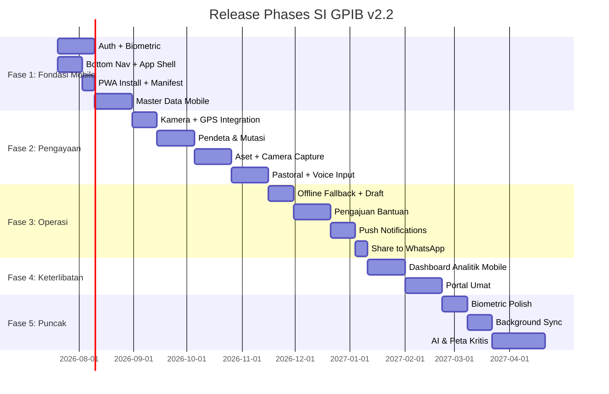

# 📄 SI GPIB v2.2 — Product Requirements Document (PRD)

> **Sistem Informasi Pos Pelayanan Kesaksian (SI Pos Pelkes) GPIB**
> Versi Dokumen: 1.0 | Tanggal: 20 Juli 2026
> Referensi: Blueprint v2.2 (Mobile First PWA + Biometric)
> Status: *Ready for Development*

---

## 📑 Daftar Isi

1. [Executive Summary](#1-executive-summary)
2. [Problem Statement](#2-problem-statement)
3. [Goals & Success Metrics](#3-goals--success-metrics)
4. [User Personas](#4-user-personas)
5. [User Stories](#5-user-stories)
6. [Functional Requirements](#6-functional-requirements)
7. [Non-Functional Requirements](#7-non-functional-requirements)
8. [UX/UI Requirements](#8-uiux-requirements)
9. [Data Requirements](#9-data-requirements)
10. [Integration Requirements](#10-integration-requirements)
11. [Release Phases](#11-release-phases)
12. [Acceptance Criteria](#12-acceptance-criteria)
13. [Out of Scope](#13-out-of-scope)
14. [Assumptions & Dependencies](#14-assumptions--dependencies)
15. [Risks & Mitigations](#15-risks--mitigations)
16. [Glossary](#16-glossary)
17. [Appendix](#17-appendix)

---

## 1. Executive Summary

**SI GPIB v2.2** adalah platform digital **Mobile First PWA** untuk mengelola data hierarki pelayanan GPIB (Gereja Protestan Indonesia di Barat) — mencakup 25 Mupel, 350+ Jemaat Induk, 200+ Pos Pelkes, dan 600+ Pendeta di seluruh Indonesia.

Sistem ini menjadi **Single Source of Truth** untuk 4 Bidang Pelayanan dan Unit Misioner lainnya serta dirancang untuk **90%+ akses via mobile** oleh pendeta di lapangan, termasuk di daerah terpencil (Kalimantan pedalaman, Papua, Sulawesi Barat).

### 🎯 Value Proposition

| Untuk | Value |
|-------|-------|
| **Pendeta di lapangan** | Input data pastoral, foto aset, log kegiatan langsung dari HP — tanpa perlu laptop |
| **KMJ (Ketua Majelis Jemaat)** | Monitoring real-time seluruh Pos Pelkes di jemaatnya |
| **Admin Mupel** | Dashboard analitik + approval workflow pengajuan bantuan |
| **Super User Sinode** | Single Source of Truth untuk pengambilan keputusan strategis |

---

## 2. Problem Statement

### ❌ Kondisi Saat Ini (Berdasarkan Slide 8 GPIB Reach Out)

| Masalah | Dampak |
|---------|--------|
| Data manual/semi-digital (Excel, kertas, WhatsApp) | Data tersebar, sulit diverifikasi |
| Tiap Bidang punya sistem sendiri | Silo mentality, data tumpang tindih |
| Reporting lambat | Butuh minggu/bulan untuk kompilasi data |
| Tidak ada geospasial terintegrasi | Sulit identifikasi Pos Pelkes terpencil |
| Pendeta di daerah sinyal lemah tidak bisa input | Data tidak uptodate |

### 💡 Solusi yang Ditawarkan

Platform **Mobile First PWA** yang:
- ✅ **Single Source of Truth** — 1 platform untuk semua Bidang
- ✅ **Mobile First** — Dioptimalkan untuk HP pendeta di lapangan
- ✅ **Biometric Auth** — Login < 1 detik dengan fingerprint/Face ID
- ✅ **Camera + GPS** — Foto aset + auto-fill koordinat
- ✅ **Offline-Ready** — Form draft + pending queue saat sinyal lemah
- ✅ **PWA Installable** — Terasa seperti app native

---

## 3. Goals & Success Metrics

### 🎯 Business Goals

| # | Goal | Target | Timeline |
|---|------|--------|----------|
| G1 | Adopsi sistem oleh pendeta | ≥ 80% pendeta aktif | 6 bulan post-launch |
| G2 | Kelengkapan data Pos Pelkes | ≥ 95% Pos Pelkes punya data lengkap | 12 bulan |
| G3 | Kecepatan reporting | Dari minggu → real-time | Post-launch |
| G4 | Kepuasan pengguna | NPS ≥ 50 | 6 bulan post-launch |
| G5 | Adopsi PWA | ≥ 60% install rate | 3 bulan post-launch |
| G6 | Adopsi Biometric | ≥ 70% pendeta aktifkan | 3 bulan post-launch |

### 📊 Key Performance Indicators (KPI)

```yaml
performance:
  - page_load_time_mobile: "< 1.5s (P95)"
  - page_load_time_desktop: "< 2s (P95)"
  - api_response_time: "< 500ms (P95)"
  - lighthouse_mobile_score: "> 90"

reliability:
  - uptime: "99.9%"
  - error_rate: "< 0.1%"

mobile:
  - pwa_install_rate: "> 60%"
  - biometric_adoption: "> 70%"
  - camera_capture_success: "> 95%"
  - form_draft_recovery: "> 90%"

usage:
  - daily_active_users: "tracked"
  - mobile_vs_desktop_ratio: "> 90:10"
  - data_completeness: "> 95%"
```

---

## 4. User Personas

### 👤 Persona 1: Super User (Admin Sinode)

| Aspek | Detail |
|-------|--------|
| **Nama** | Bpk. Stolaputih |
| **Role** | Super User Sinode |
| **Device** | Laptop + HP |
| **Lokasi** | Kantor Sinode Jakarta |
| **Konteks** | Membutuhkan overview seluruh GPIB untuk keputusan strategis |
| **Pain Points** | Data tersebar, reporting lambat, tidak ada dashboard terintegrasi |
| **Goals** | Lihat data real-time seluruh GPIB, export laporan, manage user |
| **Tech Savvy** | Medium |

**User Needs:**
- Dashboard analitik seluruh GPIB
- Manajemen user & role
- Export data ke Excel/PDF
- Audit trail aktivitas

---

### 👤 Persona 2: Admin Mupel

| Aspek | Detail |
|-------|--------|
| **Nama** | Bpk. Junior (Mupel 22-04-EB) |
| **Role** | Admin Mupel |
| **Device** | HP Android (primary) |
| **Lokasi** | Kalimantan Timur |
| **Konteks** | Mengkoordinasi 10-20 Jemaat Induk di wilayahnya |
| **Pain Points** | Sulit monitor jemaat yang tersebar, approval manual |
| **Goals** | Monitor jemaat di Mupel-nya, approve pengajuan bantuan |
| **Tech Savvy** | Medium |

**User Needs:**
- Dashboard Mupel (filter by Mupel)
- Approval workflow pengajuan bantuan
- Laporan berkala Mupel
- Komunikasi dengan KMJ

---

### 👤 Persona 3: KMJ (Ketua Majelis Jemaat)

| Aspek | Detail |
|-------|--------|
| **Nama** | Pdt. Anita (KMJ Jemaat 02-01-BM Bethesda Muntok) |
| **Role** | KMJ (harus Pendeta) |
| **Device** | HP (primary) |
| **Lokasi** | Muntok, Bangka Barat |
| **Konteks** | Memimpin jemaat dengan 1 Pos Pelkes (POS-13055 Parittiga, 27 KK, 84 jiwa) |
| **Pain Points** | Sulit track kegiatan pendeta, data Pos Pelkes tidak uptodate |
| **Goals** | Monitor semua Pos Pelkes di jemaatnya, review log pastoral |
| **Tech Savvy** | Medium-Low |

**User Needs:**
- Daftar Pos Pelkes di jemaatnya
- Review log pastoral pendeta
- Assign PJ ke Pos Pelkes
- Lihat demografi per Pos Pelkes

---

### 👤 Persona 4: PJ / User (Pendeta di Lapangan) ⭐ PRIMARY USER

| Aspek | Detail |
|-------|--------|
| **Nama** | Pdt. Otniel (PJ Pos Pelkes 23-03-ET Efata Tenggarong) |
| **Role** | User (Pendeta yang ditugaskan) |
| **Device** | HP Android mid-range (primary) |
| **Lokasi** | Long Hubung, Kalimantan Timur (sinyal terbatas) |
| **Konteks** | Melayani Pos Pelkes "Eben Haezer" Tripariq Makmur (26 KK, 99 jiwa) |
| **Pain Points** | Sinyal lemah, harus input data di lapangan, butuh cepat |
| **Goals** | Input log pastoral, foto aset, update demografi dengan cepat |
| **Tech Savvy** | Low-Medium |

**User Needs:**
- ⭐ **Mobile-first** — semua fitur harus bisa di HP
- ⭐ **Biometric login** — login cepat tanpa ketik password
- ⭐ **Camera capture** — foto aset langsung dari lapangan
- ⭐ **GPS auto-fill** — koordinat otomatis saat input Pos Pelkes
- ⭐ **Offline-ready** — form draft saat sinyal hilang
- ⭐ **Voice input** — input log pastoral dengan suara (opsional)
- ⭐ **Quick action** — FAB untuk aksi cepat (log, foto, bantuan)

**Skenario Kritis:**
> Pdt. Otniel berada di Long Hubung (sinyal 2G). Ia ingin input log pastoral setelah kunjungan. Ia buka PWA, login dengan fingerprint, isi form log pastoral, foto kegiatan. Sinyal hilang → form tersimpan otomatis di draft. Saat dapat sinyal lagi, data otomatis terkirim.

---

## 5. User Stories

### 📱 Modul 1: Autentikasi & Biometric

| ID | User Story | Priority | Acceptance Criteria |
|----|-----------|----------|---------------------|
| US-1.1 | Sebagai User, saya ingin login dengan email/phone + password agar bisa akses sistem | 🔴 Must | - Login berhasil dalam < 3 detik<br>- Validasi email/phone + password<br>- Redirect ke dashboard sesuai role |
| US-1.2 | Sebagai User, saya ingin login dengan biometric (fingerprint/Face ID) agar login cepat di lapangan | 🔴 Must | - Login < 1 detik<br>- Fallback ke password jika biometric gagal<br>- Max 5 device per user |
| US-1.3 | Sebagai User, saya ingin aktivasi biometric setelah login pertama kali | 🔴 Must | - Setup biometric hanya setelah login password sukses<br>- Consent dialog jelas<br>- Bisa revoke device kapan saja |
| US-1.4 | Sebagai User, saya ingin logout dari semua device | 🟠 Should | - Satu klik logout semua device<br>- Konfirmasi dialog |
| US-1.5 | Sebagai User, saya ingin reset password via email/phone | 🟠 Should | - OTP via email/WhatsApp<br>- Link reset expire dalam 15 menit |

---

### 📱 Modul 2: Manajemen Mupel & Jemaat Induk

| ID | User Story | Priority | Acceptance Criteria |
|----|-----------|----------|---------------------|
| US-2.1 | Sebagai Super User, saya ingin melihat daftar 25 Mupel | 🔴 Must | - List semua Mupel dengan search<br>- Filter by wilayah |
| US-2.2 | Sebagai Super User, saya ingin CRUD Mupel | 🔴 Must | - Create, Read, Update, Delete Mupel<br>- Validasi nama unik |
| US-2.3 | Sebagai Admin Mupel, saya ingin melihat Jemaat Induk di Mupel saya | 🔴 Must | - Filter otomatis by Mupel<br>- List dengan search & filter |
| US-2.4 | Sebagai KMJ, saya ingin melihat detail Jemaat Induk yang saya pimpin | 🔴 Must | - Info jemaat + KMJ + daftar PJ<br>- Daftar Pos Pelkes di bawahnya |
| US-2.5 | Sebagai Super User, saya ingin assign KMJ ke Jemaat Induk | 🔴 Must | - Dropdown pendeta di jemaat tersebut<br>- Validasi: KMJ harus pendeta<br>- 1 Jemaat = tepat 1 KMJ |

---

### 📱 Modul 3: Manajemen Pos Pelkes + Geospasial + Kamera

| ID | User Story | Priority | Acceptance Criteria |
|----|-----------|----------|---------------------|
| US-3.1 | Sebagai User, saya ingin melihat daftar Pos Pelkes di jemaat saya | 🔴 Must | - List dengan card view (mobile)<br>- Search & filter<br>- Sort by nama/tanggal berdiri |
| US-3.2 | Sebagai User, saya ingin melihat Pos Pelkes di peta | 🔴 Must | - Peta Leaflet dengan marker<br>- Cluster marker untuk performa<br>- Tap marker → detail Pos |
| US-3.3 | Sebagai User, saya ingin input Pos Pelkes baru dengan kamera + GPS | 🔴 Must | - Form dengan camera capture<br>- GPS auto-fill koordinat<br>- Upload foto < 1MB (compressed) |
| US-3.4 | Sebagai User, saya ingin edit data Pos Pelkes | 🔴 Must | - Edit semua field<br>- History perubahan |
| US-3.5 | Sebagai User, saya ingin lihat detail Pos Pelkes (profil lengkap) | 🔴 Must | - Info dasar + demografi<br>- Daftar pendeta + pelayan<br>- Log pastoral terakhir<br>- Aset + lampiran |
| US-3.6 | Sebagai User, saya ingin share info Pos Pelkes ke WhatsApp | 🟠 Should | - Share button → Web Share API<br>- Fallback ke WhatsApp direct link |

---

### 📱 Modul 4: Manajemen Pendeta (KMJ/PJ)

| ID | User Story | Priority | Acceptance Criteria |
|----|-----------|----------|---------------------|
| US-4.1 | Sebagai Super User, saya ingin CRUD data pendeta | 🔴 Must | - Form lengkap (nama, WA, jabatan, dll)<br>- Assign ke Jemaat Induk |
| US-4.2 | Sebagai KMJ, saya ingin assign PJ ke Pos Pelkes | 🔴 Must | - Multi-select pendeta<br>- 1 Jemaat bisa punya >1 PJ<br>- Riwayat penugasan tercatat |
| US-4.3 | Sebagai Super User, saya ingin melihat daftar PJ per Jemaat | 🔴 Must | - List PJ aktif<br>- Status penugasan |
| US-4.4 | Sebagai User, saya ingin melihat profil pendeta | 🔴 Must | - Info pribadi<br>- Riwayat penugasan<br>- Log pastoral yang dilakukan |

---

### 📱 Modul 5: Mutasi & Penugasan Pendeta

| ID | User Story | Priority | Acceptance Criteria |
|----|-----------|----------|---------------------|
| US-5.1 | Sebagai Super User, saya ingin mutasi pendeta ke Jemaat Induk lain | 🔴 Must | - Atomic transaction (DB function)<br>- Otomatis insert ke riwayat mutasi<br>- Update `m_pendeta.id_induk` |
| US-5.2 | Sebagai Super User, saya ingin melihat riwayat mutasi pendeta | 🔴 Must | - Timeline view<br>- Filter by pendeta/tanggal |
| US-5.3 | Sebagai Super User, saya ingin assign pendeta ke Pos Pelkes | 🔴 Must | - Validasi: pendeta terdaftar di Jemaat Induk yang sama (atau kasus khusus) |
| US-5.4 | Sebagai Super User, saya ingin akhiri penugasan pendeta di Pos Pelkes | 🟠 Should | - Set `tgl_selesai`<br>- Update status |

---

### 📱 Modul 6: Log Pastoral + Voice Input

| ID | User Story | Priority | Acceptance Criteria |
|----|-----------|----------|---------------------|
| US-6.1 | Sebagai PJ, saya ingin input log pastoral dengan cepat | 🔴 Must | - Form mobile-friendly<br>- Auto-fill tanggal hari ini<br>- Quick select jenis kegiatan |
| US-6.2 | Sebagai PJ, saya ingin input log pastoral dengan suara (opsional) | 🟡 Could | - Voice-to-text (Web Speech API)<>- Bahasa Indonesia<br>- Fallback ke keyboard |
| US-6.3 | Sebagai KMJ, saya ingin melihat log pastoral di jemaat saya | 🔴 Must | - List log dengan filter (tanggal, pendeta, Pos)<br>- Export ke Excel |
| US-6.4 | Sebagai Super User, saya ingin melihat semua log pastoral GPIB | 🔴 Must | - Filter by Mupel, Jemaat, Pos, tanggal<br>- Dashboard statistik |

---

### 📱 Modul 7: Demografi Pelkat

| ID | User Story | Priority | Acceptance Criteria |
|----|-----------|----------|---------------------|
| US-7.1 | Sebagai PJ, saya ingin input demografi per kategori pelkat | 🔴 Must | - Input per kategori (Pemuda, Wanita, Anak, Lansia, dll)<br>- Composite PK (id_pos, kategori) |
| US-7.2 | Sebagai KMJ, saya ingin melihat demografi Pos Pelkes | 🔴 Must | - Chart visualisasi<br>- Perbandingan antar kategori |
| US-7.3 | Sebagai Super User, saya ingin analisis demografi GPIB | 🟠 Should | - Dashboard analitik<br>- Filter by Mupel, Jemaat |

---

### 📱 Modul 8: Inventaris Aset + Kamera + GPS

| ID | User Story | Priority | Acceptance Criteria |
|----|-----------|----------|---------------------|
| US-8.1 | Sebagai PJ, saya ingin input aset tanah dengan foto + GPS | 🔴 Must | - Camera capture<br>- GPS auto-fill<br>- Upload sertifikat (PDF/image) |
| US-8.2 | Sebagai PJ, saya ingin input aset bangunan | 🔴 Must | - Foto bangunan<br>- Fungsi, kondisi, tahun berdiri |
| US-8.3 | Sebagai PJ, saya ingin input aset bergerak (kendaraan) | 🔴 Must | - Foto + no polisi<br>- Tanggal pajak |
| US-8.4 | Sebagai User, saya ingin melihat daftar aset Pos Pelkes | 🔴 Must | - Tab: Tanah, Bangunan, Bergerak<br>- Preview foto |
| US-8.5 | Sebagai User, saya ingin upload lampiran aset | 🔴 Must | - Multi-file upload<br>- Max 10MB per file<br>- Support PDF, JPG, PNG |

---

### 📱 Modul 9: Offline Fallback + Form Draft

| ID | User Story | Priority | Acceptance Criteria |
|----|-----------|----------|---------------------|
| US-9.1 | Sebagai User, saya ingin form auto-save setiap 30 detik | 🔴 Must | - Auto-save ke localStorage<br>- Indikator "Tersimpan di draft" |
| US-9.2 | Sebagai User, saya ingin lihat data yang sudah di-cache saat offline | 🔴 Must | - Data master (Mupel, Jemaat, Pos) tetap bisa dilihat<br>- Read-only mode |
| US-9.3 | Sebagai User, saya ingin submission otomatis retry saat online | 🔴 Must | - Pending queue<br>- Retry otomatis dengan exponential backoff<br>- Notifikasi saat sukses/gagal |
| US-9.4 | Sebagai User, saya ingin lihat status koneksi | 🔴 Must | - Banner online/offline di header<br>- Jumlah pending submission |
| US-9.5 | Sebagai User, saya ingin lihat halaman offline fallback | 🟠 Should | - Halaman khusus saat offline total<br>- Aksi: lihat data tersimpan, retry semua |

---

### 📱 Modul 10: Pengajuan Bantuan (Workflow)

| ID | User Story | Priority | Acceptance Criteria |
|----|-----------|----------|---------------------|
| US-10.1 | Sebagai PJ, saya ingin ajukan bantuan untuk Pos Pelkes | 🔴 Must | - Form: jenis bantuan, estimasi biaya, urgensi<br>- Optional: link ke aset tertentu |
| US-10.2 | Sebagai KMJ, saya ingin review pengajuan bantuan dari Pos Pelkes | 🔴 Must | - List pengajuan di jemaat saya<br>- Approve/reject dengan catatan |
| US-10.3 | Sebagai Admin Mupel, saya ingin approve pengajuan dari Jemaat | 🔴 Must | - Workflow: Pos → Jemaat → Mupel → Sinode |
| US-10.4 | Sebagai Super User, saya ingin approve pengajuan akhir | 🔴 Must | - Final approval<br>- Notifikasi ke pemohon |
| US-10.5 | Sebagai User, saya ingin tracking status pengajuan | 🔴 Must | - Timeline status<br>- Notifikasi saat ada perubahan |

---

### 📱 Modul 11: Pelayan & Relawan

| ID | User Story | Priority | Acceptance Criteria |
|----|-----------|----------|---------------------|
| US-11.1 | Sebagai PJ, saya ingin input data pelayan di Pos Pelkes | 🔴 Must | - Form: nama, WA, jabatan, dll |
| US-11.2 | Sebagai PJ, saya ingin input data relawan | 🟠 Should | - Form: nama, kategori, pelatihan |
| US-11.3 | Sebagai User, saya ingin lihat daftar pelayan & relawan | 🔴 Must | - List dengan search & filter |

---

### 📱 Modul 12: Jadwal Ibadah

| ID | User Story | Priority | Acceptance Criteria |
|----|-----------|----------|---------------------|
| US-12.1 | Sebagai PJ, saya ingin input jadwal ibadah rutin | 🔴 Must | - Form: jenis, hari, jam |
| US-12.2 | Sebagai User, saya ingin lihat jadwal ibadah Pos Pelkes | 🔴 Must | - List jadwal<br>- Filter by hari |

---

### 📱 Modul 13: Kerawanan & Potensi Wilayah

| ID | User Story | Priority | Acceptance Criteria |
|----|-----------|----------|---------------------|
| US-13.1 | Sebagai PJ, saya ingin input data kerawanan wilayah | 🟠 Should | - Form: kategori, jenis risiko, frekuensi |
| US-13.2 | Sebagai PJ, saya ingin input data potensi wilayah | 🟠 Should | - Form: nama potensi, kategori, deskripsi |
| US-13.3 | Sebagai Super User, saya ingin peta kerawanan & potensi GPIB | 🟡 Could | - Visualisasi peta<br>- Filter by Mupel |

---

### 📱 Modul 14: Dashboard Analitik

| ID | User Story | Priority | Acceptance Criteria |
|----|-----------|----------|---------------------|
| US-14.1 | Sebagai Super User, saya ingin dashboard analitik GPIB | 🟠 Should | - KPI: jumlah Pos, Pendeta, Jemaat<br>- Chart: pertumbuhan, distribusi |
| US-14.2 | Sebagai Admin Mupel, saya ingin dashboard Mupel | 🟠 Should | - Filter by Mupel<br>- KPI spesifik Mupel |
| US-14.3 | Sebagai KMJ, saya ingin dashboard Jemaat | 🟠 Should | - Overview Pos Pelkes<br>- Statistik demografi |
| US-14.4 | Sebagai User, saya ingin export laporan ke Excel/PDF | 🟠 Should | - Export dengan filter<br>- Format rapi |

---

### 📱 Modul 15: Push Notifications

| ID | User Story | Priority | Acceptance Criteria |
|----|-----------|----------|---------------------|
| US-15.1 | Sebagai User, saya ingin notifikasi pengajuan bantuan | 🟡 Could | - Push notification (PWA)<br>- Klik → langsung ke detail |
| US-15.2 | Sebagai User, saya ingin notifikasi mutasi pendeta | 🟡 Could | - Notifikasi ke KMJ & PJ terkait |
| US-15.3 | Sebagai User, saya ingin manage preferensi notifikasi | 🟡 Could | - Toggle per jenis notifikasi |

---

### 📱 Modul 16: Portal Umat (Public)

| ID | User Story | Priority | Acceptance Criteria |
|----|-----------|----------|---------------------|
| US-16.1 | Sebagai pengunjung, saya ingin lihat peta sebaran Pos Pelkes GPIB | 🟢 Won't (Fase 4) | - Public page<br>- Peta interaktif |
| US-16.2 | Sebagai umat, saya ingin cari Pos Pelkes terdekat | 🟢 Won't (Fase 4) | - Geolocation<br>- Radius search |

---

## 6. Functional Requirements

### 🔴 Must Have (Fase 1-2)

| ID | Requirement | Deskripsi |
|----|-------------|-----------|
| FR-01 | **Autentikasi Multi-Method** | Login via email/phone + password, biometric (WebAuthn), OTP |
| FR-02 | **Role-Based Access Control** | 5 role: Super User, Admin Mupel, KMJ, PJ, User — dengan RLS di Supabase |
| FR-03 | **Manajemen Hierarki** | CRUD Mupel → Jemaat Induk → Pos Pelkes dengan relasi yang benar |
| FR-04 | **KMJ & PJ Management** | 1 Jemaat = 1 KMJ (pendeta), 1 Jemaat = 0+ PJ (pendeta) |
| FR-05 | **Geospasial** | Input & visualisasi koordinat GPS (PostGIS) |
| FR-06 | **Camera Capture** | Foto langsung dari kamera HP dengan compression < 1MB |
| FR-07 | **GPS Auto-Fill** | Auto-fill koordinat saat input Pos Pelkes/aset |
| FR-08 | **Mutasi Pendeta** | Atomic transaction dengan riwayat lengkap |
| FR-09 | **Log Pastoral** | Input cepat dengan auto-fill tanggal & quick select |
| FR-10 | **Inventaris Aset** | CRUD aset tanah, bangunan, bergerak + lampiran |
| FR-11 | **Form Draft** | Auto-save setiap 30 detik ke localStorage |
| FR-12 | **Offline-Ready** | Read-only data saat offline, pending queue untuk submission |
| FR-13 | **PWA Installable** | Manifest + Service Worker + A2HS prompt |
| FR-14 | **Bottom Navigation** | Mobile-first navigation dengan 5 menu utama |
| FR-15 | **Biometric Auth** | WebAuthn untuk login cepat (< 1 detik) |

### 🟠 Should Have (Fase 3)

| ID | Requirement | Deskripsi |
|----|-------------|-----------|
| FR-16 | **Workflow Pengajuan Bantuan** | Multi-level approval: Pos → Jemaat → Mupel → Sinode |
| FR-17 | **Push Notifications** | Notifikasi real-time untuk approval, mutasi |
| FR-18 | **Share to WhatsApp** | Web Share API + fallback ke WhatsApp link |
| FR-19 | **Pull-to-Refresh** | Gesture untuk refresh data di halaman list |
| FR-20 | **Skeleton Loading** | UX loading yang smooth |
| FR-21 | **Haptic Feedback** | Vibrasi saat aksi penting (submit, success, error) |
| FR-22 | **Dashboard Analitik** | Chart & KPI per role |
| FR-23 | **Export Laporan** | Excel & PDF dengan filter |

### 🟡 Could Have (Fase 4-5)

| ID | Requirement | Deskripsi |
|----|-------------|-----------|
| FR-24 | **Voice Input** | Voice-to-text untuk log pastoral (Bahasa Indonesia) |
| FR-25 | **Portal Umat** | Public page untuk peta sebaran |
| FR-26 | **Background Sync** | Auto-sync data di background |
| FR-27 | **Badge Counter** | Jumlah notifikasi di icon PWA |
| FR-28 | **AI Analytics** | Prediksi pertumbuhan jemaat, identifikasi Pos kritis |

### ❌ Won't Have (Out of Scope)

| ID | Requirement | Alasan |
|----|-------------|--------|
| FR-29 | **Full Offline-First + Sync Engine** | Terlalu kompleks, diganti dengan online-first + PWA caching |
| FR-30 | **Native Mobile App (iOS/Android)** | PWA sudah cukup, hemat biaya |
| FR-31 | **Payment Gateway** | Bukan core requirement |
| FR-32 | **Video Conferencing** | Di luar scope SI Pos Pelkes |

---

## 7. Non-Functional Requirements

### ⚡ Performance

| ID | Requirement | Target | Measurement |
|----|-------------|--------|-------------|
| NFR-01 | First Contentful Paint (Mobile) | < 1.5s | Lighthouse |
| NFR-02 | Largest Contentful Paint | < 2.5s | Lighthouse |
| NFR-03 | Time to Interactive | < 3.5s | Lighthouse |
| NFR-04 | Total Blocking Time | < 200ms | Lighthouse |
| NFR-05 | Cumulative Layout Shift | < 0.1 | Lighthouse |
| NFR-06 | JS Bundle Size (gzipped) | < 100KB | Build output |
| NFR-07 | CSS Size (gzipped) | < 30KB | Build output |
| NFR-08 | Image Size per upload | < 200KB | Client-side compression |
| NFR-09 | API Response Time (P95) | < 500ms | Monitoring |
| NFR-10 | Database Query Time | < 100ms | Supabase Dashboard |

### 🔒 Security

| ID | Requirement | Implementasi |
|----|-------------|--------------|
| NFR-11 | Row Level Security (RLS) | Semua tabel punya RLS di Supabase |
| NFR-12 | JWT dengan Custom Claims | Role, id_pendeta, id_induk, id_mupel di JWT |
| NFR-13 | Biometric Security | WebAuthn, device-bound, max 5 device, auto-expire 90 hari |
| NFR-14 | HTTPS Only | Enforce di Vercel |
| NFR-15 | Rate Limiting | API routes dibatasi (100 req/menit/user) |
| NFR-16 | Input Validation | Zod di client + server |
| NFR-17 | SQL Injection Prevention | Drizzle ORM + parameterized queries |
| NFR-18 | XSS Prevention | React auto-escape + CSP headers |
| NFR-19 | CSRF Protection | SameSite cookies + token |
| NFR-20 | File Upload Security | Validasi tipe, size, virus scan (opsional) |

### 📱 Mobile-First

| ID | Requirement | Target |
|----|-------------|--------|
| NFR-21 | Touch Target | Min 44x44px (Apple HIG) |
| NFR-22 | Font Size | Min 16px (body) |
| NFR-23 | Safe Area | Handle notch & home indicator |
| NFR-24 | PWA Install Rate | > 60% |
| NFR-25 | Lighthouse Mobile Score | > 90 |
| NFR-26 | Viewport Meta | `<meta name="viewport" content="width=device-width, initial-scale=1, viewport-fit=cover">` |

### 🌐 Accessibility

| ID | Requirement | Target |
|----|-------------|--------|
| NFR-27 | WCAG 2.1 AA | Compliant |
| NFR-28 | Keyboard Navigation | Full support |
| NFR-29 | Screen Reader | ARIA labels di semua komponen |
| NFR-30 | Color Contrast | Min 4.5:1 |
| NFR-31 | Reduce Motion | Support `prefers-reduced-motion` |

### 🔄 Reliability

| ID | Requirement | Target |
|----|-------------|--------|
| NFR-32 | Uptime | 99.9% SLA |
| NFR-33 | Error Rate | < 0.1% |
| NFR-34 | Backup | Daily automatic backup (Supabase) |
| NFR-35 | Disaster Recovery | RTO < 1 jam, RPO < 24 jam |

### 📈 Scalability

| ID | Requirement | Target |
|----|-------------|--------|
| NFR-36 | Concurrent Users | Support 500+ concurrent users |
| NFR-37 | Data Volume | Support 10 tahun data (30-50 tahun lifecycle) |
| NFR-38 | Horizontal Scaling | Vercel + Supabase auto-scale |

---

## 8. UI/UX Requirements

### 🎨 Design System

| Aspek | Standar |
|-------|---------|
| **Primary Color** | GPIB Blue `#1E40AF` |
| **Accent Color** | Gold `#F59E0B` |
| **Typography** | Inter (UI), Merriweather (Headings) |
| **Spacing** | 8px grid |
| **Border Radius** | 12px (cards), 8px (buttons) |
| **Shadows** | Subtle, consistent elevation |
| **Dark Mode** | Supported via `next-themes` |

### 📱 Mobile Layout

```
┌─────────────────────────┐
│  Network Status Banner  │  ← Optional (saat offline/pending)
├─────────────────────────┤
│                         │
│     App Content         │  ← Scrollable
│     (with Safe Area)    │
│                         │
├─────────────────────────┤
│ ⚙️ │ 📄 │ ➕ │ 🗺️ │ 🏠 │  ← Bottom Navigation (Thumb Zone)
└─────────────────────────┘
```

### 🔘 Key UI Components

| Komponen | Spesifikasi |
|----------|-------------|
| **Bottom Navigation** | 5 item: Beranda, Peta, Input (FAB), Laporan, Profil |
| **Floating Action Button** | Quick action: Log Pastoral, Foto Aset, Pengajuan Bantuan |
| **Card View** | Untuk list Pos Pelkes, Jemaat, Pendeta |
| **Pull-to-Refresh** | Hanya di halaman list |
| **Skeleton Loading** | Saat data loading |
| **Toast Notification** | Success/error feedback |
| **Modal Bottom Sheet** | Untuk quick action |
| **Swipeable Card** | Swipe left = delete, right = edit |

### ♿ Accessibility Checklist

- [ ] Touch target 44x44px minimum
- [ ] Safe area handling (notch, home indicator)
- [ ] High contrast mode support
- [ ] Reduce motion support
- [ ] Screen reader optimized (ARIA)
- [ ] VoiceOver / TalkBack compatible
- [ ] Min 16px font size

---

## 9. Data Requirements

### 📊 Initial Data Migration

| Data | Jumlah | Sumber |
|------|--------|--------|
| Mupel | 25 | `GPIB.xlsx` → sheet `Mupel` |
| Jemaat Induk | 350+ | `GPIB.xlsx` → sheet `Jemaat` |
| Pos Pelkes | 500+ | `GPIB.xlsx` → sheet `Pos Pelkes` |
| Pendeta | 100+ | `GPIB.xlsx` → sheet `Pendeta` |
| Users | 100+ | `GPIB.xlsx` → sheet `Users` |
| Log Aktivitas | 500+ | `GPIB.xlsx` → sheet `Log_Aktivitas` |

### 🔐 Data Security

| Aspek | Requirement |
|-------|-------------|
| **PII Protection** | No_WA, Email, Password dienkripsi |
| **Audit Trail** | Semua perubahan tercatat di `Log_Aktivitas` |
| **Backup** | Daily backup + point-in-time recovery |
| **Data Retention** | Retain 30-50 tahun (sesuai lifecycle) |
| **GDPR-like** | Right to access, right to delete (untuk user data) |

### 📈 Data Quality

| Aspek | Target |
|-------|--------|
| Completeness | > 95% Pos Pelkes punya data lengkap |
| Accuracy | Validasi berlapis (client + server) |
| Consistency | Single Source of Truth |
| Timeliness | Real-time update |

---

## 10. Integration Requirements

### 🔗 External Integrations

| Integration | Purpose | Priority |
|-------------|---------|----------|
| **Supabase Auth** | Authentication + JWT | 🔴 Must |
| **Supabase Storage** | File upload (aset, lampiran) | 🔴 Must |
| **Supabase Realtime** | Live updates (opsional) | 🟠 Should |
| **Web Share API** | Share ke WhatsApp/native | 🟠 Should |
| **Web Speech API** | Voice input (opsional) | 🟡 Could |
| **Geolocation API** | GPS auto-fill | 🔴 Must |
| **WebAuthn API** | Biometric authentication | 🔴 Must |
| **Camera API** | Photo capture | 🔴 Must |
| **Vibration API** | Haptic feedback | 🟠 Should |

### 🚫 No Integration (Out of Scope)

- Payment gateway
- Email marketing
- SMS gateway (gunakan WhatsApp)
- Video conferencing
- Social media

---

## 11. Release Phases

### 📅 Timeline (Mengacu Blueprint v2.2)



### 🎯 Milestones & Deliverables

| Fase | Periode | Deliverables | Success Criteria |
|------|---------|--------------|------------------|
| **Fase 1: Fondasi Mobile** | Jul–Agu 2026 | Auth + Biometric, Bottom Nav, PWA Install, Master Data | - Login < 1 detik (biometric)<br>- PWA installable<br>- 25 Mupel + 350 Jemaat ter-import |
| **Fase 2: Pengayaan** | Sep–Okt 2026 | Kamera + GPS, Pendeta, Aset, Log Pastoral | - 500+ Pos Pelkes ter-input<br>- Foto aset bisa di-upload<br>- Log pastoral bisa di-input < 30 detik |
| **Fase 3: Operasi** | Nov–Des 2026 | Offline Fallback, Draft, Pengajuan Bantuan, Push Notif | - Form draft auto-save bekerja<br>- Workflow approval berjalan<br>- Push notifikasi diterima |
| **Fase 4: Keterlibatan** | Jan–Feb 2027 | Dashboard Mobile, Portal Umat | - Dashboard analitik bisa diakses<br>- Portal publik live |
| **Fase 5: Puncak** | Feb–Mar 2027 | Biometric Polish, Background Sync, AI | - Background sync bekerja<br>- AI analytics tersedia |

### 🚦 Go/No-Go Criteria per Fase

| Fase | Go Criteria |
|------|-------------|
| **Fase 1** | - Auth bekerja untuk semua role<br>- PWA installable di Android & iOS<br>- Data master ter-import 100%<br>- Lighthouse mobile score > 85 |
| **Fase 2** | - Kamera capture bekerja di 95% device<br>- GPS auto-fill akurasi < 50m<br>- Log pastoral bisa di-input offline (draft) |
| **Fase 3** | - Workflow approval end-to-end bekerja<br>- Push notifikasi diterima < 5 detik<br>- Form draft recovery rate > 90% |
| **Fase 4** | - Dashboard load < 2 detik<br>- Portal publik accessible tanpa login |
| **Fase 5** | - Background sync bekerja saat app di-background<br>- AI predictions akurasi > 70% |

---

## 12. Acceptance Criteria

### ✅ Definition of Done (per User Story)

Semua User Story harus memenuhi:

- [ ] **Code Complete** — Semua kode ditulis & di-review
- [ ] **Unit Tests** — Coverage > 80%
- [ ] **Integration Tests** — Critical flows tested
- [ ] **E2E Tests** — Playwright untuk critical user journeys
- [ ] **TypeScript Strict** — No `any` types
- [ ] **Linting** — ESLint + Prettier pass
- [ ] **Accessibility** — axe-core pass (WCAG 2.1 AA)
- [ ] **Performance** — Lighthouse score > 90 (mobile)
- [ ] **Responsive** — Bekerja di mobile (320px+), tablet, desktop
- [ ] **Documentation** — Inline docs + README updated
- [ ] **QA Approved** — QA sign-off
- [ ] **PO Approved** — Product Owner sign-off

### 🎯 Critical User Journeys (E2E)

| # | Journey | Steps |
|---|---------|-------|
| CJ-1 | **Pendeta input log pastoral di lapangan** | Login biometric → Buka Pos Pelkes → Input log pastoral → Foto kegiatan → Submit → Data tersimpan |
| CJ-2 | **KMJ review log pastoral** | Login → Lihat daftar Pos Pelkes → Pilih Pos → Lihat log pastoral → Filter by tanggal |
| CJ-3 | **Admin Mupel approve bantuan** | Login → Lihat pengajuan → Review detail → Approve dengan catatan → Notifikasi terkirim |
| CJ-4 | **Super User mutasi pendeta** | Login → Cari pendeta → Klik "Mutasi" → Pilih Jemaat baru → Konfirmasi → Riwayat tercatat |
| CJ-5 | **User input aset dengan kamera** | Login → Buka Pos Pelkes → Tab Aset → Tambah Aset → Foto dengan kamera → GPS auto-fill → Submit |
| CJ-6 | **User offline lalu online** | Login → Input form → Sinyal hilang → Form auto-save → Sinyal kembali → Auto-submit → Notifikasi sukses |

---

## 13. Out of Scope

### ❌ Tidak Termasuk dalam PRD Ini

| Item | Alasan |
|------|--------|
| **Native Mobile App (iOS/Android)** | PWA sudah cukup, hemat biaya development & maintenance |
| **Full Offline-First + Sync Engine** | Terlalu kompleks, diganti dengan online-first + PWA caching + form draft |
| **Payment Gateway** | Bukan core requirement SI Pos Pelkes |
| **Video Conferencing** | Di luar scope, gunakan Zoom/Meet separately |
| **Email Marketing** | Gunakan WhatsApp untuk komunikasi |
| **SMS Gateway** | Gunakan WhatsApp untuk notifikasi |
| **Social Media Integration** | Fokus ke internal sistem dulu |
| **Multi-language** | Fase 1 hanya Bahasa Indonesia |
| **Custom Domain per Jemaat** | Single domain untuk seluruh GPIB |
| **AI Chatbot** | Bisa dipertimbangkan di Fase 6+ |

### 🔄 Deferred to Future Versions

| Feature | Target Version |
|---------|----------------|
| Voice Input (Web Speech API) | v2.3 (Fase 2) |
| AI Analytics | v2.4 (Fase 5) |
| Portal Umat | v2.5 (Fase 4) |
| Background Sync | v2.6 (Fase 5) |
| Badge Counter | v2.7 (Fase 4) |

---

## 14. Assumptions & Dependencies

### ✅ Assumptions

| # | Assumption | Risk if Wrong |
|---|------------|---------------|
| A-1 | 90%+ pendeta punya HP smartphone | High — harus reconsider mobile-first approach |
| A-2 | Pendeta familiar dengan HP (minimal WhatsApp) | Medium — perlu training lebih intensif |
| A-3 | Supabase & Vercel tetap available & stabil | High — perlu backup plan (self-hosted) |
| A-4 | Data di `GPIB.xlsx` akurat & lengkap | Medium — perlu data cleansing sebelum import |
| A-5 | KMJ & PJ selalu seorang Pendeta | Low — sudah dikonfirmasi stakeholder |
| A-6 | WebAuthn support di 85%+ device pendeta | Medium — fallback ke password/OTP |
| A-7 | Camera & GPS permission di-allow oleh user | Medium — perlu UX yang jelas untuk minta permission |
| A-8 | Tim development punya kapasitas 7 bulan | High — perlu re-schedule jika tidak |

### 🔗 Dependencies

| # | Dependency | Owner | Status |
|---|------------|-------|--------|
| D-1 | **Supabase Project** | DevOps | ⏳ Pending setup |
| D-2 | **Vercel Account** | DevOps | ⏳ Pending setup |
| D-3 | **Domain Name** | Sinode GPIB | ⏳ Pending confirmation |
| D-4 | **Data Cleansing** | Admin Sinode | ⏳ In progress |
| D-5 | **Design Assets (Logo, Icon)** | Designer | ⏳ Pending |
| D-6 | **Stakeholder Approval** | Product Owner | ⏳ Pending |
| D-7 | **User Training Material** | Training Team | ⏳ Will start Fase 2 |
| D-8 | **WhatsApp Business API** (opsional) | External | ⏳ Optional |

---

## 15. Risks & Mitigations

### ⚠️ Risk Matrix

| # | Risk | Impact | Probability | Mitigation | Owner |
|---|------|--------|-------------|------------|-------|
| R-1 | **User adoption rendah** | 🔴 High | 🟡 Medium | - Training intensif<br>- Onboarding yang mudah<br>- Champion di setiap Mupel | Product Owner |
| R-2 | **Data migration error** | 🔴 High | 🟡 Medium | - Data cleansing sebelum import<br>- Validation script<br>- Rollback plan | Data Team |
| R-3 | **Performance issue di device lama** | 🟠 High | 🟡 Medium | - Performance budget ketat<br>- Testing di device low-end<br>- Progressive enhancement | Dev Team |
| R-4 | **Biometric tidak support di device lama** | 🟡 Medium | 🟡 Medium | - Fallback ke password/OTP<br>- Edukasi user | Dev Team |
| R-5 | **Sinyal terbatas di Pos Pelkes terpencil** | 🟠 High | 🔴 High | - PWA caching<br>- Form draft<br>- Pending queue | Dev Team |
| R-6 | **Security breach** | 🔴 Critical | 🟢 Low | - RLS ketat<br>- Regular audit<br>- 2FA/Biometric | Security Team |
| R-7 | **Scope creep** | 🟡 Medium | 🔴 High | - Strict roadmap<br>- MoSCoW prioritization<br>- Change request process | Product Owner |
| R-8 | **Vendor lock-in (Supabase/Vercel)** | 🟡 Medium | 🟢 Low | - Standard SQL<br>- Portable code<br>- Export strategy | Dev Team |
| R-9 | **Tim development tidak cukup** | 🔴 High | 🟡 Medium | - Hire additional devs<br>- Outsource non-core<br>- Re-schedule | Management |
| R-10 | **localStorage quota exceeded** | 🟡 Medium | 🟢 Low | - Auto-cleanup<br>- Max 5MB per user<br>- Monitor usage | Dev Team |

### 🛡️ Mitigation Strategies

1. **Training & Onboarding**
   - Video tutorial per modul
   - Live workshop per fase
   - Champion di setiap Mupel
   - FAQ & documentation

2. **Data Quality**
   - Validation di client + server
   - Cross-check antar modul
   - Regular data audit

3. **Performance**
   - Performance budget ketat
   - Lighthouse monitoring
   - Testing di device low-end

4. **Security**
   - RLS di semua tabel
   - Regular penetration testing
   - Audit trail lengkap

5. **Disaster Recovery**
   - Daily backup
   - Point-in-time recovery
   - RTO < 1 jam, RPO < 24 jam

---

## 16. Glossary

| Term | Definition |
|------|------------|
| **GPIB** | Gereja Protestan Indonesia di Barat |
| **Mupel** | Majelis Urusan Pelayanan (Wilayah) — ada 25 Mupel |
| **Jemaat Induk** | Gereja Induk — di bawah 1 Mupel |
| **Pos Pelkes** | Pos Pelayanan Kesaksian — di bawah 1 Jemaat Induk |
| **KMJ** | Ketua Majelis Jemaat — harus seorang Pendeta |
| **PJ** | Pendeta Jemaat — bisa >1 per Jemaat |
| **Pelkat** | Pelayanan Kategorial (Pemuda, Wanita, Anak, Lansia, dll) |
| **Bajem** | Bakal Jemaat — calon Pos Pelkes |
| **PWA** | Progressive Web App |
| **RLS** | Row Level Security (Supabase) |
| **WebAuthn** | Web Authentication API (untuk biometric) |
| **A2HS** | Add to Home Screen |
| **FAB** | Floating Action Button |
| **FCP** | First Contentful Paint |
| **LCP** | Largest Contentful Paint |
| **TTI** | Time to Interactive |
| **NPS** | Net Promoter Score |
| **RTO** | Recovery Time Objective |
| **RPO** | Recovery Point Objective |
| **PII** | Personally Identifiable Information |

---

## 17. Appendix

### 📎 A. Referensi Dokumen

| Dokumen | Versi | Tanggal |
|---------|-------|---------|
| Blueprint SI GPIB v2.2 | 2.2 | 20 Juli 2026 |
| DB_SCHEMA.html | 1.0 | 28 April 2026 |
| DATABASE_SCHEMA.md | 1.0 | 28 April 2026 |
| GPIB_Reach_Out_V2.0.html | 2.0 | 11 Mei 2026 |
| GPIB.xlsx (Data Master) | - | 19 Juli 2026 |

### 📎 B. Stakeholders

| Role | Nama | Kontak |
|------|------|--------|
| **Product Owner** | [TBD] | - |
| **Tech Lead** | [TBD] | - |
| **DevOps** | [TBD] | - |
| **Designer** | [TBD] | - |
| **QA Lead** | [TBD] | - |
| **Stakeholder Sinode** | Bpk. Stolaputih | +62 8111550543 |
| **Stakeholder Admin** | [TBD] | +62 8176588277 |

### 📎 C. Change Log

| Versi | Tanggal | Perubahan | Author |
|-------|---------|-----------|--------|
| 1.0 | 20 Juli 2026 | Initial PRD based on Blueprint v2.2 | Tim Development |

### 📎 D. Approval

| Role | Nama | Tanda Tangan | Tanggal |
|------|------|--------------|---------|
| **Product Owner** | [TBD] | _____________ | __________ |
| **Tech Lead** | [TBD] | _____________ | __________ |
| **Stakeholder Sinode** | [TBD] | _____________ | __________ |

---

## 📝 Penutup

> *"Data yang dikumpulkan dengan benar adalah pelita hikmat."*

PRD ini adalah **kontrak produk** antara tim development dan stakeholder GPIB. Dokumen ini akan menjadi acuan utama selama development SI GPIB v2.2 dan akan diperbarui seiring perkembangan proyek melalui **Change Request Process**.

### ✅ Next Steps

1. **Review PRD** oleh stakeholder (Product Owner, Tech Lead, Sinode)
2. **Approval** — Tanda tangan di Appendix D
3. **Kick-off Meeting** — Align dengan tim development
4. **Setup Repository** — GitHub + Supabase + Vercel
5. **Mulai Fase 1** — Target 20 Juli 2026

---

**Dokumen ini adalah living document** — akan diperbarui via Change Request Process.

📅 *Tanggal: 20 Juli 2026*
✍️ *Disusun oleh: Tim Development SI GPIB v2.0*
🔗 *Versi: 1.0 (berdasarkan Blueprint v2.2)*
📊 *Status: Ready for Approval*

---

