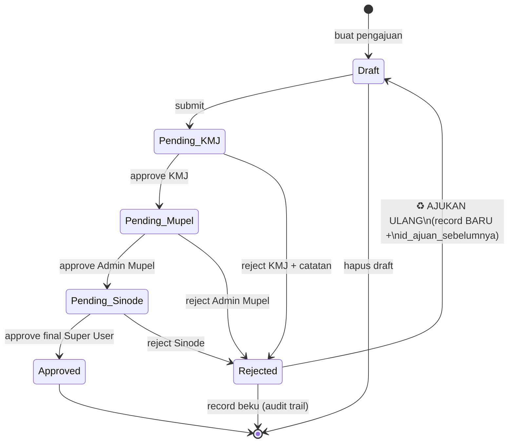
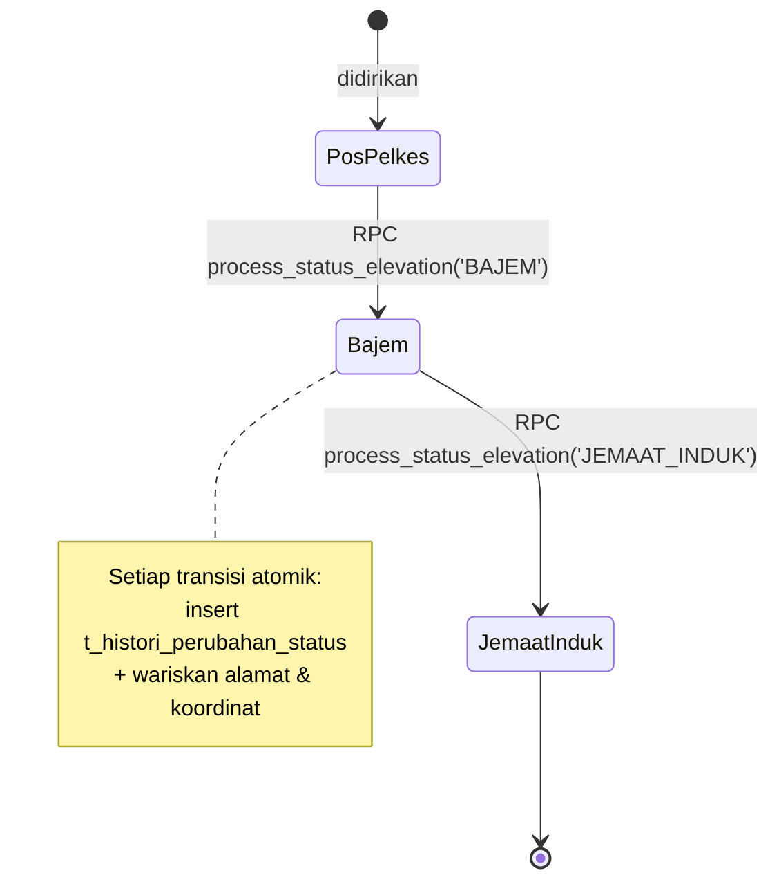
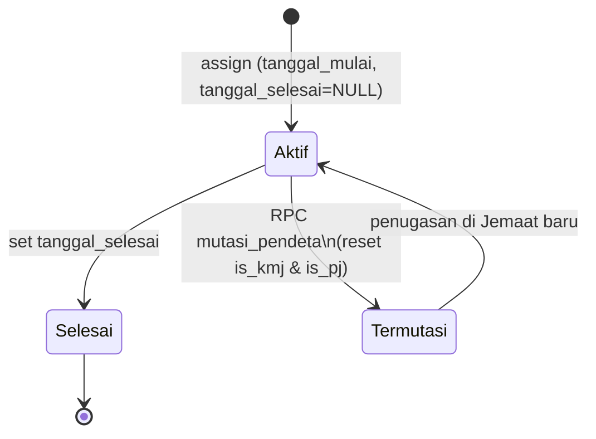
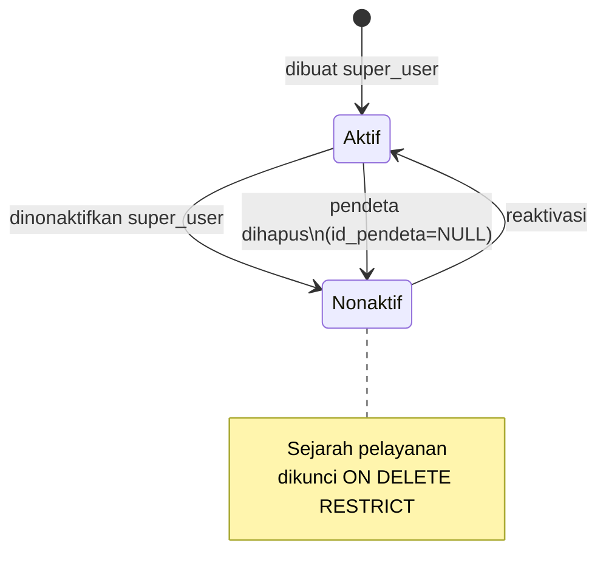
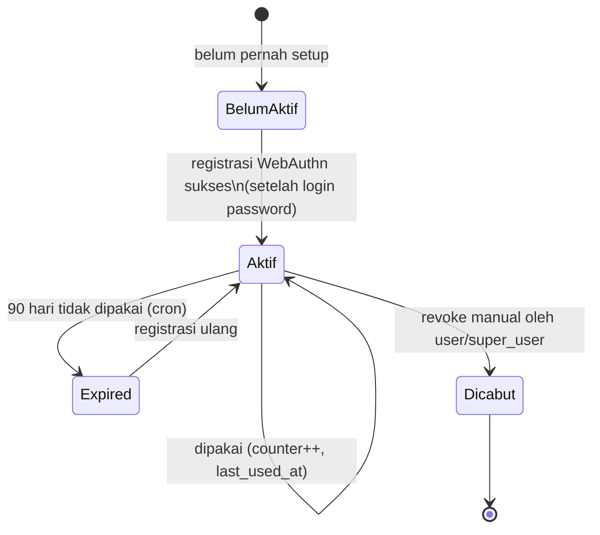
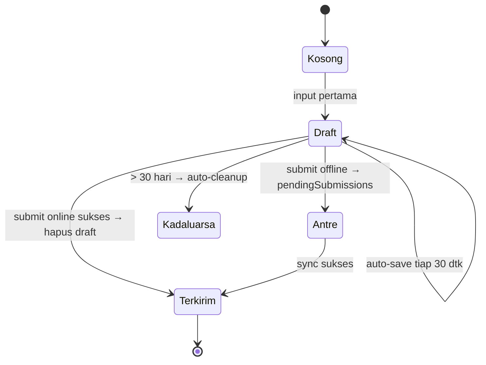
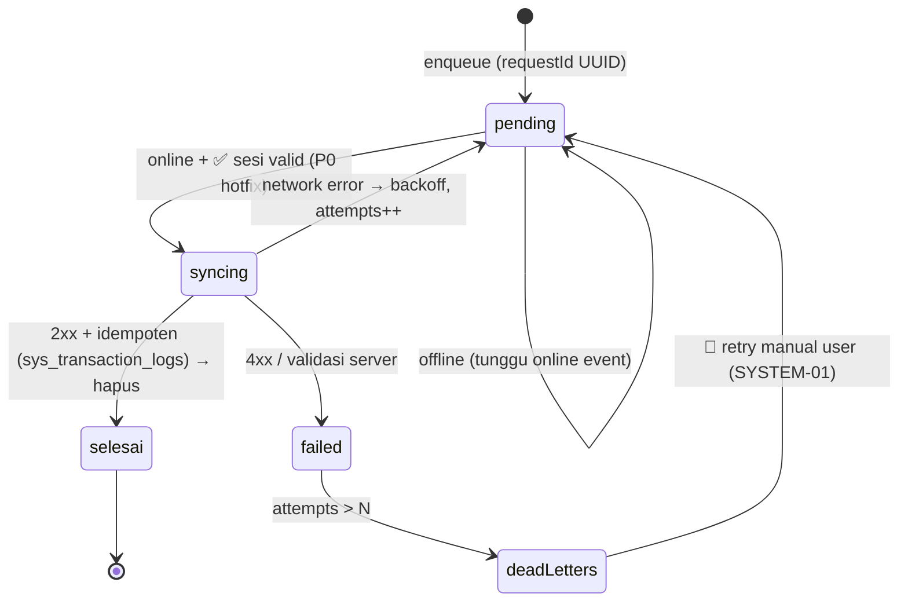
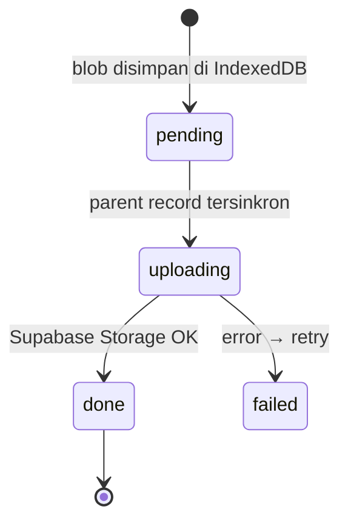
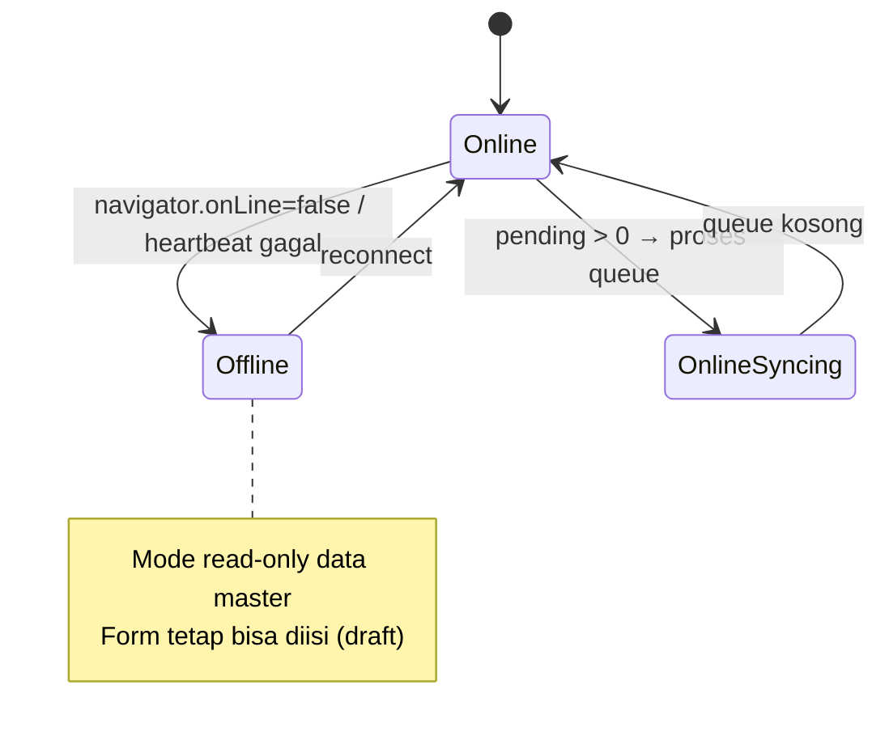

# 🗺️ SI GPIB v2.2 — UX Blueprint

**Versi Dokumen:** 0.1.0 (Draft for Review)
**Arsitektur:** Online-First + Mobile-First PWA + Biometric Auth
**Referensi:** `rules.md` v2.3.2 · EIA v0.1.1 · PRD v2.2.1 · Blueprint v2.2.2 · ERD v2.2.3
**Status:** 🟡 Draft — siap direview sebelum turun ke CJ-1 & Design System

## Posisi Dokumen

```
rules.md        → HOW to build (guardrails)
ERD             → WHAT data exists (tabel & relasi)
EIA v0.1.1      → WHAT / WHY / WHO / WHERE (arsitektur informasi)
UX Blueprint    → HOW users move (dokumen ini)  ←
Design System   → HOW it looks (token & komponen)
src/lib/domains → HOW code implements
```

EIA menjawab empat pertanyaan kontekstual pengguna; UX Blueprint menerjemahkannya menjadi **flow, layar, dan state**:

| Pertanyaan EIA | Dijawab UX Blueprint lewat |
|---|---|
| "Saya di konteks apa?" | Context chip + scope label di header (§5) |
| "Saya melihat data siapa?" | Scope filter & permission-driven list (§6) |
| "Mengapa saya bisa/tidak bisa melihat ini?" | Empty-state explanation, bukan layar kosong (§6) |
| "Apa hubungan data ini dengan organisasi?" | Breadcrumb hierarki + deep-link dua arah (§4) |

---

## 0. Prinsip UX (Turunan EIA §0.2)

| # | Prinsip | Konsekuensi di UX Blueprint |
|---|---|---|
| P1 | Satu bahasa untuk semua peran | Label UI memakai istilah organisasi (Mupel/Jemaat/Pos), bukan nama tabel/entitas teknis |
| P2 | Entity + State + Permission = UX | Setiap layar diinventarisasi dengan 3 dimensi: siapa akses, state apa saja, aksi apa |
| P3 | Dua lapis state | Lifecycle bisnis (A) dan sync offline (B) tidak pernah dicampur dalam satu indikator UI |
| P4 | Selaras dengan kode | Setiap screen ID dipetakan 1:1 ke route Next.js dan domain di `src/lib/domains/` |
| P5 | Hormati constraint mobile | Bottom-nav maksimal 5 slot; touch ≥ 44px; font ≥ 16px; card view di mobile |
| P6 | Traceable | Setiap flow/screen menunjuk balik ke EIA/PRD/CJ (§7) |

---

## 1. User Flows per Role

### 1.0 Peta Konteks per Role (Entry Point)

| Role | Landing | Konteks JWT (scope) | Primary Job-to-be-Done | Frekuensi akses |
|---|---|---|---|---|
| `super_user` | `/dashboard` | Global (seluruh GPIB) | Keputusan strategis, kelola user & mutasi | Harian, laptop + HP |
| `admin_mupel` | `/dashboard` | `id_mupel` | Monitor Mupel + approval bantuan level 2 | Harian, HP |
| `kmj` | `/dashboard` | `id_induk`, `id_pendeta` | Monitor jemaat, review pastoral, approval level 1 | Harian, HP |
| `pj` | `/dashboard` | `id_induk`, `id_pendeta` | **Input lapangan**: log, aset, demografi, bantuan | Sangat sering, HP mid-range |
| `user` | `/dashboard` | `id_pos` | Input lapangan di Pos yang ditugaskan | Sangat sering, HP mid-range |

**Notasi flow:** `F-{ROLE}-{n}` · setiap flow memuat Trigger → Langkah → Sukses → Cabang gagal.

---

### 1.1 Role PJ / User — ⭐ PRIMARY USER

#### F-PJ-1 · Login (Biometric-first)
**Trigger:** Buka PWA dalam kondisi logout.
1. Sistem cek: ada credential biometrik aktif di device ini? (`m_webauthn_credentials`, ≤ 5 device, belum expire 90 hari)
   - ✅ Ada → tampilkan tombol biometrik besar di `AUTH-01` → sentuh → login **< 1 detik** → `HOME-01`
   - ❌ Tidak ada → form email/phone + password
2. Login password sukses → `HOME-01`
3. **Cabang gagal:** biometrik gagal 3× → otomatis fallback ke password (rules: FR-15, US-1.2)
4. **Cabang khusus:** login password pertama kali → banner ajakan aktivasi biometrik di `HOME-01` (F-X-1)

#### F-PJ-2 · Input Log Pastoral di Lapangan (= CJ-1) 🏆 Golden Path
**Trigger:** FAB → "Log Pastoral" (atau shortcut PWA `/pastoral/new`).
1. `PASTORAL-02` terbuka: tanggal auto-fill hari ini, quick-select jenis kegiatan, Pos auto-fill dari konteks JWT
2. User mengisi form (opsional: voice input Bahasa Indonesia)
3. Foto kegiatan: kamera → kompresi < 200KB → preview
4. **Auto-save draft tiap 30 detik** ke Dexie (`drafts`) → indikator "✓ Tersimpan di draft"
5. Submit:
   - 🟢 **Online** → Server Action → sukses → toast + haptic `success` → draft dihapus → kembali ke `PASTORAL-01`
   - 🟠 **Sinyal hilang** → command masuk `pendingSubmissions` (status `pending`) → banner "1 data menunggu pengiriman" → retry otomatis dengan exponential backoff saat online → notifikasi sukses
   - 🔴 **Validasi server gagal** → error inline di form, draft tetap tersimpan
6. KMJ dapat langsung melihat log ini di jemaatnya (real-time, FR-09)

#### F-PJ-3 · Input Aset dengan Kamera + GPS (= CJ-5)
**Trigger:** Tab Aset di `POS-02` → "Tambah Aset", atau FAB → "Foto Aset".
1. Pilih jenis aset (Tanah / Bangunan / Bergerak) di `ASET-02`
2. Kamera capture → kompresi → **validasi EXIF GPS** (business rule #16; manual override tersedia)
3. GPS auto-fill koordinat (`Geolocation API`, akurasi target < 50m)
4. Lampiran tambahan (sertifikat PDF/JPG, max 10MB/file)
5. Submit → jalur online/offline sama dengan F-PJ-2 (attachment via `pendingAttachments`, foto di Dexie sebagai Blob, **bukan** localStorage)

#### F-PJ-4 · Ajukan Bantuan
**Trigger:** FAB → "Pengajuan Bantuan".
1. Form di `BANTUAN-02`: jenis bantuan, estimasi biaya, urgensi, opsional link ke aset tertentu
2. Simpan sebagai `Draft` atau langsung submit → status `Pending_KMJ`
3. User memantau status di `BANTUAN-03` (timeline: Pos → Jemaat → Mupel → Sinode) + notifikasi tiap perubahan status

#### F-PJ-5 · Ajukan Ulang Bantuan yang Ditolak (EIA v0.1.1)
**Trigger:** Notifikasi "Pengajuan ditolak" → `BANTUAN-03` menampilkan alasan reject + CTA "Ajukan Ulang".
1. Tap "Ajukan Ulang" → `BANTUAN-04` (form ter-prefill dari pengajuan lama)
2. Submit → **record baru** `Draft`/`Pending_KMJ` dengan `id_ajuan_sebelumnya` menunjuk record lama
3. Record lama tetap `Rejected` (audit trail — tidak pernah di-mutasi)
4. Timeline di `BANTUAN-03` baru menampilkan rantai "Pengajuan ke-N ← sebelumnya"

#### F-PJ-6 · Skenario Offline Penuh (= CJ-6)
**Trigger:** Kehilangan sinyal di tengah pengisian form.
1. Banner header berubah amber: "Offline — N data menunggu" (`SYSTEM-02`)
2. Form tetap bisa diisi → auto-save draft ke IndexedDB
3. Navigasi ke data master (Mupel/Jemaat/Pos) → **read-only mode** dari cache SW
4. Sinyal kembali → sync engine: **verifikasi session dulu (P0 hotfix)** → loop pending queue → retry backoff
5. Gagal permanen (4xx/attempts > N) → masuk **Dead-Letter Queue** → user diberi aksi "Lihat data gagal kirim" di `SYSTEM-01`
6. Sukses → toast + haptic + badge pending berkurang

---

### 1.2 Role KMJ

#### F-KMJ-1 · Review Log Pastoral (= CJ-2)
1. `HOME-01` → kartu "Aktivitas Pastoral Minggu Ini" (scope: jemaat sendiri)
2. `PASTORAL-01` → filter: tanggal, pendeta, Pos → card view mobile
3. Tap log → detail + foto kegiatan → deep-link ke Pos terkait
4. Export ke Excel (desktop/tablet; di mobile → share ringkasan via WhatsApp)

#### F-KMJ-2 · Approval Bantuan Level 1
1. Notifikasi/badge di nav "Laporan" → `BANTUAN-01` tab **"Menunggu Persetujuan"** (scope jemaat)
2. Tap pengajuan → `BANTUAN-03`: detail, urgensi, lampiran, riwayat
3. Aksi: **Approve** (→ `Pending_Mupel`, notifikasi ke Admin Mupel) atau **Reject** dengan catatan wajib (→ `Rejected`, notifikasi ke pemohon + CTA ajukan ulang)

#### F-KMJ-3 · Assign PJ ke Pos Pelkes
1. `JEMAAT-02` → tab "Pendeta" → multi-select pendeta terdaftar di jemaat yang sama (validasi RULE 5)
2. Konfirmasi penugasan → riwayat tercatat (`t_pj_jemaat`, `tanggal_mulai`)
3. Akhiri penugasan → set `tanggal_selesai` + status

#### F-KMJ-4 · Supervisi Profile 360° (Scope Jemaat)
1. Dari daftar pendeta → `SETTINGS-06`
2. 8 section tampil **kecuali**: tab **Keluarga** dan tab **Perangkat Biometrik** (🔒 tersembunyi — EIA §6, RLS asimetris)
3. Tab **Aktivitas (audit)** terlihat dengan scope hanya Jemaat yang dipimpin
4. Aksi organisasional terbatas (lihat mutasi; eksekusi mutasi hanya super_user)

---

### 1.3 Role Admin Mupel

#### F-AM-1 · Dashboard Mupel
1. `HOME-01` ter-filter otomatis ke Mupel sendiri (context chip: "Mupel M-22 · Kalimantan Timur")
2. KPI: jumlah Jemaat, Pos, Pendeta, pengajuan menunggu approval
3. Drill-down: Mupel → Jemaat → Pos (breadcrumb hierarki)

#### F-AM-2 · Approval Bantuan Level 2 (= CJ-3)
1. Badge "Menunggu Approval" → `BANTUAN-01` tab approval (scope Mupel)
2. Review → Approve (→ `Pending_Sinode`) / Reject dengan catatan
3. Notifikasi terkirim < 5 detik ke level berikutnya & pemohon

#### F-AM-3 · Supervisi Profile 360° (Scope Mupel)
- Tab **Aktivitas** ✅ terlihat (scope Mupel) — untuk pemetaan pelayanan
- Tab **Keluarga** ❌ dan **Perangkat Biometrik** ❌ tetap tersembunyi (EIA §6 — final)
- Section **Kompetensi & Karunia** terbaca → mendukung penugasan berbasis keahlian (US-25.2)

---

### 1.4 Role Super User

#### F-SU-1 · Dashboard Global
1. `HOME-01`: KPI seluruh GPIB (25 Mupel · 350+ Jemaat · 500+ Pos · 600+ Pendeta)
2. Chart distribusi & pertumbuhan (Recharts, lazy-loaded)
3. Export laporan Excel/PDF dengan filter

#### F-SU-2 · Mutasi Pendeta (= CJ-4)
1. `PENDETA-02` → tap "Mutasi"
2. Bottom sheet: pilih Jemaat tujuan + alasan + tanggal
3. Konfirmasi → **WAJIB RPC `mutasi_pendeta`** (atomic): update `id_induk` + insert `t_riwayat_mutasi_pendeta` + reset flag `is_kmj` & `is_pj` (RULE 6)
4. Notifikasi ke KMJ asal & tujuan; timeline mutasi di profil pendeta ter-update

#### F-SU-3 · Elevasi Status Pos
1. `POS-02` → aksi "Elevasi Status" (hanya muncul bila relevan: Pos Pelkes → Bajem, atau Bajem → Jemaat Induk)
2. Wizard `POS-07`: target status, tanggal, keterangan/SK; untuk JEMAAT_INDUK: nama induk baru, Mupel tujuan, `jemaat_ke`
3. Eksekusi **WAJIB RPC `process_status_elevation`** → histori tercatat di `t_histori_perubahan_status`; koordinat & alamat diwarisi ke Jemaat Induk baru

#### F-SU-4 · Approval Final (Level 3)
- Sama dengan F-AM-2, scope global; Approve final → `Approved` → notifikasi ke seluruh rantai

#### F-SU-5 · Manajemen Pengguna + Supervisi (= CJ-7)
1. `SETTINGS-05`: list semua user, search + filter role/status
2. Tap user → `SETTINGS-06` Profile 360° **mode supervision**: semua 8 section tampil **termasuk** tab Aktivitas privat + Keluarga + Perangkat Biometrik (hak super_user)
3. Aksi: nonaktifkan akun, ubah peran (dengan konfirmasi)
4. Deep-link dua arah: profil → jemaat/pos/log → kembali ke profil (breadcrumb)

---

### 1.5 Flow Lintas Role

#### F-X-1 · Aktivasi Biometric (semua role)
Prasyarat: login password sukses terlebih dahulu (business rule #13).
`HOME-01` banner / `SETTINGS-03` → consent dialog → `navigator.credentials.create()` → verify server → tersimpan di `m_webauthn_credentials` → sukses + haptic. Bila device sudah punya 5 credential → prompt cabut salah satu dulu.

#### F-X-2 · Reset Password
`AUTH-03` → OTP via email/WhatsApp → link reset expire 15 menit.

#### F-X-3 · Cabut Perangkat Biometrik
`SETTINGS-03` → list device dengan `last_used_at` → konfirmasi cabut → revoke (auto-expire 90 hari juga berjalan via cron).

#### F-X-4 · Offline Fallback Global
Route apa pun saat offline total → `SYSTEM-01` (`/offline`): lihat data tersimpan, retry semua pending, cek koneksi.

---

## 2. Screen Inventory

**Konvensi ID:** `{GRUP}-{nn}` · setiap layar memuat: route, akses role, JTBD, state layers.
🔓 = semua role terautentikasi (dengan scope) · 🔒 = role terbatas

### 2.1 Master Table

| ID | Route | Akses | JTBD utama |
|---|---|---|---|
| **AUTH-01** | `/login` | Publik | Login password/biometrik |
| **AUTH-02** | `/register` | Publik (flow undangan — lihat OQ-1) | Registrasi akun |
| **AUTH-03** | `/forgot-password` | Publik | Reset password via OTP |
| **HOME-01** | `/dashboard` | 🔓 | Beranda adaptif per role: KPI, pending badge, quick actions |
| **MUPEL-01** | `/mupel` | 🔒 super_user | Daftar 25 Mupel + search/filter wilayah |
| **MUPEL-02** | `/mupel/[id]` | 🔒 super_user, admin_mupel (scope) | Detail Mupel + daftar Jemaat |
| **JEMAAT-01** | `/jemaat` | 🔓 (scoped) | Daftar Jemaat Induk |
| **JEMAAT-02** | `/jemaat/[id]` | 🔓 (scoped) | Profil Jemaat: KMJ, PJ, daftar Pos |
| **POS-01** | `/pos-pelkes` | 🔓 (scoped) | Daftar Pos — card view, search, sort |
| **POS-02** | `/pos-pelkes/[id]` | 🔓 (scoped) | **Profil 360° Pos** — tab: Info, Demografi, Pastoral, Aset, Pelayan, Jadwal, Wilayah |
| **POS-03** | `/pos-pelkes/new` | 🔒 pj, user, kmj+ | Input Pos + kamera + GPS |
| **POS-04** | `/pos-pelkes/[id]/edit` | 🔒 (hak edit per scope) | Edit data Pos + history |
| **POS-05** | `/pos-pelkes/map` | 🔓 | **Tab Peta** — sebaran marker + cluster |
| **POS-06** | `/pos-pelkes/[id]/map` | 🔓 (scoped) | Peta fullscreen satu Pos + aset |
| **POS-07** | `/pos-pelkes/[id]/elevasi` | 🔒 super_user | Wizard elevasi status (RPC) |
| **PENDETA-01** | `/pendeta` | 🔓 (scoped) | Daftar pendeta |
| **PENDETA-02** | `/pendeta/[id]` | 🔓 (scoped) | Profil pendeta + riwayat + log |
| **PENDETA-03** | `/pendeta/new` | 🔒 super_user | CRUD pendeta |
| **MUTASI-01** | `/mutasi` | 🔒 super_user, admin_mupel (read) | Timeline riwayat mutasi |
| **MUTASI-02** | `/mutasi/new` | 🔒 super_user | Form mutasi (RPC atomic) |
| **PASTORAL-01** | `/pastoral` | 🔓 (scoped) | **Tab Laporan** — list log + filter + export |
| **PASTORAL-02** | `/pastoral/new` | 🔒 pj, user | **Quick form** log + voice + draft |
| **ASET-01** | `/aset` | 🔓 (scoped) | Daftar aset per Pos — tab Tanah/Bangunan/Bergerak |
| **ASET-02** | `/aset/new` | 🔒 pj, user, kmj+ | Form aset + kamera + GPS + lampiran |
| **BANTUAN-01** | `/bantuan` | 🔓 (scoped) | List pengajuan: "Milikku" vs "Menunggu Approval" |
| **BANTUAN-02** | `/bantuan/new` | 🔒 pj, user | Form pengajuan bantuan |
| **BANTUAN-03** | `/bantuan/[id]` | 🔓 (scoped) | Detail + timeline status + aksi approve/reject |
| **BANTUAN-04** | `/bantuan/[id]/ajukan-ulang` | 🔒 pemohon | Form ajukan ulang (record baru) |
| **DEMO-01** | `/demografi` | 🔓 (scoped) | Input/lihat demografi pelkat per Pos + chart |
| **SETTINGS-01** | `/settings` | 🔓 | Menu profil & pengaturan |
| **SETTINGS-02** | `/settings/profile` | 🔓 | **Profile 360° diri sendiri** — 8 section |
| **SETTINGS-03** | `/settings/biometric` | 🔓 | Kelola perangkat biometrik (max 5) |
| **SETTINGS-04** | `/settings/notifications` | 🔓 | Preferensi notifikasi |
| **SETTINGS-05** | `/settings/users` | 🔒 super_user | Manajemen semua pengguna |
| **SETTINGS-06** | `/settings/users/[id]` | 🔒 super_user, admin_mupel, kmj (scoped) | Profile 360° supervision |
| **PUBLIC-01** | `/peta-sebaran` | Publik | Peta sebaran Pos GPIB (Fase 4) |
| **PUBLIC-02** | `/statistik` | Publik | Statistik publik GPIB (Fase 4) |
| **SYSTEM-01** | `/offline` | 🔓 | Offline fallback page |

### 2.2 Overlay Global (bukan route)

| ID | Komponen | Perilaku |
|---|---|---|
| SYSTEM-02 | `NetworkBanner` | Muncul saat offline **atau** pending > 0; sticky top |
| SYSTEM-03 | FAB Action Sheet | 5 slot nav tetap; FAB = slot tengah. Item adaptif per role (lihat §4) |
| SYSTEM-04 | `InstallPrompt` banner | A2HS saat eligible, dismissible |
| SYSTEM-05 | Toast + Haptic | Feedback sukses/gagal di semua mutasi |

### 2.3 Detail Layar Kritis

#### HOME-01 — Beranda Adaptif
```
┌─────────────────────────────────┐
│ [NetworkBanner bila offline]     │ ← SYSTEM-02
│ Context chip: "Jemaat 23-03-ET ▾"│ ← §5
│ ── KPI strip (per role) ──       │
│ Pos: 3 · Jiwa: 284 · Pending: 1  │
│ ── Kartu cepat ──                │
│ [Log terakhir] [Approval n]      │
│ ── Aksi hari ini ──              │
│ [+ Log] [📷 Aset] [📋 Bantuan]   │
├─────────────────────────────────┤
│ 🏠 Beranda | 🗺 Peta | ➕ | 📄 Laporan | 👤 Profil │
└─────────────────────────────────┘
```
**State:** loading → skeleton; empty (user baru) → onboarding checklist; offline → data cache read-only + badge pending.

#### POS-02 — Profil 360° Pos
- Header: nama, kategori badge (`Pos Pelkes`/`Bajem`), KK/jiwa, mini-map
- Tab horizontal swipeable: **Info · Demografi · Pastoral · Aset · Pelayan · Jadwal · Wilayah**
- Aksi kontekstual: share WhatsApp (FR-18), elevasi (super_user only), edit
- **State:** setiap tab punya skeleton + empty-state tersendiri ("Belum ada log pastoral — Catat pertama" + CTA)

#### PASTORAL-02 — Quick Form (inti CJ-1)
- Urutan field dioptimalkan thumb-reach: jenis kegiatan (chip quick-select) → tanggal (auto) → jumlah jiwa → catatan (+🎙 voice) → foto
- Indikator draft persisten di footer: "✓ Tersimpan di draft · 12:04"
- Tombol submit full-width 44px+; saat offline berubah jadi **"Simpan & Kirim Nanti"** (eksplisit, bukan silent fail)

#### BANTUAN-03 — Detail + Timeline
- Timeline vertikal: Draft → KMJ → Mupel → Sinode → Approved/Rejected (badge warna per state §3)
- Bila `Rejected`: alasan tampil + CTA **"Ajukan Ulang"** + link ke pengajuan sebelumnya (rantai audit)
- Aksi approve/reject hanya muncul untuk role approver level saat ini (permission-driven rendering)

#### SETTINGS-02/06 — Profile 360°
8 section: Akun · Pelayanan (hierarki) · Kompetensi & Karunia · Keterlibatan Sinodal · Keluarga · Mutasi (timeline) · Log & Aktivitas · Perangkat Biometrik.
- **Stat strip** via RPC `get_profile_stats` (1 round-trip)
- User non-pendeta → section pelayanan menampilkan **pesan anggun**, bukan error (business rule #21)
- Visibilitas tab mengikuti matriks §6

---

## 3. State Diagram (Dua Lapis — EIA §5)

> **Aturan P3:** indikator lifecycle bisnis dan indikator sync offline **tidak pernah digabung**. Badge status pengajuan ≠ badge pending pengiriman.

### 3.1 Layer A — Lifecycle State (Bisnis)

#### A1 · Pengajuan Bantuan

**Aturan UI:** record `Rejected` tidak pernah berubah status; ajukan ulang selalu membuat record baru (EIA v0.1.1 + rules §Workflow).

#### A2 · Status Pos Pelkes (Elevasi)


#### A3 · Penugasan Pendeta


#### A4 · Akun Pengguna


#### A5 · Credential Biometrik


### 3.2 Layer B — Sync State (Offline Engine — Dexie v5)

#### B1 · Form Draft (`db.drafts`)


#### B2 · Pending Submission (`db.pendingSubmissions` — Command Pattern)


#### B3 · Attachment (`db.pendingAttachments`)


#### B4 · Network & UI


### 3.3 Pemetaan State → Elemen UI

| State | Lokasi UI | Bentuk |
|---|---|---|
| Offline | Header | Banner amber `SYSTEM-02` |
| Online + pending > 0 | Header | Banner hijau + badge jumlah |
| Draft tersimpan | Footer form | Teks "✓ Tersimpan di draft · HH:MM" |
| Submission antre | Nav + banner | Badge counter pada FAB/Laporan |
| Dead-letter | `SYSTEM-01` + toast error | CTA "Lihat data gagal kirim" |
| Status bantuan | `BANTUAN-03` | Timeline + badge warna (Draft abu, Pending biru, Approved hijau, Rejected merah) |
| Kategori Pos | Card & header POS-02 | Badge "Pos Pelkes" vs "Bajem" |
| Biometrik expired | `SETTINGS-03` | Badge + CTA registrasi ulang |

---

## 4. Navigation Model (EIA §8 → implementasi)

### 4.1 Bottom Navigation — 5 slot tetap (P5)

| Slot | Label | Tujuan | Catatan |
|---|---|---|---|
| 1 | Beranda | `/dashboard` | Adaptif per role |
| 2 | Peta | `/pos-pelkes/map` | Leaflet + clustering |
| 3 | **Input (FAB)** | Action sheet | Item per role (bawah) |
| 4 | Laporan | `/pastoral` | Badge = pengajuan menunggu approval (KMJ/Mupel/Sinode) atau pending sync (PJ/User) |
| 5 | Profil | `/settings` | Entry Profile 360 |

**Isi FAB per role:**

| Role | Item FAB (max 5) |
|---|---|
| pj / user | Log Pastoral · Foto Aset · Pengajuan Bantuan · Ajukan Ulang (contextual) · Tambah Pelayan |
| kmj | Log Pastoral · Assign PJ · Pengajuan Bantuan · Approve cepat |
| admin_mupel | Approve Pengajuan · Laporan Mupel |
| super_user | Tambah Pendeta · Mutasi · Elevasi Pos · Approve Final |

### 4.2 Deep-link & Breadcrumb
- Pola deep-link: `/pos-pelkes/{id}?tab=aset`, `/settings/users/{id}?section=keluarga` (permission-gated)
- Breadcrumb mobile = back button + **context chip** (nama Mupel/Jemaat/Pos aktif) — bukan breadcrumb teks panjang
- Deep-link dua arah Profile 360 ↔ entitas (US-23.8)

---

## 5. Context Model → UI (menjawab "Saya di konteks apa?")

1. **Context chip di header** setiap layar list/detail: menampilkan scope aktif (contoh: `Mupel M-22 · Kalimantan Timur` atau `Pos POS-81917 · Eben Haezer`).
2. **Perilaku scope per role:**
   - `super_user` → chip interaktif: bisa memfilter global → Mupel → Jemaat → Pos
   - `admin_mupel` → terkunci ke Mupel sendiri (chip statis), drill-down ke bawah bebas
   - `kmj` → terkunci ke Jemaat sendiri
   - `pj` / `user` → terkunci ke Jemaat/Pos penugasan
3. **Scope label di setiap list** — teks kecil di atas daftar: *"Menampilkan: Pos di Jemaat 23-03-ET"* → menjawab "Saya melihat data siapa?"
4. Perpindahan konteks selalu via navigasi hierarki (Mupel → Jemaat → Pos), tidak ada "teleport" tanpa breadcrumb.

---

## 6. Permission Matrix → Konsekuensi UI (EIA §6)

### 6.1 Privasi Profile 360° (final v0.1.1)

| Section | Pemilik | super_user | admin_mupel | kmj | Konsekuensi UI |
|---|---|---|---|---|---|
| Keluarga | ✅ | ✅ | ❌ | ❌ | Tab disembunyikan total (bukan disabled) |
| Aktivitas / audit | ✅ | ✅ | ✅ scope Mupel | ✅ scope Jemaat | Tab terlihat, data ter-filter scope |
| Perangkat Biometrik | ✅ | ✅ | ❌ | ❌ | Tab disembunyikan total |
| Kompetensi & Karunia | ✅ | ✅ | ✅ | ✅ | Terbaca untuk pemetaan penugasan |
| Hierarki, Mutasi, Log pastoral | ✅ | ✅ | sesuai scope | sesuai scope | Scope-driven |

### 6.2 Modul umum (ringkas)

| Modul | super_user | admin_mupel | kmj | pj / user |
|---|---|---|---|---|
| Mupel/Jemaat | CRUD | Read (scope) | Read (scope) | Read (scope) |
| Pos Pelkes | CRUD | Read | CRUD terbatas | Create/Update di Pos tugas |
| Pendeta | CRUD + mutasi (RPC) | Read | Read + assign PJ | Read |
| Pastoral | Read all | Read Mupel | Read Jemaat | Create (milik sendiri) |
| Bantuan | Approve final | Approve L2 | Approve L1 | Create + ajukan ulang |
| Elevasi Pos | Eksekusi (RPC) | — | — | — |

**Prinsip rendering:** data tanpa izin → **tidak dirender sama sekali** (bukan blur/disable); aksi tanpa izin → tombol tidak muncul; scope kosong → empty-state informatif ("Tidak ada pengajuan di jemaat Anda").

---

## 7. Traceability (UX ↔ Sumber)

| Elemen UX | EIA | PRD | Critical Journey |
|---|---|---|---|
| F-PJ-2 + PASTORAL-02 + B1/B2 | §5 (dua lapis state) | US-6.1, US-9.1–9.4 | **CJ-1** & CJ-6 |
| F-KMJ-1 + PASTORAL-01 | §2, §6 | US-6.3 | CJ-2 |
| F-AM-2 + BANTUAN-01/03 + A1 | §5.1 | US-10.2–10.5 | CJ-3 |
| F-SU-2 + MUTASI-02 + A3 | §1.2 (O6) | US-5.1 | CJ-4 |
| F-PJ-3 + ASET-02 + B3 | §5 | US-8.1–8.5 | CJ-5 |
| F-PJ-6 + SYSTEM-01/02 + B2/B4 | §5, P3 | US-9.x | CJ-6 |
| F-SU-5 + SETTINGS-05/06 + §6.1 | §6 | US-23.5–23.7 | CJ-7 |
| F-SU-3 + POS-07 + A2 | §1.2 | — (rules RPC) | — |
| F-PJ-5 + BANTUAN-04 + A1 | §5.1 | US-10.6 | — |

---

## 8. Open Questions

| # | Pertanyaan | Dampak | Keputusan dibutuhkan oleh |
|---|---|---|---|
| OQ-1 | `AUTH-02 /register`: self-registration atau invitation-only oleh super_user? (PRD saat ini menyiratkan user dibuat admin) | Flow registrasi & RLS | Sebelum Fase 1 |
| OQ-2 | Voice input (US-6.2, Could): slot 🎙 di PASTORAL-02 disiapkan sejak Fase 1 (disabled) atau baru Fase 2? | Kompleksitas form | Sebelum CJ-1 dibangun |
| OQ-3 | Badge "Laporan" (slot 4) untuk PJ: menampilkan pending sync atau tidak, mengingat sudah ada banner? | Risiko duplikasi indikator (P3) | Design System |
| OQ-4 | Landing deep-link push notification: langsung ke BANTUAN-03 atau via HOME-01? | Implementasi Fase 3 | Fase 3 |
| OQ-5 | Context chip untuk `user` dengan >1 Pos: perlu quick-switcher antar Pos? | Navigasi harian PJ/User | Sebelum CJ-1 |
| OQ-6 | `PUBLIC-02 /statistik`: masuk Fase 4 atau ditunda bersama Portal Umat? | Scope Fase 4 | Fase 4 |

---

## 📌 Jembatan ke CJ-1

CJ-1 (*Pendeta input log pastoral di lapangan*) akan menyentuh tepat irisan berikut dari blueprint ini — sehingga implementasinya bisa langsung dimulai tanpa keputusan UX baru:

| Aspek | Acuan |
|---|---|
| Flow | **F-PJ-1** (login biometrik) → **F-PJ-2** (input log) |
| Layar | `AUTH-01` → `HOME-01` → `PASTORAL-02` (+ overlay `SYSTEM-02`, `SYSTEM-05`) |
| State | **A-** tidak ada lifecycle (log sekali tulis) · **B1** draft + **B2** pending submission |
| Domain code | `src/lib/domains/pastoral/` (schema → service → queries) |
| Guardrails | Dexie bukan localStorage · Server Action bukan API Route · async params Next 16 · touch ≥ 44px |


---

